---
published: true
permalink: /modulo-aquisicao
layout: slate
filename: moduloaquisicao.md
title: Módulo Aquisição
---  

# MÓDULO AQUISIÇÃO 12ª Edição

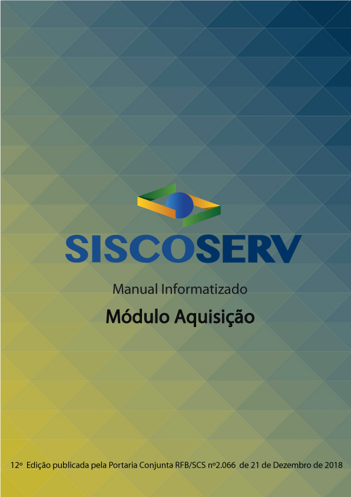

[TOC]

# Capítulo 1 - Informações gerais e normativas sobre o Siscoserv

## 1. Introdução

O Sistema Integrado de Comércio Exterior de Serviços,
[Intangíveis](#Intangível) e Outras Operações que Produzam Variações no
Patrimônio (Siscoserv) é um sistema informatizado, desenvolvido pelo
Governo Federal como ferramenta para o aprimoramento das ações de
estímulo, formulação, acompanhamento e aferição das políticas públicas
relacionadas a serviços e intangíveis, bem como para a orientação de
estratégias empresariais de comércio exterior de serviços e intangíveis.

O Siscoserv guarda conformidade com as diretrizes do Acordo Geral sobre
Comércio de Serviços (GATS) da Organização Mundial do Comércio (OMC),
aprovado pelo Decreto Legislativo n° 30, de 15 de
dezembro de 1994, e promulgado pelo Decreto n° 1.355, de
30 de dezembro de 1994.

## 2. Base Legal do Siscoserv

[Lei n° 12.546, de 14 de dezembro de 2011, artigos 24 a
27.](https://www.planalto.gov.br/ccivil_03/_ato2011-2014/2011/lei/l12546.htm)

[Decreto n° 7.708, de 02 de abril de
2012.](http://www.planalto.gov.br/CCIVIL_03/_Ato2011-2014/2012/Decreto/D7708.htm)

Portaria MDIC n° 113, de 17 de maio de 2012, com suas alterações
posteriores.

Instrução Normativa RFB n° 1.277, de 28 de junho de 2012, com suas
alterações posteriores.

[Portaria Conjunta RFB/SCS n° 1.908, de 19 de julho de 2012, com suas
alterações
posteriores.](http://pesquisa.in.gov.br/imprensa/jsp/visualiza/index.jsp?jornal=1&pagina=31&data=20/07/2012)

Portaria Conjunta RFB/SCS nº 2.000, de 18 de dezembro de 2018.

Portaria Conjunta RFB/SCS n° 2.066, de 21 de dezembro de 2018.

A prestação de informação no Siscoserv observa as normas complementares
estabelecidas neste Manual.

## 3. Módulos Venda e Aquisição do Siscoserv

O Siscoserv conta com dois Módulos: **Venda e Aquisição**.

No **Módulo Venda** devem ser registrados os serviços,
[intangíveis](#Intangível) e [outras operações que produzam variações no
patrimônio](#Outrasoperações), vendidos por [residentes](#residente) ou
domiciliados no País a residentes ou domiciliados no exterior. Este
módulo abrange também o registro das operações realizadas por meio de
presença comercial no exterior.

No **Módulo Aquisição** devem ser registrados os serviços,
[intangíveis](#Intangível) e [outras operações que produzam variações no
patrimônio](#Outrasoperações), adquiridos por [residentes](#residente)
ou domiciliados no País, de residentes ou domiciliados no exterior.

Para maiores informações sobre o Modulo Venda acesse:

<http://www.mdic.gov.br/index.php/comercio-servicos/a-secretaria-de-comercio-e-servicos-scs-15/estatisticas-2>

## 4. Registros no Módulo Aquisição

No Módulo Aquisição do Siscoserv estão previstos os seguintes registros:

\- Registro de Aquisição de Serviços (RAS): contém dados referentes à
aquisição, por [residente](#residente) ou domiciliado no País, de
serviços, [intangíveis](#Intangível) e [outras operações que produzam
variações no patrimônio](#Variações), de residente ou domiciliado no
exterior; e

\- Registro de Pagamento (RP): contém dados referentes ao pagamento
relativo à aquisição objeto de prévio RAS.

### 4.1. O Registro de Aquisição de Serviços, Intangíveis e Outras Operações que Produzam Variações no Patrimônio (RAS)

O Registro de Aquisição de Serviços, [Intangíveis](#Intangível) e
[Outras Operações que Produzam Variações no Patrimônio](#Variações)
(RAS) serve para informar a aquisição realizada por
[residentes](#residentenoBrasil) ou domiciliados no País de residentes
ou domiciliados no exterior.

Estão obrigados a registrar as informações no Sistema aqueles
relacionados no
[item](#quem-deve-efetuar-registro-no-siscoserv-módulo-aquisição) 5 e
dispensados de registro aqueles relacionados no item 6.

A obrigação de registro não se estende às transações envolvendo serviços
e [intangíveis](#Intangível) incorporados aos bens e mercadorias
importados, registrados no Sistema Integrado de Comércio Exterior -
Siscomex.

Os serviços de frete, seguro e de agentes externos, bem como demais
serviços relacionados às operações de comércio exterior de bens e
mercadorias, serão objeto de registro no Siscoserv, por não serem
incorporados aos bens e mercadorias.

Cada RAS destina-se a apenas um contrato de prestação de serviços[^1].
Cada contrato pode conter uma ou mais [operações](#operação) em um mesmo
RAS, desde que todas as operações sejam cursadas com o mesmo vendedor.

Caso o contrato envolva mais de um vendedor deve ser registrado um RAS
por vendedor. Por exemplo, quando um contrato for assinado com uma
empresa matriz e suas filiais em países diferentes (diversos
vendedores), devem ser registrados tantos RAS quantos sejam os
vendedores.

As operações de prestação de serviços previstas em contratos de garantia
de aquisição de bens e serviços[^2], realizadas com residentes e
domiciliados no exterior devem ser registradas quando ensejarem
[pagamento](#Pagamento).

#### 4.1.1. Prazo para o RAS

O prazo para incluir o RAS é até o último dia útil do 3°
(terceiro) mês subsequente à [data de início da prestação de
serviço](#datainicio)[^3]

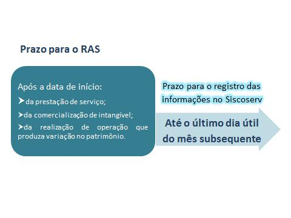

Até 31 de dezembro de 2013, o prazo para o RAS foi, excepcionalmente,
até o último dia útil do 6° (sexto) mês subsequente à
data de início da prestação de serviço, da comercialização de intangível
ou da realização de operação que produza variação no patrimônio.

### 4.2. Registro de Pagamento (RP)
-------------------------------

O RP do Siscoserv complementa o RAS com informações relativas ao
[pagamento](#Pagamento) a residentes ou domiciliados no exterior, pela
aquisição de serviços[^4], bem como o pagamento dos demais custos e
despesas incorridos para a efetiva prestação desses serviços. Neste
registro são solicitados os seguintes dados: a data de pagamento, o
valor pago (valor parcial ou total do contrato, expresso na moeda
informada no RAS), o [valor pago com recursos mantidos no
exterior](#valormantidonoexterior), número do documento que comprove o
[pagamento](#Pagamento) realizado (inclusive notas de despesas), bem
como outros elementos pertinentes.

#### 4.2.1. Prazos para o RP 

Para o registro de pagamento, há dois prazos
possíveis, dependendo da data de pagamento:

1)  quando o pagamento ocorrer **depois** da inclusão do RAS, o usuário
    deve efetuar o RP até o **último dia útil do mês subsequente** ao
    do pagamento.

> [Cabe observar que o prazo de inclusão do RAS deve ser respeitado,
> conforme previsto no item [4.1.1 Prazo para o
> RAS](#prazo-para-o-ras)
>
> 

2)  quando o pagamento ocorrer **antes** da inclusão do RAS , o usuário
    deve efetuar o RP até o último dia útil do mês subsequente ao de
    inclusão desse RAS.

> Cabe observar que o prazo de inclusão do RAS deve ser respeitado,
> conforme previsto no item 4.1.1 Prazo para o
> RAS](#prazo-para-o-ras).

### 4.3. Situações especiais de registro
------------------------------------

#### 4.3.1. Operação com data de conclusão indeterminada

A operação cuja data de conclusão não seja conhecida por ocasião do seu
registro, em razão de não ter sido pactuada entre as partes, pode ser
objeto de registros periódicos, conforme [itens 2.1](#inclusão-do-ras)
(Inclusão do RAS) ou [2.1.1](#inclusão-de-aditivo-ao-ras) (Inclusão de
Aditivo ao RAS) do Capítulo 2 deste Manual. Nesse caso, a data de início
e a data de conclusão devem ser indicadas dentro do mesmo
ano-calendário. Posteriormente, a data de conclusão pode ser ajustada,
mediante retificação, conforme descrito nos itens
[2.1.2](#retificação-do-ras) (Retificação do RAS) ou
[2.1.3](#retificação-do-aditivo-ao-ras) (Retificação do Aditivo ao RAS)
do Capítulo 2 deste Manual.

#### 4.3.2. Operação iniciada sem que o valor esteja definido

A operação cujo valor não seja conhecido por ocasião do seu registro, em
função de sua apuração só puder ocorrer após a efetiva prestação do
serviço, pode ser registrada pelo seu valor estimado. Posteriormente, o
valor deve ser ajustado, mediante retificação, conforme descrito nos
itens [2.1.2](#retificação-do-ras) ou
[2.1.3](#retificação-do-aditivo-ao-ras) do Capítulo 2 deste Manual.

#### 4.3.3. Operação envolvendo gastos pessoais no exterior por pessoas físicas residentes no Brasil

Os gastos pessoais no exterior de pessoas físicas residentes no País, em
operações de valor superior a US\$ 30.000,00 (trinta mil dólares dos
Estados Unidos da América), ou o equivalente em outra moeda, no mês,
relativas à aquisição de serviços[^5], devem ser registrados pela pessoa
física pelos seus montantes acumulados mensalmente, por NBS e por País
do vendedor.

Nesse caso, a data de início será o primeiro dia do mês e a data de
conclusão será o último dia do mês, para as operações ocorridas nesse
período.

São exemplos de gastos pessoais a aquisição de refeições, hospedagem,
serviços médico-hospitalares, locomoção no exterior em viagens de
turismo, de negócios, de treinamento, missões oficiais, participação em
congressos, feiras e conclaves.

A inclusão do RAS será feita observadas as seguintes instruções
específicas para preenchimento:

I -- Nome do Vendedor e Endereço do Vendedor, NIF - inserir a expressão:
"DIVERSOS";

II -- Valor da Operação: informar a somatório dos valores relacionados
às operações cuja realização ocorreu no mês de referência;

III -- Data de Início e Data de Conclusão: informar o primeiro e o
último dia do mês de referência.

A inclusão do RP será feita observadas adicionalmente as seguintes
instruções específicas para preenchimento:

I -- Data do Pagamento: informar o último dia do mês;

II -- Valor do Pagamento: informar o somatório do valor pago no mês;

III -- [Número do Documento](#numerodocumento), inserir a expressão:
"DIVERSOS".

## 5. Quem deve efetuar registro no Siscoserv -- Módulo Aquisição

Estão obrigados a registrar as informações no Sistema - Módulo
Aquisição, os [residentes](#residentenoBrasil) ou domiciliados no Brasil
que realizem, com residentes ou domiciliados no exterior,
[operações](#operaçao) de aquisição de serviços,
[intangíveis](#Intangível) e [outras operações que produzam variações no
patrimônio](#Variações) das pessoas físicas, das pessoas jurídicas ou
dos [entes despersonalizados](#entedespersonalizado), inclusive
operações de importação de serviços.

Estão obrigados a efetuar registro no Módulo Aquisição do Siscoserv:

I - o tomador do serviço residente ou domiciliado no Brasil;

II - a pessoa física ou jurídica, residente ou domiciliada no Brasil,
que adquire o intangível, inclusive os direitos de propriedade
intelectual, por meio de cessão, concessão, licenciamento ou por
quaisquer outros meios admitidos em direito; e

III - a pessoa física ou jurídica ou o responsável legal do [ente
despersonalizado](#entedespersonalizado), residente ou domiciliado no
Brasil, que realize [outras operações que produzam variações no
patrimônio](#Variações).

Para fins do Módulo Aquisição do Siscoserv, são considerados prestadores
de serviço os residentes ou domiciliados no exterior que faturam os
residentes ou domiciliados no Brasil.

Também são obrigados a efetuar registro os órgãos da administração
pública, direta e indireta, da União, dos Estados, dos Municípios e do
Distrito Federal.

O registro realizado por pessoa jurídica deve ser efetuado por
estabelecimento.

O registro no Siscoserv independe da contratação de câmbio, do meio de
pagamento ou da existência de um contrato formal.

Os gastos pessoais no exterior, relativos à aquisição de serviços[^6],
efetuados por pessoas físicas residentes no País, que se desloquem
temporariamente ao exterior a serviço de pessoas jurídicas domiciliadas
no País, são operações da pessoa física no Siscoserv.

São exemplos de gastos pessoais a aquisição de refeições, hospedagem e
locomoção no exterior em viagens de negócios, de treinamento, missões
oficiais, participação em congressos, feiras e conclaves.

Também devem ser registradas as [operações](#operação) de aquisição de
serviços[^7] iniciadas e não concluídas antes das datas constantes do
Anexo Único da Portaria Conjunta RFB/SCS no 1.908, de 19 de julho de
2012. Para essas operações deve ser registrada como data de início,
aquela indicada no retrocitado Anexo Único, por capítulo da NBS. Caso
haja saldo a pagar, deve ser indicado como valor da operação, o saldo
remanescente a pagar. Nos casos em que o pagamento tenha ocorrido
integralmente antes da data indicada no anexo, deve ser registrado o
valor proporcional da operação correspondente ao período remanescente da
prestação do serviço[^8], justificando o valor registrado no campo
**Informações Complementares**.

Caso tenha ocorrido o pagamento integral antes das datas constantes do
Anexo Único da Portaria Conjunta RFB/SCS n° 1.908, de 19
de julho de 2012, e não tenha sido iniciada a prestação do serviço[^9],
o registro de pagamento obedece ao [item 2.2 do Capítulo 2 deste
Manual](#inclusão-do-rp).

Em qualquer dos casos, a **Data** constante dos **Dados do RP** deve ser
aquela em que ocorreu o [pagamento](#Pagamento).

As [operações](#Operação) iniciadas e concluídas antes das datas
constantes do Anexo Único não devem ser registradas, independentemente
de terem sido ou não pagas.

Não podem ser registradas operações previamente ao [início da prestação
do serviço](#datainicio), da transferência do [intangível](#Intangível)
ou da realização de [outra operação que produza variação no
patrimônio](#Variações).

A responsabilidade pelos registros RAS/RP no Módulo Aquisição do
Siscoserv é do residente ou domiciliado no País que mantenha relação
contratual com residente ou domiciliado no exterior e que por este seja
faturado pela prestação de serviço[^10], ainda que ocorra a
subcontratação de residente ou domiciliado no País ou no exterior.

Exemplos:

\(1) Empresa (A) domiciliada no Brasil mantém relação contratual, em que
é tomadora de serviço, com empresa (B) domiciliada no exterior, e por
esta é faturada pela prestação de serviço. A empresa (B) subcontrata
empresa (C) domiciliada no Brasil para prestação parcial ou integral de
serviço pertinente à relação contratual de (A) com (B). A empresa (A)
deve proceder aos registros RAS e RP no Módulo Aquisição do Siscoserv,
no modo de prestação em que o serviço for prestado por (B) ([Modo 1 --
Comércio Transfronteiriço](#Modo1), [Modo 2 -- Consumo no
Exterior](#Modo2) ou [Modo 4 -- Movimento Temporário de Pessoas
Físicas](#Modo4)). Além disso, a empresa (C) deve proceder aos registros
RVS e RF no Módulo Venda do Siscoserv, no modo de prestação em que o
serviço for prestado a (B).

\(2) Empresa (A) domiciliada no Brasil mantém relação contratual, em que
é tomadora de serviço, com empresa também domiciliada no Brasil (B) e
por esta é faturada pela prestação de serviço. A empresa (B) subcontrata
empresa (C) domiciliada no exterior para prestação parcial ou integral
de serviço pertinente à relação contratual de (A) com (B). A empresa (B)
deve proceder aos registros RAS e RP no Módulo Aquisição do Siscoserv,
no modo de prestação em que o serviço for prestado por (C) ([Modo 1 --
Comércio Transfronteiriço](#Modo1), [Modo 2 -- Consumo no
Exterior](#Modo2) ou [Modo 4 -- Movimento Temporário de Pessoas
Físicas](#Modo4)). A empresa (A) não deve proceder aos registros no
Módulo Aquisição do Siscoserv quanto a sua relação contratual com (B),
pois ambas são domiciliadas no Brasil. Além disso, como não há relação
contratual entre (A) e (C), não há registros no Siscoserv adicionais a
serem feitos.

\(3) Empresa (A) domiciliada no Brasil mantém relação contratual, em que
é tomadora de serviço, com empresa (B) domiciliada no exterior, mediante
movimentação temporária de profissionais e por esta é faturada pela
prestação de serviço. A empresa (A) deve proceder aos registros RAS e RP
no Módulo Aquisição do Siscoserv em [Modo 4 -- Movimento Temporário de
Pessoa Física](#Modo4), em relação a essa operação.

## 6. Quem está dispensado de efetuar registro no Siscoserv -- Módulo Aquisição

Estão dispensadas do registro no Siscoserv, **nas operações que não
tenham utilizado mecanismos de apoio** ao comércio exterior de serviços,
de intangíveis e demais operações de que trata o art. 26 da Lei
n° 12.546, de 14 de dezembro de 2011:

I -- Empresas cadastradas no SIMPLES NACIONAL e MEI - as pessoas
jurídicas optantes pelo Regime Especial Unificado de Arrecadação de
Tributos e Contribuições devidos pelas Microempresas e Empresas de
Pequeno Porte -- Simples Nacional e os Microempreendedores Individuais
(MEI) de que trata o §1° do artigo 18-A da Lei
Complementar n° 123, de 14 de dezembro de 2006; e

II -- Pessoas Físicas - as pessoas físicas residentes no País que, em
nome individual, não explorem, habitual e profissionalmente, qualquer
atividade econômica de natureza civil ou comercial, com o fim
especulativo de lucro, desde que não realizem operações em valor
superior a US\$ 30.000,00 (trinta mil dólares dos Estados Unidos da
América), ou o equivalente em outra moeda, no mês.

## 7. Cronograma de registro das informações 

O Registro de Aquisição de Serviços, [Intangíveis](#Intangível) e
[Outras Operações que Produzam Variações no Patrimônio](#Variações)
(RAS) e o Registro de Pagamento (RP) obedeceram, no momento da
implantação do Siscoserv, ao cronograma, que tem por base a Nomenclatura
Brasileira de Serviços, Intangíveis e Outras Operações que Produzam
Variações no Patrimônio -- NBS, conforme previsto no §
5° do art. 6° da [Portaria Conjunta
RFB/SCS n° 1.908, de 19 de julho de
2012](http://pesquisa.in.gov.br/imprensa/jsp/visualiza/index.jsp?jornal=1&pagina=31&data=20/07/2012).

## 8. Modos de Prestação de Serviços - Módulo Aquisição

Os modos de prestação identificam, conforme estabelecido no Acordo Geral
sobre Comércio de Serviços da OMC (GATS)[^11], a prestação de serviços,
segundo a localização do prestador e do tomador. No Módulo Aquisição, os
modos de prestação são os seguintes:

### Modo 1 - Comércio Transfronteiriço

Serviço adquirido do território de um país ao território de outro país, por
[residente](#residente) ou domiciliado no Brasil e prestado por
residente ou domiciliado no exterior.

Exemplos:

-   serviço adquirido via Internet por empresa brasileira de empresa
    > domiciliada no exterior;

-   serviços de corretagem de ações prestados a cliente domiciliado ou
    > [residente no Brasil](#residentenoBrasil) efetuados por empresa
    > corretora domiciliada no exterior;

-   serviços de projeto e desenvolvimento de estruturas e conteúdo de
    > páginas eletrônicas realizados no exterior para cliente residente
    > ou domiciliado no Brasil;

-   serviços de transporte internacional de cargas prestado por empresa
    > domiciliada no exterior a empresa domiciliada no Brasil.

> 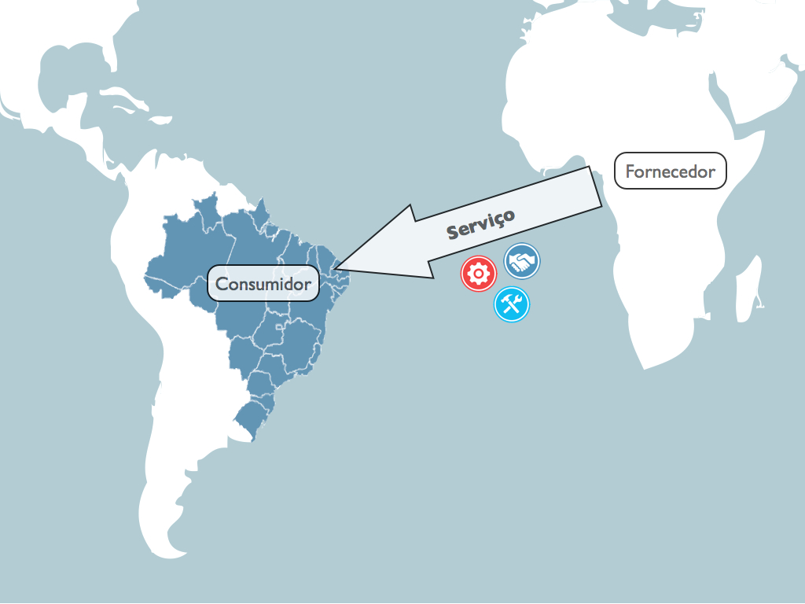

### Modo 2 - Consumo no Exterior

Serviço prestado por
residente e domiciliado no exterior e consumido no território de outro
país por residente ou domiciliado no Brasil.

Exemplos:

-   serviços educacionais presenciais prestados no exterior a residente no Brasil;

-   capacitação no exterior de funcionários de pessoa jurídica domiciliada no Brasil;

-   empresa brasileira envia equipamento para reparo no território de
    outro país;

-   serviços médicos especializados prestados no exterior a residente no
    Brasil;

-   serviços de manuseio de cargas e contêineres prestados no exterior a
    pessoa jurídica domiciliada no Brasil;

-   serviços de hospedagem prestados no exterior a residente no Brasil.

> 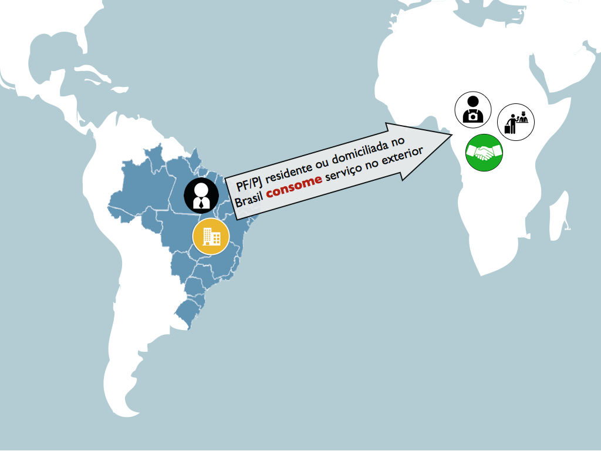

### Modo 3 - Presença comercial no Brasil

O registro de Modo 3 é restrito ao Módulo Vendas no Siscoserv, porque é um
registro especial focado em capturar o faturamento de filiais, sucursais
ou controladas de empresas brasileiras domiciliadas no exterior com a
venda de serviços ou a transferência de intangíveis.

Não há registro especial de Modo 3 no Módulo Aquisição,
pelo fato de que as empresas domiciliadas no Brasil, ainda que
relacionadas a empresas estrangeiras (ou seja, mesmo quando são uma
presença comercial de uma empresa estrangeira no Brasil), são
consideradas pela legislação brasileira, para todos os fins, empresas
brasileiras.

Sendo assim, essas empresas consideradas presença comercial de uma
empresa estrangeira no Brasil, por estarem domiciliadas no país e
estarem regidas pela legislação comercial e tributária que afeta a todas
as empresas brasileiras, devem efetuar seus registros em Módulo Venda e
Aquisição do Siscoserv sempre que realizarem operações de venda ou
aquisição de serviços com residentes ou domiciliados no exterior,
inclusive operações *intercompany*, de acordo com o previsto na
legislação pertinente ao Siscoserv e neste Manual.

### Modo 4 - Movimento temporário de pessoas físicas

Residentes no exterior deslocam-se por tempo limitado ao Brasil com
vistas a prestar um serviço à [residente](#residentenoBrasil) ou
domiciliado no Brasil.

Exemplos:

-   arquiteto residente no exterior desloca-se para desenvolver projeto de arquitetura no Brasil;

-   empreiteiras domiciliadas no exterior enviam trabalhadores que mantêm vínculo empregatício no exterior para construção de uma rodovia no Brasil;

-   advogado residente no exterior desloca-se a fim de prestar consultoria jurídica no Brasil.

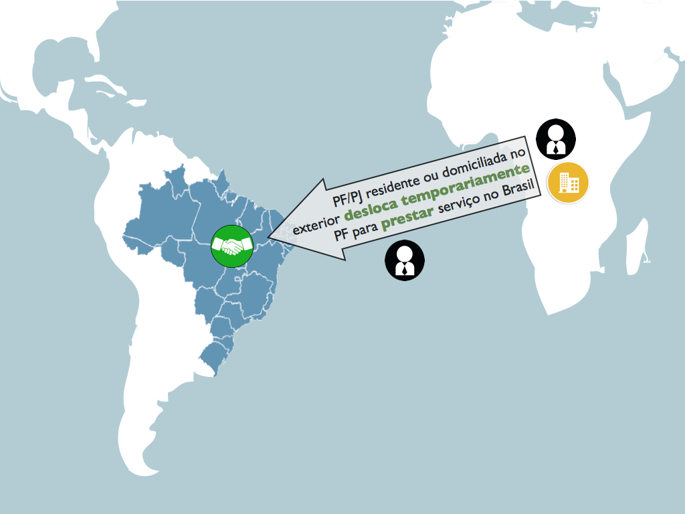

Devem registrar [operações](#operaçao) em Modo 4 no Módulo Aquisição do
Siscoserv as pessoas físicas ou jurídicas
[residentes](#residentenoBrasil) ou domiciliadas no Brasil, quando a
aquisição de serviço ensejar o deslocamento temporário de pessoa(s)
física(s) residente(s) no exterior com vistas a prestar um serviço no
Brasil, exceto quando se estabelecer vínculo empregatício no Brasil.

## 9. Nomenclatura Brasileira de Serviços, Intangíveis e Outras Operações que Produzam Variações no Patrimônio (NBS)

O registro de
[operações](file:///F:\Propostas%20para%20novas%20funcionalidades.doc#Operação)
no Siscoserv será realizado de acordo com a [Nomenclatura Brasileira de
Serviços, Intangíveis e Outras Operações que Produzam Variações no
Patrimônio
(NBS)](http://www.mdic.gov.br/index.php/comercio-servicos/a-secretaria-de-comercio-e-servicos-scs-13)
e pelas respectivas [Notas Explicativas
(NEBS)](http://www.mdic.gov.br/index.php/comercio-servicos/a-secretaria-de-comercio-e-servicos-scs-13),
aprovadas pelo [Decreto n° 7.708, de 2 de abril de
2012](http://www.planalto.gov.br/ccivil_03/_Ato2011-2014/2012/Decreto/D7708.htm),
e Portarias Conjuntas RFB/SCS que atualizam a Nomenclatura.

A prestação de serviços[^12] iniciada até 31 de dezembro de 2018 deve
ser registrada tendo por base a NBS 1.1, publicada pela
Portaria Conjunta RFB / SCS nº 1.820, de 2014.

A prestação de serviços[^13] iniciada a partir de 1º de janeiro de 2019
devem ser registradas tendo por base a [NBS
2.0](http://www.mdic.gov.br/images/REPOSITORIO/scs/decos/NBS/Anexo_I_NBS_2.0_com_altera%C3%A7%C3%B5es_6.12.18.pdf),
publicada pela [Portaria Conjunta RFB/SCS nº 2.000, de 18 de dezembro de
2018.](http://pesquisa.in.gov.br/imprensa/jsp/visualiza/index.jsp?data=20/12/2018&jornal=515&pagina=139&totalArquivos=243),
que produz efeitos a partir de 1º de janeiro de 2019.

Esse registro deverá observar as seguintes regras gerais para
interpretação da NBS:

**Regra 1.** Os títulos das Seções e Capítulos têm apenas valor
indicativo. Para os efeitos legais, a classificação do serviço,
[intangível](file:///F:\Propostas%20para%20novas%20funcionalidades.doc#Intangível)
ou [outra operação que produza variação no
patrimônio](file:///F:\Propostas%20para%20novas%20funcionalidades.doc#Outrasoperações)
é determinada pelos textos das posições e das Notas de Seção e de
Capítulo quando houver e, desde que não sejam contrárias aos textos das
referidas posições e Notas, pelas Regras seguintes.

**Regra 2.** Quando aparentar que o serviço,
[intangível](file:///F:\Propostas%20para%20novas%20funcionalidades.doc#Intangível)
ou [outra operação que produza
variações](file:///F:\Propostas%20para%20novas%20funcionalidades.doc#Outrasoperações)
no patrimônio pode ser classificado em duas ou mais posições, a
classificação efetuar-se-á da seguinte forma:

2a) A posição mais específica prevalece sobre a mais genérica. Todavia,
quando duas ou mais posições se referirem, cada uma delas, a apenas um
dos serviços,
[intangíveis](file:///F:\Propostas%20para%20novas%20funcionalidades.doc#Intangível)
ou [outras operações que produzam variações no
patrimônio](file:///F:\Propostas%20para%20novas%20funcionalidades.doc#Outrasoperações)
que constituam o objeto a ser classificado, tais posições devem ser
consideradas como igualmente específicas, ainda que uma dessas posições
apresente uma descrição mais precisa ou completa desse objeto.

2b) Quando a Regra 2a) não permitir efetuar a classificação, o serviço,
intangível ou [outra operação que produza variações no
patrimônio](#Outrasoperações) classificar-se-á na posição situada em
último lugar na ordem numérica, dentre as suscetíveis de serem
consideradas válidas.

**Regra 3.** A classificação de serviços, intangíveis e [outras
operações que produzam variações no
patrimônio](file:///F:\Propostas%20para%20novas%20funcionalidades.doc#Outrasoperações)
nas subposições de uma mesma posição é determinada, para efeitos legais,
pelos textos dessas subposições e, quando houver, das Notas de
Subposição respectivas, assim como, \"*mutatis mutandis*\", pelas Regras
precedentes, entendendo-se que apenas são comparáveis subposições do
mesmo nível. Para os fins da presente Regra, as Notas de Seção e de
Capítulo são também aplicáveis, salvo disposições em contrário.

**Regra 4.** As Regras anteriores aplicar-se-ão, \"*mutatis mutandis*\",
para determinar dentro de cada posição ou subposição, o item aplicável
e, dentro deste último, o subitem correspondente, entendendo-se que
apenas são comparáveis desdobramentos (itens e subitens) do mesmo nível.

No contexto do Siscoserv e da Nomenclatura Brasileira de Serviços, são
exemplos de:

1\) Serviços: serviços de construção; serviços de transporte de cargas;
serviços de concessão de crédito; serviços de pesquisa e
desenvolvimento; serviços de consultoria; serviços de auditoria;
serviços de gerenciamento de redes; serviços fotográficos; serviços de
arquitetura e serviços de saúde humana.

2)
[Intangíveis](file:///F:\Propostas%20para%20novas%20funcionalidades.doc#Intangível):
licenciamento de direitos de autor e direitos conexos; licenciamento de
direitos sobre a propriedade industrial; cessão de direitos de autor e
direitos conexos; cessão de direitos sobre a propriedade industrial.

3\) [Outras operações que produzam variações no
patrimônio](file:///F:\Propostas%20para%20novas%20funcionalidades.doc#Outrasoperações):
fornecimento de refeições; fornecimento de bebidas em bares, cervejarias
e outros e arrendamento mercantil financeiro de máquinas e equipamentos.

O usuário deve informar o código de acordo com a Nomenclatura Brasileira
de Serviços, Intangíveis e Outras Operações que Produzam Variações no
Patrimônio (NBS).

O código na Nomenclatura Brasileira de Serviços, Intangíveis e Outras
Operações que Produzam Variações no Patrimônio (NBS) é composto por nove
dígitos, sendo que sua significância, da esquerda para a direita, é:

a\) o primeiro dígito, da esquerda para a direita, é o número 1 e é o
indicador que o código que se segue se refere a um serviço, intangível
ou outra operação que produz variação no patrimônio;

b\) o segundo e o terceiro dígitos indicam o Capítulo da NBS;

c\) o quarto e o quinto dígitos, associados ao primeiro e ao segundo
dígitos, representam a posição dentro de um Capítulo;

d\) o sexto e o sétimo dígitos, associados aos cinco primeiro dígitos,
representam, respectivamente, as subposições de primeiro e de segundo
nível;

e\) o oitavo dígito é o item; e

f\) o nono dígito é o subitem.

A sistemática de classificação dos códigos da NBS obedece à seguinte
estrutura:

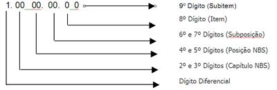

Exemplo:

O código 1.1403.21.10, onde se classificam os "serviços de engenharia de
projetos de construção residencial" deve ser entendido, da esquerda para
a direita, da forma que se segue:

a\) o algarismo 1, da esquerda para a direita, sinaliza que se trata de
código que se aloja na NBS;

b\) o segundo e o terceiro dígitos (14) informa que o código em tela está
no Capítulo 14, dedicado aos "Outros Serviços Profissionais";

c\) o quarto e o quinto, da esquerda para a direita (03), associados ao
primeiro, segundo e terceiro dígitos, separados por um ponto, (1.14)
assinala que a terceira posição do Capítulo 14 é ocupada pelos "serviços
de engenharia";

d\) o sexto e o sétimo dígitos, da esquerda para a direita, indicam,
respectivamente, as subposições de primeiro e segundo nível (21);

e\) o oitavo dígito (1) diz que há item no código; e

f\) o nono dígito (0) informa que o item não foi desdobrado (se o fosse,
então o algarismo deveria ser diferente de zero).

Dessa maneira, fica claro que nem sempre o código NBS se apresenta
totalmente desdobrado, isto é, um algarismo diferente de zero para
subitem como, por exemplo:

  1.0119.10.00   Serviços de construção de estruturas de prédios
  -------------- ---------------------------------------------------------------
  1.0606.10.00   Serviços de operação de aeroportos, exceto manuseio de cargas
  1.0905.91.00   Serviços de consultoria financeira
  1.2206.19.10   Serviços de palestras e conferências

O usuário pode informar diretamente o código, ou localizá-lo acionando a
ferramenta de busca: , situada ao lado do campo **Código
NBS**.

Na informação do código NBS, a posição mais específica prevalece sobre a
mais genérica, sendo que o código só pode ser informado em seu maior
nível de detalhamento (nove dígitos).

*Exemplo 1:*

Código NBS

**Capítulo 1:** 1.01

**Posição:** 1.0105

                                                                                                           

**Subposição N1:** 1.0105.1

**Subposição N2:** 1.0105.11

Como, para esse código, não há desdobramentos além do nível **Subposição
N2**, os dígitos faltantes são preenchidos com 0, até que se complete 9
dígitos.

**Código a ser informado**: 1.0105.11.00

*Exemplo 2:*

**Capítulo 1:** 1.07

**Posição:** 1.0702

Como, para esse código, não há desdobramentos além do nível **Posição**,
os dígitos faltantes são preenchidos com 0, até que se complete 9
dígitos.

**Código a ser informado**: 1.0702.00.00

Para utilizar a ferramenta de busca:

1-   no campo **Código NBS**, acionar botão ;

2-   é aberta a janela **Seleção de Código NBS** para realização da
busca do código;

3-  o usuário pode optar por **Utilizar Pesquisa por Código** ou
**Utilizar Pesquisa por Descrição**:

**Utilizar Pesquisa por Código:** o usuário deve selecionar o código,
expandindo os níveis "Capítulo", "Posição", "Subposição", "Item" e
"Subitem", conforme o caso. Uma vez identificado o código NBS, acione
**Confirmar.**

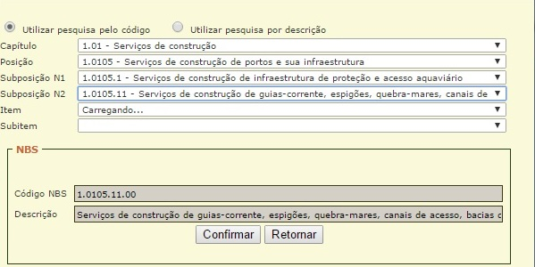

**Utilizar Pesquisa por Descrição:** no campo **Descrição**, informe
termo que identifique o serviço, acione **Pesquisar**, selecione com um
clique um dos códigos NBS localizados, acione **Confirmar.**

Em caso de dúvidas sobre classificação da NBS, consulte as Regras de
Interpretação da NBS, bem como suas [Notas
Explicativas](http://www.mdic.gov.br/index.php/comercio-servicos/a-secretaria-de-comercio-e-servicos-scs-13)
(NEBS).

Caso persistam dúvidas, deve ser formalizado processo administrativo de
**consulta** à Secretaria da Receita Federal do Brasil (RFB), nos termos
do art. 48 da Lei n° 9.430, de 27 de dezembro de 1996 e
do Decreto n° 7.708, de 02 de abril de 2012, que
instituiu a NBS.

## 10. Mecanismos de apoio / fomento ao Comércio Exterior de Serviços e Intangíveis

A informação sobre Mecanismo de apoio/fomento
no Siscoserv tem a finalidade de contribuir para a gestão do fomento
pelos órgãos e instituições responsáveis pela sua concessão. Esta
informação deve ser registrada em cumprimento ao previsto no art. 26 da
Lei n° 12.546, de 14 de dezembro de 2011.

O campo enquadramento deve ser obrigatoriamente preenchido no caso de
[operação](#Operação) amparada em um ou mais mecanismos de apoio/fomento
ao comércio exterior de serviços, intangíveis e às [outras operações que
produzam variação no patrimônio](#outrasoperações).

O órgão ou a entidade da administração pública que tenha atribuição
legal de regulação, normatização, controle ou fiscalização de mecanismo
de apoio/fomento, sem prejuízo de legislação específica, utilizará as
informações da operação, relacionadas à sua área de competência, para
verificação do adimplemento das condições necessárias à fruição daquele
mecanismo sob sua gestão.  

A concessão ou o reconhecimento de cada mecanismo condiciona-se ao
registro das operações no Siscoserv.

No RAS, são considerados Mecanismos de apoio/fomento ao comércio
exterior de serviços, os definidos na seguinte **lista exaustiva**:

+-----------------------------------+-----------------------------------+
| **Mecanismos de Apoio/Fomento**   | **Medida Legal**                  |
+===================================+===================================+
| **ADM. PÚBLICA E REPR.            | [Lei nº 10.865, de 30 de      |
| INTERNACIONAL isenção**           | abril de 2004, art.               |
| **PIS/Pasep/Cofins Imp.**         | 9º](http://www.planalto.gov.b |
|                                   | r/ccivil_03/_ato2004-2006/2004/le |
| Isenção da Contribuição para o    | i/l10.865.htm)                    |
| PIS/Pasep-Importação e da         |                                   |
| Cofins-Importação incidentes      |                                   |
| sobre as importações de serviços  |                                   |
| realizadas pela União, Estados,   |                                   |
| Distrito Federal e Municípios,    |                                   |
| suas autarquias e fundações       |                                   |
| instituídas e mantidas pelo poder |                                   |
| público; pelas Missões            |                                   |
| Diplomáticas e Repartições        |                                   |
| Consulares de caráter permanente  |                                   |
| e pelos respectivos integrantes;  |                                   |
| e pelas representações de         |                                   |
| organismos internacionais de      |                                   |
| caráter permanente, inclusive os  |                                   |
| de âmbito regional, dos quais o   |                                   |
| Brasil seja membro, e pelos       |                                   |
| respectivos integrantes.          |                                   |
+-----------------------------------+-----------------------------------+
| **Alugueis e Arrend. Mercantil de | [Lei n° 10.865, |
| maquinas, equip., embarc. e       | de 30 de abril de 2004, art. 8º,  |
| aeronaves -- red. zero PIS/PASEP  | §                                 |
| Imp./Cofins Imp.**                | 14](http://www.planalto.gov.br/cc |
|                                   | ivil_03/_ato2004-2006/2004/lei/l1 |
| Redução a zero das alíquotas da   | 0.865.htm)                        |
| Contribuição para o               |                                   |
| PIS/Pasep-Importação e da         |                                   |
| Cofins-Importação incidentes      |                                   |
| sobre o valor pago, creditado,    |                                   |
| entregue, empregado ou remetido à |                                   |
| pessoa física ou jurídica         |                                   |
| residente ou domiciliada no       |                                   |
| exterior, referente a alugueis e  |                                   |
| contraprestações de arrendamento  |                                   |
| mercantil de máquinas e           |                                   |
| equipamentos, embarcações e       |                                   |
| aeronaves utilizados na atividade |                                   |
| da empresa.                       |                                   |
+-----------------------------------+-----------------------------------+
| **Arrendamento Mercantil de       | Lei nº 11.371,  |
| aeronave para empresa de          | de 28 de novembro de 2006, art.   |
| transporte aéreo público-- red.   | 16                                |
| zero do IR**                      |                                   |
|                                   |                                   | 
| Redução a zero da alíquota do     |                                   |
| imposto de renda na fonte         |                                   |
| incidente na hipótese de          |                                   |
| pagamento, crédito, entrega,      |                                   |
| emprego ou remessa por fonte      |                                   |
| situada no País a pessoa jurídica |                                   |
| domiciliada no exterior, a título |                                   |
| de contraprestação de contrato de |                                   |
| arrendamento mercantil de         |                                   |
| aeronave ou dos motores a ela     |                                   |
| destinados, celebrado por empresa |                                   |
| de transporte aéreo público       |                                   |
| regular, de passageiros ou de     |                                   |
| cargas, até 31 de dezembro de     |                                   |
| 2011.                             |                                   |
+-----------------------------------+-----------------------------------+
| **Comissão a agentes externos na  | [Lei n° 9.481,  |
| exportação-- red. a zero IR**     | de 13 de julho de 1997, art.      |
|                                   | 1°, inciso II\  |
| Redução a zero da alíquota do IR  | ](http://www.planalto.gov.br/cciv |
| fonte incidente sobre os          | il_03/LEIS/L9481.htm)             |
| rendimentos auferidos no País por |                                   |
| residentes ou domiciliados no     |                                   |
| exterior na hipótese de comissões |                                   |
| pagas por exportadores a seus     |                                   |
| agentes no exterior.              |                                   |
+-----------------------------------+-----------------------------------+
| **Despesas de armazenagem, mov. e | [Lei n° 9.481,  |
| transporte de carga no exterior-- | de 13 de julho de 1997, art.      |
| red. a zero IR**                  | 1°, inciso XII\ |
|                                   | ](http://www.planalto.gov.br/cciv |
| Redução a zero da alíquota do IR  | il_03/LEIS/L9481.htm)             |
| na fonte incidente sobre os       |                                   |
| rendimentos auferidos no País,    |                                   |
| por residentes ou domiciliados no |                                   |
| exterior, na hipótese de valores  |                                   |
| pagos, creditados, entregues,     |                                   |
| empregados ou remetidos para o    |                                   |
| exterior pelo exportador          |                                   |
| brasileiro, relativos às despesas |                                   |
| de armazenagem, movimentação e    |                                   |
| transporte de carga e emissão de  |                                   |
| documentos realizadas no          |                                   |
| exterior.                         |                                   |
+-----------------------------------+-----------------------------------+
| **EVENTOS FIFA (subsidiária)**    | [Lei nº 12.350, de 20 de      |
| **isenção** **PIS/Pasep/Cofins    | dezembro de 2010, art.            |
| Imp.**                            | 8º](http://www.planalto.gov.b |
|                                   | r/ccivil_03/_ato2007-2010/2010/Le |
| Isenção da Contribuição para o    | i/L12350.htm)                     |
| PIS/Pasep-Importação e da         |                                   |
| Cofins-Importação incidentes na   |                                   |
| importação de serviços            |                                   |
| decorrentes das atividades        |                                   |
| próprias e diretamente vinculadas |                                   |
| à organização ou realização dos   |                                   |
| Eventos realizados pela           |                                   |
| subsidiária Fifa no Brasil.       |                                   |
+-----------------------------------+-----------------------------------+
| **EVENTOS FIFA isenção            | [Lei nº 12.350, de 20 de      |
| PIS/Pasep/Cofins Imp.**           | dezembro de 2010, art.            |
|                                   | 7º](http://www.planalto.gov.b |
| Isenção da Contribuição para o    | r/ccivil_03/_ato2007-2010/2010/Le |
| PIS/Pasep-Importação e da         | i/L12350.htm)                     |
| Cofins-Importação em relação aos  |                                   |
| fatos geradores decorrentes das   |                                   |
| atividades próprias e diretamente |                                   |
| vinculadas à organização ou       |                                   |
| realização dos Eventos realizados |                                   |
| pela Fifa.                        |                                   |
+-----------------------------------+-----------------------------------+
| **Fretes, arrendamentos de        | [Lei n° 9.481,  |
| embarcações ou aeronaves e outros | de 13 de julho de 1997, art.      |
| -- red a zero IR**                | 1°, inciso      |
|                                   | I](http://www.planalto.gov.br/cci |
| Redução a zero da alíquota do IR  | vil_03/LEIS/L9481.htm)            |
| na fonte incidente sobre os       |                                   |
| rendimentos auferidos no País por |                                   |
| residentes ou domiciliados no     |                                   |
| exterior na hipótese de receitas  |                                   |
| de fretes, afretamentos, alugueis |                                   |
| ou arrendamentos de embarcações   |                                   |
| marítimas ou fluviais ou de       |                                   |
| aeronaves estrangeiras, feitos    |                                   |
| por empresas, desde que tenham    |                                   |
| sido aprovados pelas autoridades  |                                   |
| competentes, bem assim os         |                                   |
| pagamentos de aluguel de          |                                   |
| containers, sobrestadia e outros  |                                   |
| relativos ao uso de serviços de   |                                   |
| instalações portuárias.           |                                   |
+-----------------------------------+-----------------------------------+
| **MATERIAL AERONÁUTICO red. zero  | Lei nº 10.865,  |
| PIS/Pasep Imp /Cofins Imp.**      | de 30 de abril de 2004, art.      |
|                                   | 8º, § 12, inciso VII          |
| Redução a zero das alíquotas da   |                                   |
| Contribuição para o               |                     |
| PIS/Pasep-Importação e da         |                                   |
| Cofins-Importação incidentes      |                                   |
| sobre o valor dos serviços a      |                                   |
| serem empregados na manutenção,   |                                   |
| reparo, revisão, conservação,     |                                   |
| modernização, conversão e         |                                   |
| montagem das aeronaves,           |                                   |
| classificadas na posição 88.02 da |                                   |
| NCM, de seus motores, suas        |                                   |
| partes, peças, componentes,       |                                   |
| ferramentais e equipamentos.      |                                   |
+-----------------------------------+-----------------------------------+
| **PROMOÇÃO BENS NO EXTERIOR       | [Lei n° 9.481,  |
| redução a zero IR**               | de 13 de julho de 1997, art.      |
|                                   | 1°, inciso III, |
| Redução a zero da alíquota do IR  | alínea a\                         |
| na fonte incidente sobre os       | ](http://www.planalto.gov.br/cciv |
| rendimentos auferidos no País,    | il_03/leis/l9481.htm)[Decreto     |
| por residentes ou domiciliados no | nº 6.761, de 5 de fevereiro de    |
| exterior, na hipótese de valores  | 2009, art.                        |
| pagos, creditados, entregues,     | 1º](http://www.planalto.gov.br/cc |
| empregados ou remetidos para o    | ivil_03/_Ato2007-2010/2009/Decret |
| exterior em decorrência de        | o/D6761.htm)                      |
| despesas com pesquisas de         |                                   |
| mercado, bem como alugueis e      | Portaria MDIC nº 221, de 08 de    |
| arrendamentos de estandes e       | julho de 2013                     |
| locais para exposições, feiras e  |                                   |
| conclaves semelhantes, no         |                                   |
| exterior, inclusive promoção e    |                                   |
| propaganda no âmbito desses       |                                   |
| eventos, para produtos            |                                   |
| brasileiros.                      |                                   |
+-----------------------------------+-----------------------------------+
| **PROMOÇÃO DE DEST. TURÍSTICOS    | [Lei n° 9.481,  |
| BRASILEIROS redução a zero IR**   | de 13 de julho de 1997, art.      |
|                                   | 1°, inciso III, |
| Redução a zero da alíquota do IR  | alínea a\                         |
| na fonte incidente sobre os       | ](http://www.planalto.gov.br/cciv |
| rendimentos auferidos no País,    | il_03/leis/l9481.htm)[Decreto     |
| por residentes ou domiciliados no | nº 6.761, de 5 de fevereiro   |
| exterior, na hipótese de valores  | de 2009, art.                     |
| pagos, creditados, entregues,     | 1º](http://www.planalto.gov.b |
| empregados ou remetidos para o    | r/ccivil_03/_Ato2007-2010/2009/De |
| exterior em decorrência de        | creto/D6761.htm)                  |
| despesas com pesquisas de         |                                   |
| mercado, bem como alugueis e      | Portaria MDIC nº 221, de 08 de    |
| arrendamentos de estandes e       | julho de 2013                     |
| locais para exposições, feiras e  |                                   |
| conclaves semelhantes, no         |                                   |
| exterior, inclusive promoção e    |                                   |
| propaganda no âmbito desses       |                                   |
| eventos, para promoção de         |                                   |
| destinos turísticos brasileiros.  |                                   |
+-----------------------------------+-----------------------------------+
| **PROMOÇÃO DO BRASIL NO EXTERIOR  | [Lei n° 9.481,  |
| redução a zero IR**               | de 13 de julho de 1997, art.      |
|                                   | 1°, inciso III, |
| Redução a zero da alíquota do IR  | alínea b\                         |
| na fonte incidente sobre os       | ](http://www.planalto.gov.br/cciv |
| rendimentos auferidos no País,    | il_03/leis/l9481.htm)[Decreto     |
| por residentes ou domiciliados no | nº 6.761, de 5 de fevereiro   |
| exterior, na hipótese de valores  | de 2009, art.                     |
| pagos, creditados, entregues,     | 1º](http://www.planalto.gov.b |
| empregados ou remetidos, a        | r/ccivil_03/_Ato2007-2010/2009/De |
| residentes ou domiciliados no     | creto/D6761.htm)                  |
| exterior, por órgãos do Poder     |                                   |
| Executivo Federal, relativos a    | Portaria MDIC nº 221, de 08 de    |
| contratação de serviços           | julho de 2013                     |
| destinados à promoção do Brasil   |                                   |
| no exterior.                      |                                   |
+-----------------------------------+-----------------------------------+
| **PROMOÇÃO SERVIÇOS NO EXTERIOR   | [Lei n° 9.481,  |
| redução a zero IR**               | de 13 de julho de 1997, art.      |
|                                   | 1°, inciso III, |
| Redução a zero da alíquota do IR  | alínea a\                         |
| na fonte incidente sobre os       | ](http://www.planalto.gov.br/cciv |
| rendimentos auferidos no País,    | il_03/leis/l9481.htm)[Decreto     |
| por residentes ou domiciliados no | nº 6.761, de 5 de fevereiro   |
| exterior, na hipótese de valores  | de 2009, art.                     |
| pagos, creditados, entregues,     | 1º](http://www.planalto.gov.b |
| empregados ou remetidos para o    | r/ccivil_03/_Ato2007-2010/2009/De |
| exterior em decorrência de        | creto/D6761.htm)                  |
| despesas com pesquisas de         |                                   |
| mercado, bem como alugueis e      | Portaria MDIC nº 221, de 08 de    |
| arrendamentos de estandes e       | julho de 2013                     |
| locais para exposições, feiras e  |                                   |
| conclaves semelhantes, no         |                                   |
| exterior, inclusive promoção e    |                                   |
| propaganda no âmbito desses       |                                   |
| eventos, para serviços            |                                   |
| brasileiros.                      |                                   |
+-----------------------------------+-----------------------------------+
| **RECINE -- susp. PIS/Pasep Imp.  | [Lei n° 12.599, |
| /Cofins Imp.**                    | de 23 de março de                 |
|                                   | 2012](http://www.planalto.gov.br/ |
| Suspensão da exigência da         | CCIVIL_03/_Ato2011-2014/2012/Lei/ |
| Contribuição para o               | L12599.htm)                       |
| PIS/Pasep-Importação e da         |                                   |
| Cofins-Importação para as         |                                   |
| empresas beneficiárias do Regime  |                                   |
| Especial de Tributação para       |                                   |
| Desenvolvimento da Atividade de   |                                   |
| Exibição Cinematográfica          |                                   |
| (RECINE).                         |                                   |
+-----------------------------------+-----------------------------------+
| **RECOPA susp.** **PIS/Pasep      | [Lei nº 12.350, de 20 de      |
| Imp./Cofins Imp.**                | dezembro de 2010, art.            |
|                                   | 20](http://www.planalto.gov.br/cc |
| Suspensão da exigência da         | ivil_03/_ato2007-2010/2010/Lei/L1 |
| Contribuição para o               | 2350.htm)                         |
| PIS/Pasep-Importação e da         |                                   |
| Cofins-Importação incidentes      |                                   |
| sobre serviços importados         |                                   |
| diretamente por pessoa jurídica   |                                   |
| beneficiária do RECOPA.           |                                   |
+-----------------------------------+-----------------------------------+
| **Registro e Manutenção de        | [Lei n° 11.196, |
| marcas, patentes e cultivares --  | de 21 de novembro de 2005, art.   |
| red. zero IR**                    | 17](http://www.planalto.gov.br/cc |
|                                   | ivil_03/_Ato2004-2006/2005/Lei/L1 |
| Redução a zero do IR retido na    | 1196.htm#art133)                  |
| fonte nas remessas efetuadas para |                                   |
| o exterior destinadas ao registro |                                   |
| e manutenção de marcas, patentes  |                                   |
| e cultivares.                     |                                   |
+-----------------------------------+-----------------------------------+
| **REICOMP -- susp. PIS/Pasep Imp. | [Lei n° 12.715, |
| /Cofins Imp.**                    | de 17 de setembro de              |
|                                   | 2012.](http://www.planalto.gov.br |
| Suspensão da exigência da         | /ccivil_03/_Ato2011-2014/2012/Lei |
| Contribuição para o               | /L12715.htm)                      |
| PIS/Pasep-Importação e da         |                                   |
| Cofins-Importação para as         |                                   |
| empresas beneficiárias do Regime  |                                   |
| Especial de Incentivo a           |                                   |
| Computadores para Uso             |                                   |
| Educacional -- REICOMP.           |                                   |
+-----------------------------------+-----------------------------------+
| **REIDI -- susp.PIS/Pasep Imp.    | [Lei n° 11.488, |
| /Cofins Imp.**                    | de 15 de junho de                 |
|                                   | 2007](http://www.planalto.gov.br/ |
| Suspensão da exigência da         | ccivil_03/_ato2007-2010/2007/lei/ |
| Contribuição para o               | l11488.htm)                       |
| PIS/Pasep-Importação, da          |                                   |
| Cofins-Importação, para as        |                                   |
| empresas beneficiárias do Regime  |                                   |
| Especial de Incentivos para o     |                                   |
| Desenvolvimento da Infraestrutura |                                   |
| (REIDI).                          |                                   |
+-----------------------------------+-----------------------------------+
| **REPENEC -- susp.** **PIS/Pasep  | [Lei n°12.249,  |
| Imp. /Cofins Imp.**               | de 11 de junho de                 |
|                                   | 2010](http://www.planalto.gov.br/ |
| Suspensão da exigência da         | ccivil_03/_ato2007-2010/2010/lei/ |
| Contribuição para o               | l12249.htm)                       |
| PIS/Pasep-Importação, da          |                                   |
| Cofins-Importação nas importações |                                   |
| de beneficiários do Regime        |                                   |
| Especial de Incentivos para o     |                                   |
| Desenvolvimento de Infraestrutura |                                   |
| da Indústria Petrolífera nas      |                                   |
| Regiões Norte, Nordeste e         |                                   |
| Centro-Oeste -- REPENEC.          |                                   |
+-----------------------------------+-----------------------------------+
| **REPES -- susp. PIS/PASEP /      | [Lei n° 11.196, |
| COFINS**                          | de 21 de novembro de              |
|                                   | 2005](http://www.planalto.gov.br/ |
| Suspensão da exigência da         | ccivil_03/_ato2004-2006/2005/lei/ |
| Contribuição para o PIS/Pasep, e  | l11196.htm)                       |
| da Cofins nas situações previstas |                                   |
| no Regime Especial de Tributação  |                                   |
| para a Plataforma de Exportação   |                                   |
| de Serviços de Tecnologia da      |                                   |
| Informação (REPES).               |                                   |
+-----------------------------------+-----------------------------------+
| **RETAERO -- susp.** **PIS/Pasep  | [Lei n° 12.249, |
| Imp. /Cofins Imp.**               | de 11 de junho de                 |
|                                   | 2010](http://www.planalto.gov.br/ |
| Suspensão da exigência da         | ccivil_03/_ato2007-2010/2010/lei/ |
| Contribuição para o               | l12249.htm)                       |
| PIS/Pasep-Importação, da          |                                   |
| Cofins-Importação nas importações |                                   |
| de beneficiários do Regime        |                                   |
| Especial para a Indústria         |                                   |
| Aeronáutica Brasileira --         |                                   |
| RETAERO.                          |                                   |
+-----------------------------------+-----------------------------------+
| **RETID -- susp. PIS/Pasep Imp.   | [Lei n° 12.598, |
| /Cofins Imp.**                    | de 22 de março de 2012, art.      |
|                                   | 10](http://www.planalto.gov.br/cc |
| Suspensão da exigência da         | ivil_03/_ato2011-2014/2012/Lei/L1 |
| Contribuição para o               | 2598.htm)                         |
| PIS/Pasep-Importação e da         |                                   |
| Cofins-Importação incidentes na   |                                   |
| importação de serviços de         |                                   |
| tecnologia industrial básica,     |                                   |
| projetos, pesquisa,               |                                   |
| desenvolvimento e inovação        |                                   |
| tecnológica, assistência técnica  |                                   |
| e transferência de tecnologia,    |                                   |
| destinados a empresas             |                                   |
| beneficiárias do RETID.           |                                   |
+-----------------------------------+-----------------------------------+
| **Royalties, Assistência Técnica, | [Lei n° 11.196, |
| Científica e Assemelhados --      | de 21 de novembro de 2005, art.   |
| dedutibilidade fiscal.**          | 17](http://www.planalto.gov.br/cc |
|                                   | ivil_03/_Ato2004-2006/2005/Lei/L1 |
| Dedutibilidade fiscal das         | 1196.htm#art133),                 |
| importâncias pagas a pessoa       | § 3º                              |
| física ou jurídica no exterior a  |                                   |
| título de royalties pelos         |                                   |
| direitos de propriedade           |                                   |
| industrial, bem como dos          |                                   |
| dispêndios com assistência        |                                   |
| técnica, científica ou            |                                   |
| assemelhados, relacionados com    |                                   |
| transferência de tecnologia.      |                                   |
+-----------------------------------+-----------------------------------+
| **Serviços de avaliação da        | [Lei n° 12.249, |
| conformidade vinculados aos       | de 11 de junho de 2010, art.      |
| Acordos da OMC -- red. a zero do  | 18](http://www.planalto.gov.br/cc |
| IR**                              | ivil_03/_ato2007-2010/2010/lei/l1 |
|                                   | 2249.htm)                         |
| Redução a zero do IR incidente na |                                   |
| fonte sobre as importâncias       |                                   |
| remetidas ao exterior, a título   |                                   |
| de remuneração de serviços        |                                   |
| vinculados aos processos de       |                                   |
| avaliação da conformidade,        |                                   |
| metrologia, normalização,         |                                   |
| inspeção sanitária e              |                                   |
| fitossanitária, homologação,      |                                   |
| registros e outros procedimentos  |                                   |
| exigidos pelo país importador sob |                                   |
| o resguardo dos acordos sobre     |                                   |
| medidas sanitárias e              |                                   |
| fitossanitárias (SPS) e sobre     |                                   |
| barreiras técnicas ao comércio    |                                   |
| (TBT), ambos do âmbito da         |                                   |
| Organização Mundial do Comércio - |                                   |
| OMC.                              |                                   |
+-----------------------------------+-----------------------------------+
| **ZPE -- suspensão PIS/Pasep Imp. | [Lei n° 11.508, |
| /Cofins Imp.**                    | de 20 de julho de                 |
|                                   | 2007](http://www.planalto.gov.br/ |
| Suspensão da exigência da         | ccivil_03/_Ato2007-2010/2007/Lei/ |
| Contribuição para o               | L11508.htm)                       |
| PIS/Pasep-Importação e da Cofins- |                                   |
| Importação, para as empresas      |                                   |
| autorizadas a operar em Zonas de  |                                   |
| Processamento de Exportação       |                                   |
| (ZPEs).                           |                                   |
+-----------------------------------+-----------------------------------+

## 11. Informações e canais de atendimento

Os Manuais são publicados pela Comissão do Siscoserv para contribuir com a orientação em relação aos aspectos normativos e operacionais relacionados ao Sistema.

Para dúvidas adicionais, estão disponíveis os seguintes canais de atendimento:

### Dúvidas gerais sobre registros:

O canal para dirimir dúvidas gerais referentes ao Siscoserv, e que não estejam contempladas neste Manual, é o COMEX Responde:
[http://www.comexresponde.gov.br/](http://www.comexresponde.gov.br/).
Ao acessar o site, o usuário deve buscar no menu de Assuntos Gerais o tema "Sistemas e Ferramentas de Apoio". Em seguida, no menu de Assuntos Específicos, o usuário deve escolher \"Siscoserv\". Após digitar sua mensagem no campo de Mensagem, basta inserir o Código de Verificação e clicar em Enviar.

### Dúvidas sobre o Acesso e Aspectos Técnicos do Siscoserv:

Em caso de erros ou falhas apresentados pelo Sistema, estão disponíveis os canais do SERPRO para diagnóstico e correção:

> \- Formulário*:*
> [http://www.serpro.gov.br/menu/suporte1/especificos/servicos-do-comercio-exterior](http://www.serpro.gov.br/menu/suporte1/especificos/servicos-do-comercio-exterior)*;*\
> - *Email:*
> [css.serpro\@serpro.gov.br](mailto:css.serpro@serpro.gov.br)*;
> ou*\
> - *Fone: 0800-978-2331.*

-   **[Dúvidas sobre classificação de serviços, intangíveis e outras
    operações que produzam variações no patrimônio:]**

Deve ser realizada consulta às Regras de Interpretação da Nomenclatura Brasileira de Serviços, Intangíveis e Outras Operações que Produzam Variações no Patrimônio -- NBS, bem como às suas Notas Explicativas
(NEBS), disponíveis nos seguintes endereços eletrônicos:

[http://www.mdic.gov.br/index.php/comercio-servicos/a-secretaria-de-comercio-e-servicos-scs-13]

[http://idg.receita.fazenda.gov.br/acesso-rapido/legislacao/legislacao-por-assunto/nbs-nomenclatura-brasileira-de-servicos-intangiveis-e-outras-operacoes-que-produzam-variacoes-no-patrimonio](http://idg.receita.fazenda.gov.br/acesso-rapido/legislacao/legislacao-por-assunto/nbs-nomenclatura-brasileira-de-servicos-intangiveis-e-outras-operacoes-que-produzam-variacoes-no-patrimonio)

Caso persistam dúvidas, deve ser formalizado processo administrativo de consulta à Secretaria da Receita Federal do Brasil (RFB), nos termos do art. 48 da Lei nº 9.430, de 27 de dezembro de 1996 e do Decreto nº 7.708, de 02 de abril de 2012, que instituiu a NBS.

### Dúvidas sobre registro no Siscoserv:

Deverão ser consultados os Manuais Informatizados dos Módulos Venda e Aquisição do Siscoserv no sítio da Secretaria da Receita Federal do Brasil (RFB) na Internet, no endereço
[\<[http://www.receita.fazenda.gov.br](http://www.receita.fazenda.gov.br/)]\>
e no sítio da Secretaria de Comércio e Serviços (SCS) na Internet, no endereço
[http://www.mdic.gov.br](http://www.mdic.gov.br/), bem como disponibilizados no Sistema.

Também está disponível no sítio da Secretaria de Comércio e Serviços
(SCS) uma sessão de Perguntas Frequentes que pode ser acessada por meio do seguinte endereço eletrônico:
[http://www.mdic.gov.br/index.php/comercio-servicos/a-secretaria-de-comercio-e-servicos-scs-15/estatisticas-6](http://www.mdic.gov.br/index.php/comercio-servicos/a-secretaria-de-comercio-e-servicos-scs-15/estatisticas-6)

-   **[Dúvidas sobre casos concretos -- Consultas à Secretaria da
    Receita Federal do Brasil ]**

A consulta é o instrumento previsto na [Instrução Normativa RFB nº 1.396, de 16 de setembro de 2013](http://normas.receita.fazenda.gov.br/sijut2consulta/link.action?visao=anotado&idAto=46030)
que o contribuinte possui para esclarecer dúvidas quanto à interpretação de determinado dispositivo da legislação tributária e aduaneira relativo aos tributos administrados pela Secretaria da Receita Federal do Brasil
(RFB) e sobre a classificação de serviços, intangíveis e outras operações que produzam variações no patrimônio.

Devido às possíveis implicações tributárias, as dúvidas concretas referentes às necessidades de registro, à responsabilidade pelo registro, à classificação NBS, às multas e aos prazos, entre outras,
deverão ser formalizadas mediante consulta à RFB, a qual dará origem a uma Solução de Consulta ou a uma Solução de Divergência. Importante destacar a necessidade de expor com detalhes a circunstância, examinando a questão face ao preceito legal que lhe é pertinente.

A Solução de Consulta e a Solução de Divergência, a partir da data de sua publicação, têm efeito vinculante no âmbito da RFB, respaldam o sujeito passivo que as aplicar (mesmo que não seja o consulente), desde que se enquadre na hipótese por elas abrangida, sem prejuízo de que a autoridade fiscal, em procedimento de fiscalização, verifique seu efetivo enquadramento.

Maiores informações sobre as Consultas estão disponíveis em:

[http://idg.receita.fazenda.gov.br/acesso-rapido/legislacao/consulta-sobre-interpretacao-da-legislacao-tributaria](http://idg.receita.fazenda.gov.br/acesso-rapido/legislacao/consulta-sobre-interpretacao-da-legislacao-tributaria).

### Dúvidas sobre a legislação relativa ao Siscoserv:

A legislação relativa ao Siscoserv encontra-se disponível nos endereços:

[http://www.mdic.gov.br/index.php/comercio-servicos/a-secretaria-de-comercio-e-servicos-scs-15/estatisticas-4]

[http://idg.receita.fazenda.gov.br/orientacao/tributaria/declaracoes-e-demonstrativos/siscoserv-sist-integrado-de-com-exterior-int-e-outras-operacoes-prod-var-patrim/siscoserv-sistema-integrado-de-comercio-exterior-de-servicos-intangiveis-e-outras-operacoes-que-produzam-variacoes-no-patrimonio](http://idg.receita.fazenda.gov.br/orientacao/tributaria/declaracoes-e-demonstrativos/siscoserv-sist-integrado-de-com-exterior-int-e-outras-operacoes-prod-var-patrim/siscoserv-sistema-integrado-de-comercio-exterior-de-servicos-intangiveis-e-outras-operacoes-que-produzam-variacoes-no-patrimonio)

Além dos canais disponíveis, o usuário pode tirar dúvidas em eventos relacionados ao Siscoserv. A divulgação dos eventos é realizada na seção
"Notícias" do sistema.

## 12. Glossário

Esse glossário foi desenvolvido para facilitar o entendimento dos
conceitos presentes nos registros do Siscoserv.

**Admissão Temporária:** regime aduaneiro
especial que permite a importação de bens que devam permanecer no País
durante prazo e finalidade fixados, com suspensão de tributos na
importação, retornando ao exterior sem sofrer modificações que lhes
confiram nova individualidade. Também poderão ser submetidos a este
regime bens destinados à prestação de serviços ou a produção de outros
bens, desde que com o pagamento proporcional dos impostos federais
incidentes na importação, de acordo com o tempo de permanência no País.

**Data de início da prestação de serviço:** é a
data acordada entre residente e domiciliado no Brasil e residente e
domiciliado no exterior em contrato (formal ou não) para o início da
prestação do serviço; para a transferência de intangível; e para a
realização de operação que produza variação no patrimônio.

**Declaração de Importação (DI):** é um documento eletrônico exigido na
importação de bens, cujo processamento ocorre através do Sistema
Integrado de Comércio Exterior -- Siscomex--Importação. A DI consolida
as informações cambiais, tributárias, fiscais, comerciais e estatísticas
da operação. 

**Empresa Controlada**: Considera-se controlada a sociedade na qual a
controladora, diretamente ou através de outras controladas, é titular de
direitos de sócio que lhe assegurem, de modo permanente, preponderância
nas deliberações sociais e o poder de eleger a maioria dos
administradores.

**Ente Despersonalizado:** trata-se um
termo da doutrina jurídica para se referir aos entes que não possuem
denominação legal específica, mas que podem, nos termos do art. 12 do
Código de Processo Civil Brasileiro, ser representados em juízo, ativa e
passivamente. São entes despersonalizados: a massa falida, a herança
jacente ou vacante, o espólio, as sociedades sem personalidade jurídica
e o condomínio.

**Exportação Temporária:** regime aduaneiro especial que permite a saída
do País, com suspensão do imposto de exportação, de mercadoria nacional
ou nacionalizada, condicionada ao seu retorno em prazo determinado, no
mesmo estado em que foi exportada.

**Serviço**: é uma obrigação de fazer do prestador destinada a atender
uma necessidade do tomador.

**Intangível:** Serão considerados os seguintes
intangíveis para fins do registro no Siscoserv:

I - o licenciamento (autorização para usar ou
explorar comercialmente direito patrimonial) e a cessão, temporária ou
definitiva, dos direitos de propriedade intelectual objeto das Seções 1
a 7 da Parte II do Acordo sobre os Aspectos dos Direitos de Propriedade
Intelectual Relacionados ao Comércio, conforme o Anexo 1C do Acordo
Constitutivo da Organização Mundial do Comércio constante da Ata Final
que incorpora os Resultados das Negociações Comerciais Multilaterais da
Rodada Uruguai, aprovada pelo Decreto n° 1.355, de 31 de
dezembro de 1994;

II - os contratos de transferência de tecnologia envolvendo a prestação
de serviços de assistência técnica e científica, combinadamente ou não,
e o fornecimento da tecnologia -- *know how*;

III - os contratos de franquia;

IV - a exploração dos recursos naturais e o licenciamento dos direitos
sobre conhecimento tradicional; e

V - o licenciamento dos direitos relativos ao acesso a recursos
genéticos.

Informações adicionais podem ser obtidas nas Notas Explicativas do
Capítulo 11 e 27 da Nomenclatura Brasileira de Serviços, Intangíveis e
outras Operações que Produzam Variações no Patrimônio --
[NBS](http://www.mdic.gov.br/sitio/interna/interna.php?area=4&menu=2374).

**Mecanismo de Apoio/Fomento:** Mecanismos de apoio ou fomento de
diversas naturezas (promocional, tributária e creditícia) a operações de
comércio exterior de serviços, intangíveis e [outras operações que
produzam variações no patrimônio](#Variações).

**Movimentação Temporária de Bens:** A movimentação temporária de bens
ocorre tanto na importação (Admissão Temporária) quanto na exportação
(Exportação Temporária).

**Negócio:** operação ou conjunto de operações integrantes do contrato
de prestação de serviços; da transferência ou da aquisição do
intangível; e da realização de operação(ões) que produza(m)
variação(ões) no patrimônio.

**NIF -- Número de Identificação Fiscal:** É o número fornecido pelo
órgão de administração tributária no exterior indicador de pessoa física
ou jurídica.

**Operação:** conjunto de dados que caracterizam a
prestação de um serviço, a transferência ou aquisição de intangível e a
realização de operação que produza variação no patrimônio. No RAS, são
dados de uma operação: Código da NBS, Descrição da NBS, Código e País de
Destino; Código e Descrição da Moeda; Modo de Prestação; Data de Início;
Data de Conclusão e, se for o caso, Mecanismo de apoio/fomento.

**Outras Operações que Produzam Variações no
Patrimônio -** São operações classificadas na NBS que não se enquadram
como serviços nem como intangíveis.

São exemplos:

> \- Operações que envolvem simultaneamente a prestação de serviço e o
> fornecimento de mercadoria, em que incidem o ICMS e o ISS, como
> Fornecimento de alimentos, código NBS 1.0301;
>
> \- Operações de arrendamento mercantil financeiro, código NBS
> 1.0901.5;
>
> \- Arrendamento mercantil operacional, código NBS 1.1101 e 1.1102;
>
> \- Contratos de franquias, código NBS 1.1110.30.00; e
>
> \- Fomento comercial (*factoring),* código NBS 1.0908.00.00.

**Pagamento:** é o valor transferido,
creditado, empregado, entregue ou remetido a residente ou domiciliado no
exterior, decorrente da aquisição de serviços, intangíveis e outras
operações que produzam variações no patrimônio por residente ou
domiciliado no Brasil.

Há 5 (cinco) "modos de pagar" o valor devido decorrente da prestação de
serviço, transferência de intangível ou realização de outras operações
que produção variação no patrimônio -- entrega, remessa, transferência,
crédito e emprego --, a cada um correspondendo um evento que marca a
data do pagamento, que são os seguintes: (a) entrega: a data do
recebimento do numerário pelo beneficiário; (b) remessa (entendida com a
transferência de valores para o Exterior): a data da contratação da
operação de câmbio; (c) transferência (entendida como a transmissão de
valores financeiros que não configurem nem entrega nem remessa): a data
da transmissão da quantia; (d) crédito (o registro contábil efetuado
pela fonte pagadora, pelo qual o rendimento é colocado,
incondicionalmente, à disposição do beneficiário): a data do registro
contábil efetuado pelo pagador, pelo qual o valor é colocado,
incondicionalmente, à disposição do recebedor; e (e) emprego (é a
aplicação do rendimento por conta e ordem do beneficiário, ou seja, o
modo de pagar em que o valor é aplicado por conta e ordem do
beneficiário do pagamento): data em que o valor é aplicado por conta e
ordem do beneficiário do pagamento.

**Registro de Exportação (RE):** no Sistema Integrado
de Comércio Exterior - Siscomex é o conjunto de informações de natureza
comercial, financeira, cambial e fiscal que caracterizam a operação de
exportação de uma mercadoria e definem o seu enquadramento.

**Residente no Brasil:** Considera-se residente no
Brasil a pessoa física (Lei n° 9.718, de 27 de novembro
de 1998, art. 12; Instrução Normativa SRF n° 208, de 27
de setembro de 2002, art. 2°, com a alteração dada pela
Instrução Normativa RFB n° 1.008, de 9 de fevereiro de
2010):

> I - que resida no Brasil em caráter permanente;
>
> II - que se ausente para prestar serviços como assalariada a
> autarquias ou repartições do Governo brasileiro situadas no exterior;
>
> III - que ingresse no Brasil:
>
> a\) com visto permanente, na data da chegada;
>
> b\) com visto temporário:
>
> 1\. para trabalhar com vínculo empregatício, na data da chegada;
>
> 2\. na data em que complete 184 dias, consecutivos ou não, de permanência
> no Brasil, dentro de um período de até doze meses;
>
> 3\. na data da obtenção de visto permanente ou de vínculo empregatício,
> se ocorrida antes de completar 184 dias, consecutivos ou não, de
> permanência no Brasil, dentro de um período de até doze meses;
>
> IV - brasileira que adquiriu a condição de não residente no Brasil e
> retorne ao País com ânimo definitivo, na data da chegada;
>
> V - que se ausente do Brasil em caráter temporário, ou se retire em
> caráter permanente do território nacional sem entregar a [Comunicação
> de Saída Definitiva do
> País](http://www.receita.fazenda.gov.br/PessoaFisica/IRPF/2011/glossario.html#5939266742eb5e38f545ffbcfaa734e986a45f13),
> durante os primeiros doze meses consecutivos de ausência.

**Valor Mantido no Exterior:**
refere-se aos recursos em moeda estrangeira, relativos aos recebimentos
de serviços, intangíveis ou outras operações que produzam variações no
patrimônio das entidades, mantidos no exterior, nos termos da [Lei
n°
11.371/2006](http://www.receita.fazenda.gov.br/Legislacao/Leis/2006/lei11371.htm)
e [Instrução Normativa n° 726, de 28 de fevereiro de
2007](http://www.receita.fazenda.gov.br/Legislacao/Ins/2007/in7262007.htm).

# Capítulo 2 - Operacionalização do Sistema

## 1. Acesso ao Siscoserv

O acesso ao Siscoserv está disponível no Centro Virtual de Atendimento
ao Contribuinte (e-CAC) da RFB na Internet no endereço:
<http://www.receita.fazenda.gov.br>, e no sítio da Secretaria de
Comércio e Serviços (SCS) na Internet, no endereço:
[http://www.siscoserv.mdic.gov.br](http://www.siscoserv.mdic.gov.br/);
exceto no horário de manutenção diária do sistema (01:00 às 03:00
horas).

### 1.1. Como acessar o Siscoserv

O acesso ao Siscoserv é sempre feito por [certificado
digital](#certificado) **e-CPF**. Quando a informação for prestada por
pessoa jurídica ou representante legal de terceiros, além do e-CPF do
representante legal, também se exige [procuração
eletrônica](#procuraçao). Essa procuração deve ser emitida por
estabelecimento.

**Não** é possível o acesso via certificado digital **e-CNPJ**.

**Figura:** Fluxo de acesso ao Siscoserv

### 1.2. O que é e como obter o Certificado Digital (e-CPF)

O Certificado Digital permite a identificação de uma pessoa no ambiente
digital/eletrônico em transação na internet que necessite de validade
legal e identificação inequívoca.

A lista de autoridades certificadoras, habilitadas pela Secretaria da
Receita Federal do Brasil (RFB) para emissão de Certificados Digitais
e-CPF, está disponível em:

<http://idg.receita.fazenda.gov.br/orientacao/tributaria/senhas-e-procuracoes/senhas/certificados-digitais/orientacoes-sobre-emissao-renovacao-e-revogacao-de-certificados-digitais-e-cpf-ou-e-cnpj>

### 1.3. O que é e como obter a Procuração Eletrônica

A Procuração Eletrônica, emitida exclusivamente pela RFB, é o
instrumento que permite que uma pessoa física represente outra pessoa
(física ou jurídica) no Siscoserv. As orientações para obtenção da
procuração estão disponíveis em:

http://idg.receita.fazenda.gov.br/orientacao/tributaria/senhas-e-procuracoes/procuracoes/orientacoes-gerais-procuracoes-rfb

### 1.4. Problemas de acesso

Em caso de dificuldades para acessar o sistema, recomenda-se a limpeza
de cache do navegador ou mesmo o uso de outro navegador. É possível
ainda que o problema esteja relacionado com a procuração eletrônica.
Como informado, a procuração eletrônica é emitida pela RFB, a qual
possui o seguinte link para verificação:
<http://idg.receita.fazenda.gov.br/interface/lista-de-servicos/procuracao/cadastrar-consultar-cancelar-procuracao-e-cac-eletronica-acesso-via-portal-e-cac/servico>.

Por fim, caso o problema não seja solucionado, o usuário deve entrar em
contato com o SERPRO - Serviço Federal de Processamento de Dados, que é
o órgão responsável pelos aspectos técnico-operacionais do sistema. Os
canais do SERPRO, para identificação e pronta correção dos problemas
são:

\-
<http://www.serpro.gov.br/menu/suporte1/especificos/servicos-do-comercio-exterior>

\- Fone: 0800-978-2331

\- Email: css.serpro@serpro.gov.

### 1.5. Informações Cadastrais

A funcionalidade **Informações Cadastrais** permite por um lado a
correta identificação do responsável pelo registro do RAS, por exemplo,
para questões relacionadas à depuração estatística, e por outro a
disponibilização de informações sobre a empresa e seu "Diretor de
Relações Governamentais ou Equivalente". Assim será facilitado o contato
do Ministério da Indústria, Comércio Exterior e Serviços (MDIC) com a
empresa com vistas à realização de consultas sobre temas comerciais,
sobre negociação de acordos, discussões sobre políticas de apoio e
fomento ao comércio exterior de serviços ou, ainda, convite para
participação em eventos, missões ou reuniões bilaterais relacionadas ao
comércio exterior de serviços.

**Usuário/Responsável pelo Registro** é que detém
o e-CPF e a procuração eletrônica da Empresa ou da Pessoa Física e é o
responsável pela inserção dos Dados no Sistema.

Os dados cadastrais de Nome e CPF do Responsável pelo Registro serão
automaticamente capturados do e-CPF, cabendo ao responsável complementar
as informações de telefone e e-mail.

Igualmente, no quadro **Informações Comerciais do Adquirente**, o CNPJ e
a Razão Social da pessoa jurídica, ou o CPF e o nome da pessoa física
serão automaticamente incluídos, devendo ser preenchidas as demais
informações solicitadas pelo Sistema, conforme quadros abaixo.

No caso de pessoa jurídica, é ainda necessário fornecer informações
sobre o **Diretor de Relações Governamentais ou
Equivalente**, que é a pessoa, no mais alto nível hierárquico,
responsável na pessoa jurídica por contatos sistemáticos ou periódicos
com o Governo. Esses dados serão utilizados para contatos relacionados a
políticas públicas e ações estratégicas do Ministério da Indústria,
Comércio Exterior e Serviços voltadas à alavancagem do comércio exterior
de serviços.

**Cabe ressaltar a responsabilidade da empresa no correto preenchimento
desses campos.**

Igualmente, os dados da **Pessoa Física Adquirente**
estão sendo solicitados para possibilitar que o Ministério da Indústria,
Comércio e Serviços se comunique em casos de ações estratégicas de
alavancagem do comércio exterior e que envolvam iniciativas de pessoas
físicas.

A partir de 1º de junho o sistema permitirá 2 fluxos para inserção dos
dados cadastrais, o **Fluxo de Registro Inicial**, que ocorre quando não
existem informações inseridas e o **Fluxo de Manutenção das
Informações**, que permite a atualização das informações cadastrais e/ou
a sua confirmação após um ano da ocorrência da 1ª inserção de dados
cadastrais. Essa atualização deverá ser anual ou a qualquer momento em
que houver alguma alteração das informações previamente inseridas no
sistema.

O Siscoserv permite 3 tipos de Cadastro a saber:

a)  Usuário/ Responsável pelo Registro representa uma Pessoa Jurídica;

b)  Usuário/ Responsável pelo Registro representa uma Pessoa física; e

c)  Usuário/ Responsável pelo Registro é o Próprio Adquirente.

#### 1.5.1. Caso 1 -- Usuário/ Responsável pelo Registro representa Pessoa Jurídica

Passo 1: Usuário/Responsável pelo Registro acessa o Siscoserv e clica em
Informações cadastrais;

Obs: No primeiro acesso do usuário ao Sistema, o usuário será
direcionado diretamente para a ficha de Informações Cadastrais. Não será
possível efetuar novo registro antes de preencher os dados
solicitados.

Passo 2: Preenche o CNPJ da empresa e clica em avançar;

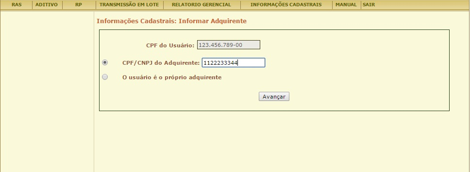

Passo 3: O Sistema apresenta uma tela para a inserção dos dados
cadastrais.

**Fluxo de Registro Inicial**

O Sistema apresenta os dados do Usuário/Responsável pelo Registro (nome
e CPF) bem como o CNPJ e Razão Social da Empresa Adquirente, oriundos do
e-CPF e da Procuração eletrônica em fundo cinza, e os demais campos a
serem preenchidos em branco.

No Fluxo de Registro inicial os campos obrigatórios, assinalados com
asterisco, não apresentam nenhum dado e precisam ser preenchidos. São
campos obrigatórios:

> \- Telefone do [Usuário/Responsável pelo Registro](#Usuário);
>
> \- E-mail do Usuário/Responsável pelo Registro;
>
> \- Nome Fantasia da Empresa Adquirente;
>
> \- Telefone da Empresa Adquirente;
>
> \- E-mail de contato da Empresa Adquirente;
>
> \- Endereço da Empresa Adquirente;
>
> \- Nome do [Diretor de Relações Governamentais ou
> Equivalente](#Diretor) da Empresa Adquirente;
>
> \- Telefone do Diretor de Relações Governamentais ou Equivalente da
> Empresa Adquirente;
>
> \- E-mail do Diretor de Relações Governamentais ou Equivalente da
> Empresa Adquirente;

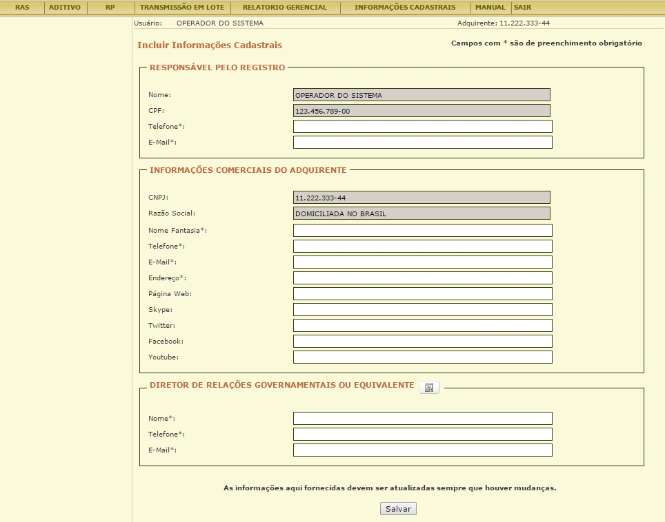

Existem outros Campos de preenchimento opcional:

> \- Endereço Web da Empresa Adquirente;
>
> \- Nome da Conta *Skype* da Empresa Adquirente;
>
> \- Perfil do *Twitter* da Empresa Adquirente;
>
> \- Perfil do *Facebook* da Empresa Adquirente;
>
> \- Endereço do Canal do *Youtube* da Empresa Adquirente.

**Fluxo de Manutenção de Informações**

Após 1 ano, ou sempre que houver alguma alteração nas informações
incluídas no cadastro do Siscoserv, o Usuário / Responsável pelo
Registro poderá acessar o campo **Informações Cadastrais** e atualizar
ou confirmar as informações previamente inseridas.

Neste caso, o Sistema disponibilizará uma tela tanto com as informações
capturadas do e-CPF e da procuração eletrônica quanto com aquelas
previamente inseridas pelo usuário.

Anualmente, será solicitada a atualização imediata dos Campos
Obrigatórios, assim que um novo Registro for iniciado.

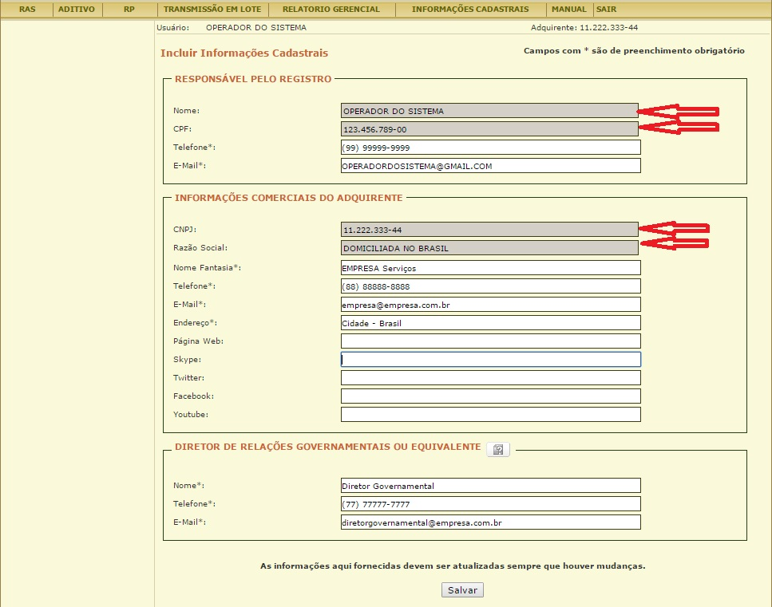

Passo 4: Após o preenchimento das informações, o Usuário/Responsável
clica em Salvar.

#### 1.5.2. Caso 2 -- Usuário/Responsável pelo Registro representa Pessoa Física

Passo 1: [Usuário/Responsável pelo Registro](#Usuário) acessa o
Siscoserv e clica em Informações cadastrais;

Obs: No primeiro acesso do usuário ao Sistema o usuário será
direcionado diretamente para a ficha de Informações Cadastrais. Não será
possível efetuar novo registro antes de preencher os dados
solicitados.

Passo 2: Preenche o CPF da Pessoa Física que está representando e clica
em avançar;

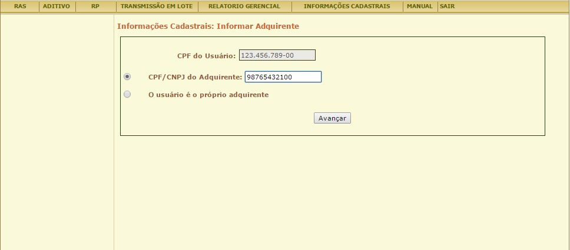

Passo 3: O Sistema apresenta uma tela para a inserção dos Dados
cadastrais.

**Fluxo de Registro Inicial**

O Sistema apresenta os dados do Usuário/Responsável pelo Registro bem
como o Nome e CPF da Pessoa Física Adquirente, oriundos do e-CPF e da
Procuração eletrônica, que se apresentam em fundo cinza, e os demais
campos a serem preenchidos em branco.

No Fluxo de Registro inicial os campos obrigatórios, assinalados com
asterisco, não apresentam nenhum dado e precisam ser preenchidos. São
campos obrigatórios:

> \- Telefone do [Usuário/Responsável pelo Registro](#Usuário);
>
> \- E-mail do Usuário/Responsável pelo Registro;
>
> \- Endereço da [Pessoa Física Adquirente](#PF);
>
> \- Telefone da Pessoa Física Adquirente;
>
> \- E-mail de contato da Pessoa Física Adquirente;

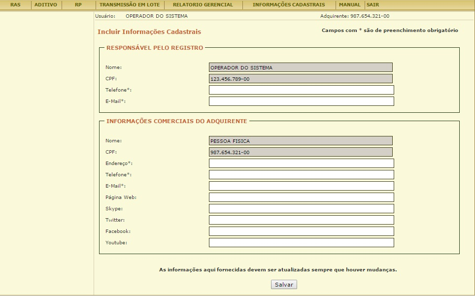

Existem outros campos de preenchimento opcional. São campos de
preenchimento opcional:

> \- Endereço Web da Pessoa Física Adquirente;
>
> \- Nome da Conta Skype Pessoa Física Adquirente;
>
> \- Perfil do *Twitter* da Pessoa Física Adquirente;
>
> \- Perfil do *Facebook* da Pessoa Física Adquirente;
>
> \- Endereço do Canal do *Youtube* da Pessoa Física Adquirente.

**Fluxo de Manutenção de Informações**

Após 1 ano, ou sempre que houver alguma alteração nas informações
incluídas no cadastro do Siscoserv, o Usuário / Responsável pelo
Registro poderá acessar o campo **Informações Cadastrais** e atualizar
ou confirmar as informações previamente inseridas.

Neste caso, o Sistema disponibilizará uma tela tanto com as informações
capturadas do e-CPF e da procuração eletrônica quanto com aquelas
previamente inseridas pelo usuário.

Anualmente, será solicitada a atualização imediata dos Campos
Obrigatórios assim que um novo Registro for iniciado.

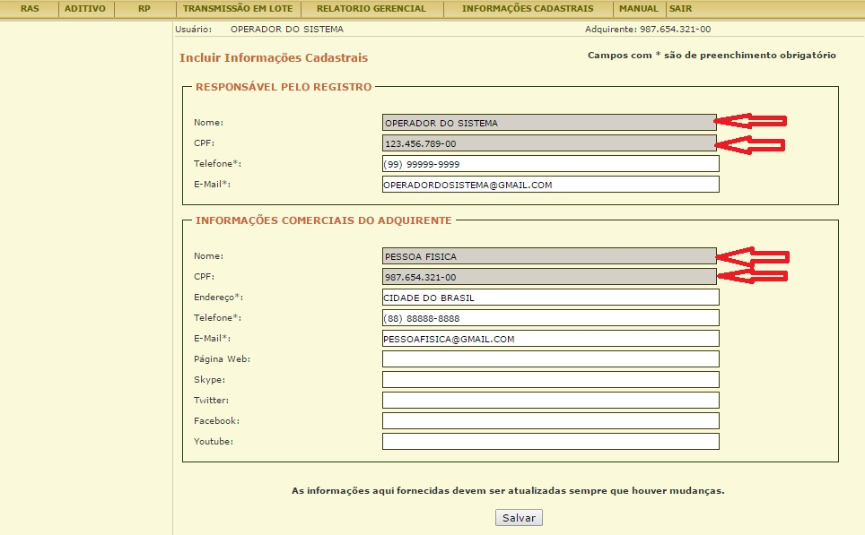

Passo 4: Após a atualização das informações, o Usuário/Responsável clica
em Salvar.

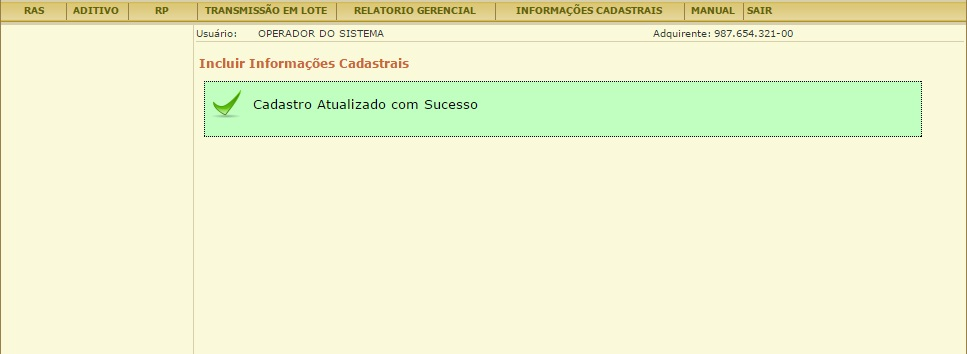

#### 1.5.3. Caso 3 -- Usuário/Responsável pelo Registro é o próprio Adquirente

Passo 1: Responsável pelo Registro acessa o Siscoserv e clica em
Informações cadastrais;

Obs: No primeiro acesso do usuário ao Sistema, o usuário será
direcionado diretamente para a ficha de Informações Cadastrais. Não será
possível efetuar novo registro antes de preencher os dados
solicitados.

Passo 2: Seleciona a Opção "O usuário é o próprio Adquirente" e clica em
Avançar;

Passo 3: O Sistema apresenta uma tela para a inserção dos Dados
cadastrais.

**Fluxo de Registro Inicial**

O Sistema apresenta os dados do Usuário/Responsável pelo Registro,
oriundos do e-CPF e da Procuração eletrônica, que se apresentam em fundo
cinza, e os demais campos a serem preenchidos em branco. Neste caso, os
dados do Usuário/Responsável pelo Registro são os mesmos da Pessoa
Física vendedora que apenas deverá complementar as demais informações
exigidas pelo Sistema.

No Fluxo de Registro inicial os campos obrigatórios, assinalados com
asterisco, não apresentam nenhum dado e precisam ser preenchidos. São
campos obrigatórios:

> \- Telefone da Pessoa Física Adquirente;
>
> \- E-mail de contato da Pessoa Física Adquirente;
>
> \- Endereço da Pessoa Física Adquirente;

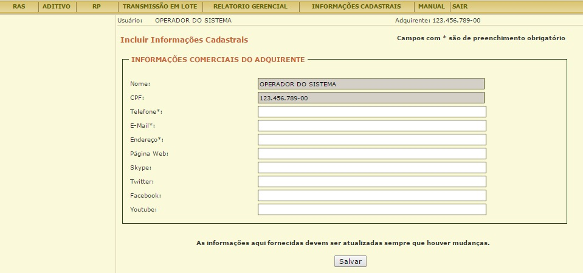

Existem outros campos de preenchimento opcional:

> \- Endereço Web da Pessoa Física Adquirente;
>
> \- Nome da Conta Skype Pessoa Física Adquirente;
>
> \- Perfil do *Twitter* da Pessoa Física Adquirente;
>
> \- Perfil do *Facebook* da Pessoa Física Adquirente;
>
> \- Endereço do Canal do *Youtube* da Pessoa Física Adquirente.

**Fluxo de Manutenção de Informações**

Após 1 ano, ou sempre que houver alguma alteração nas informações
incluídas no cadastro do Siscoserv, o Usuário/Responsável pelo Registro
poderá acessar o campo **Informações Cadastrais** e atualizar ou
confirmar as informações previamente inseridas.

Neste caso, o Sistema disponibilizará uma tela tanto com as informações
capturadas do e-CPF e da procuração eletrônica quanto com aquelas
previamente inseridas pelo usuário.

Anualmente, será solicitada a atualização imediata dos Campos
Obrigatórios assim que um novo Registro for iniciado.

Passo 4: Após a atualização das informações, o Usuário/Responsável clica
em Salvar.

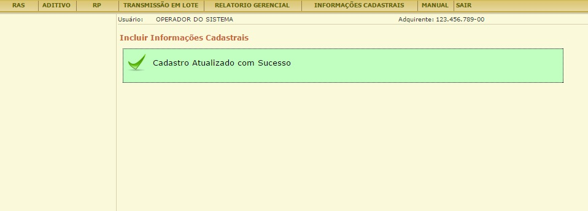

## 2. Procedimentos relativos ao registro no Módulo Aquisição

Para entrar no Módulo Aquisição do Siscoserv, o usuário deve acessar o
sítio [www.siscoserv.mdic.gov.br](http://www.siscoserv.mdic.gov.br) ou o
Centro Virtual de Atendimento ao Contribuinte (Portal e-CAC) localizado
no sítio www.receita.fazenda.gov.br e, antes de validar o certificado
digital que autoriza o acesso ao Sistema, selecionar Siscoserv **-
Módulo Aquisição** no campo **Escolha um dos serviços disponíveis:
Sistema.**

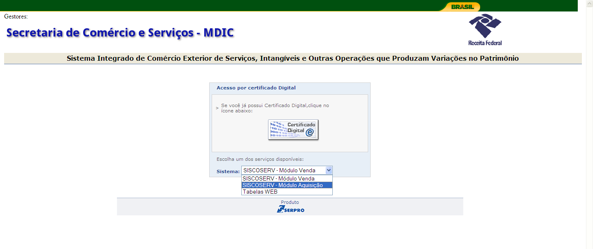

Nota: As telas podem apresentar configurações diferentes, dependendo do
navegador de internet utilizado pelo usuário.

Em seguida, o usuário clica no símbolo do **Certificado Digital @** e o
Sistema solicitará a senha de validação do Certificado.

Os registros no Siscoserv podem ser feitos de forma individualizada ou
por Transmissão em Lote.

Os registros individualizados no Siscoserv devem seguir as etapas de
preenchimento descritas nos [itens 2.1](#_3.1_O_Registro) e
[2.2](#inclusão-do-rp) do capítulo 2 deste Manual.

A transmissão em lote permite a inclusão de uma grande quantidade de
registros ao mesmo tempo e deve seguir os passos descritos no [item 3
deste capítulo](#_4._Transmissão_em). A transmissão em lote é feita por
meio do envio de um ou mais arquivos do tipo XML, compactados no formato
ZIP.

Para a criação dos arquivos que devem ser transmitidos, estão
disponibilizados os seguintes documentos:

[- Orientações Técnicas para o desenvolvimento da funcionalidade
Transmissão em Lote do SISCOSERV Módulos Venda e
Aquisição](http://www.mdic.gov.br/images/REPOSITORIO/scs/decin/Orienta%C3%A7%C3%B5es_T%C3%A9cnicas.pdf);

\- [Modelos dos Arquivos XML e XSD para Transmissão em
Lote](http://www.mdic.gov.br/images/REPOSITORIO/scs/decin/Modelos_dos_Arquivos_XML_e_XSD_para_Transmiss%C3%A3o_em_Lote_-_V_2.0.zip);
e

\- [Tabelas de Códigos do Siscoserv para Transmissão em
Lote](http://www.mdic.gov.br/images/REPOSITORIO/scs/decin/Tabelas_de_C%C3%B3digos_do_Siscosev_para_Transmiss%C3%A3o_em_Lote.zip).

Cada arquivo XML contém informações referentes a uma funcionalidade:
Inclusão de RAS, Aditivo ao RAS, Retificação do RAS, Retificação do
Aditivo ao RAS, Inclusão do RP ou Cancelamento de RP. Não é possível
incluir num mesmo arquivo XML informações de duas ou mais
funcionalidades, por exemplo, informações sobre a Retificação de um RAS
e sobre o Cancelamento de um RP. Os arquivos XML devem conter as mesmas
informações requeridas no preenchimento manual do
RAS.

### 2.1. Inclusão do RAS

Para incluir um Registro de Aquisição de Serviços (RAS) é preciso
acessar o *menu* **RAS** e em seguida a opção **Incluir**.

 

O campo **CPF do Usuário** é preenchido automaticamente pelo Sistema com
informação advinda de seu [Certificado Digital](#certificado).

 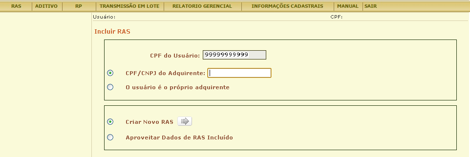

No campo **CPF/CNPJ do Adquirente,** o usuário representante legal de
outra pessoa, física ou jurídica, deve informar o CPF ou CNPJ do
adquirente representado. Caso o usuário seja o próprio adquirente, então
deve marcar a opção que indica essa situação. Para atuar como
representante legal de outra pessoa, física ou jurídica, o usuário deve
possuir [procuração eletrônica](#_2.3_O_que) do representado.

Para iniciar a inclusão do registro, há duas opções: **Criar Novo RAS**
ou **Aproveitar Dados de RAS Incluído**.

Na opção **Criar Novo RAS**, os campos a serem preenchidos estarão em
branco. Para usar essa opção, selecione **Criar Novo RAS** e acione o
botão 

Cada RAS destina-se a apenas um contrato de prestação de serviços[^14].
Cada contrato pode conter uma ou mais [operações](#operação) em um mesmo
RAS, desde que todas as operações sejam cursadas com o mesmo vendedor.

Na opção **Aproveitar Dados de RAS Incluído** o Sistema permite a
seleção de um RAS existente, cujos dados serão recuperados para a
inclusão de um novo RAS. Na tela **Dados do [Negócio](#Negócio)**, os
campos **Valor**, **Data de Início** e **Data de Conclusão** devem ser
preenchidos com os dados do novo registro.

Para usar essa opção, selecione **Aproveitar Dados de RAS Incluído**. O
Sistema apresentará as seguintes opções:

a)  **Informar o Número do RAS:** selecionada esta opção, preencha o
    campo com número de RAS do qual se deseja aproveitar os dados e
    acione o botão .

 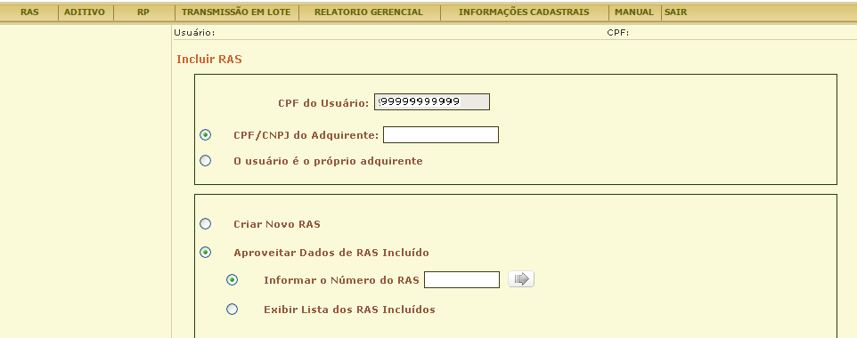

b)  **Exibir Lista dos RAS Incluídos:** selecionada esta opção, acione o
    botão . O Sistema exibe lista de RAS
    incluídos, do mais recente para o mais antigo. Acione o botão
    , à direita do RAS desejado.

 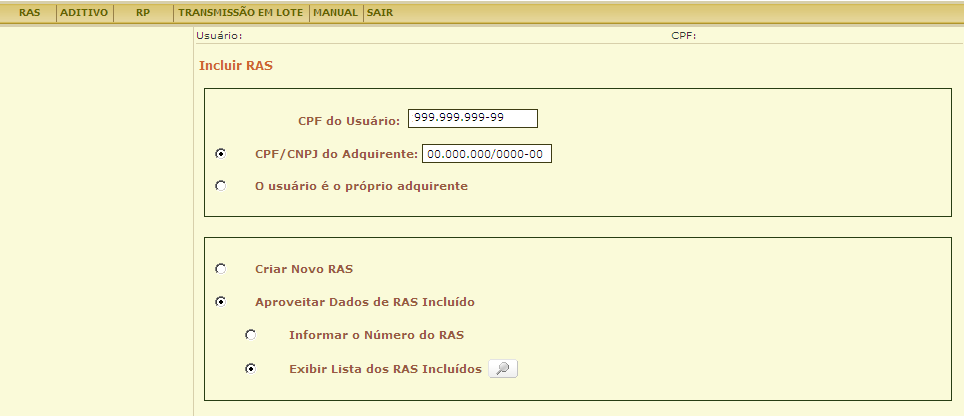

 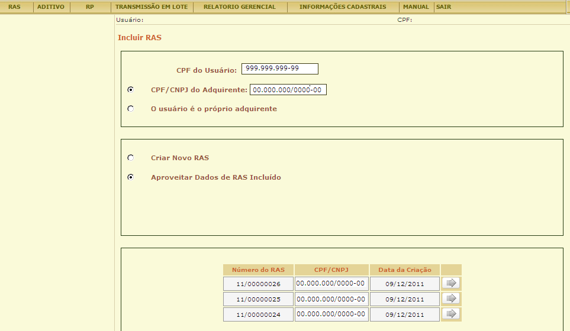

#### Opção de Atendimento à Legislação

Em seguida, o Siscoserv apresenta a seguinte tela:

 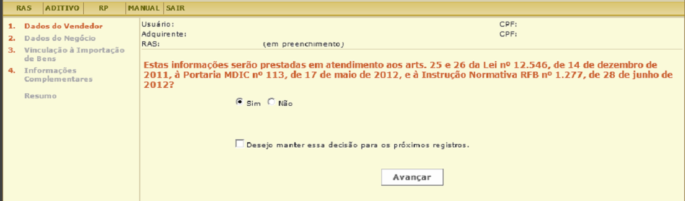

O usuário deve indicar que as informações objeto de registro serão
prestadas em atendimento aos arts. 25 e 26 da Lei n°
12.546, de 14 de dezembro de 2011, à Portaria MDIC n°
113, de 17 de maio de 2012, e à Instrução Normativa RFB
n° 1.277, de 28 de junho de 2012.

Escolha uma das opções de atendimento à legislação para seguir adiante.
No caso da não indicação de que o registro será feito em atendimento
concomitante à legislação supracitada, o adquirente estará sujeito às
sanções previstas no art. 7° ou no art.
8° da Portaria Conjunta RFB/SCS n°
1.908, de 19 de julho de 2012.

É possível manter a opção de atendimento à legislação para os futuros
RAS, selecionando o campo **Desejo manter essa decisão**. Após marcar
essa opção, a tela não será mostrada novamente em futuros preenchimentos
que assumirão a última opção marcada.

A decisão pode ser revista pelo usuário, clicando em **Atendimento à
legislação** no *menu* lateral esquerdo na tela de **Resumo**.

#### Dados do Vendedor

Em **Dados do Vendedor**, devem ser incluídos os dados do residente ou
domiciliado no exterior vendedor da [operação](#operaçao) realizada com
pessoa física, pessoa jurídica ou [ente despersonalizado](#entes)
[residente](#residentenoBrasil) ou domiciliado no Brasil.

 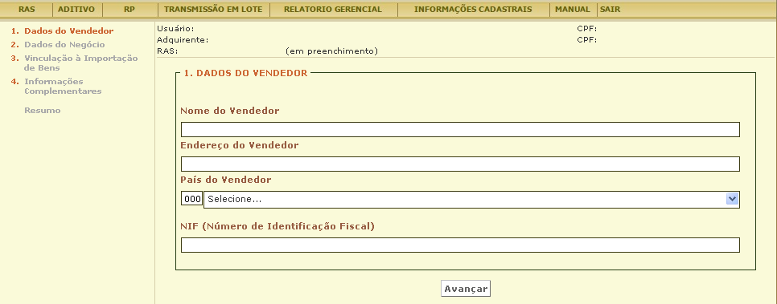

**Nome do Vendedor** -- Preencha o nome da pessoa física ou o nome
comercial da pessoa jurídica vendedora do [negócio](#Negócio).

**Endereço do Vendedor** -- Preencha com o endereço da pessoa física ou
da pessoa jurídica vendedora do [negócio](#Negócio).

**País do Vendedor** -- Selecione o país do vendedor do negócio na lista
disponível de países em **País do Vendedor**, ou informar manualmente o
código do país no campo numérico.

#### NIF - Número de Identificação Fiscal

Preencha com número
de Identificação Fiscal do vendedor do [negócio](#Negócio). O
fornecimento dessa informação é obrigatório nos casos de países que
adotam códigos de identificação fiscal.

Caso não seja informado o **NIF**, deve-se selecionar uma das opções de
**Motivo do não preenchimento**: **Dispensado do NIF** ou **País não
exige NIF**.

 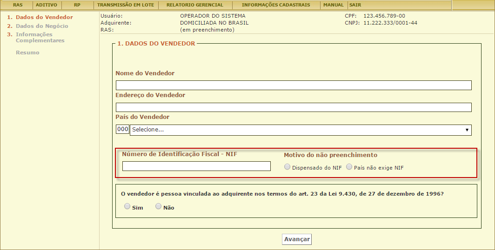

Deve-se indicar se o vendedor é pessoa vinculada ao adquirente nos
termos do [art. 23 da Lei 9.430 de dezembro de
1996](http://www.planalto.gov.br/ccivil_03/LEIS/L9430.htm#art23).

 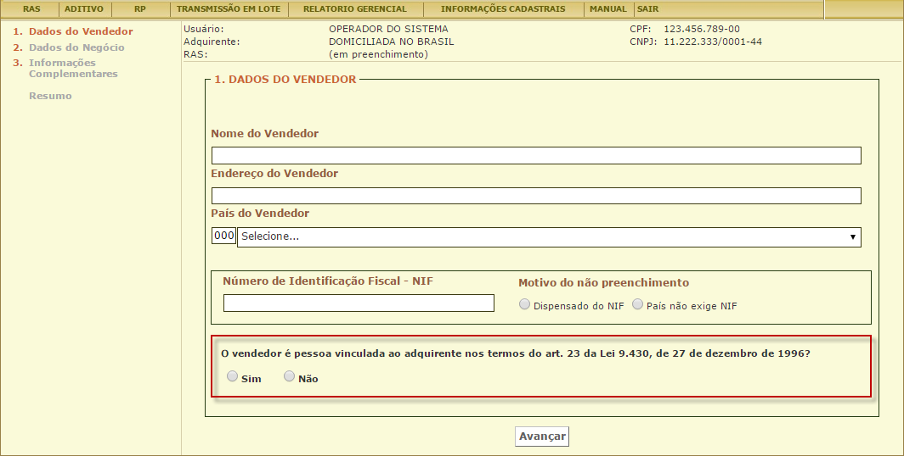

Caso o vendedor seja pessoa vinculada ao adquirente, selecione o tipo de
vinculação.

 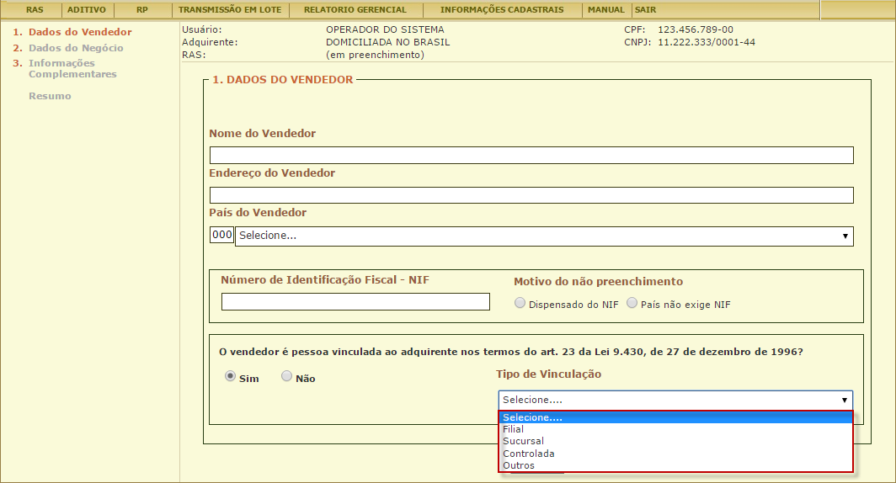

Acione **Avançar** para validar os dados e seguir para a próxima tela
(**Dados do Negócio**).

#### Dados do Negócio

Em **Dados do [Negócio](#Negócio)** são incluídos os dados das
[operações](#operaçao) de aquisição de serviços [^15], por
[residentes](#residentenoBrasil) ou domiciliados no Brasil de residentes
ou domiciliados no exterior.

Pode ser incluída uma ou mais [operações](#operaçao) em cada RAS. Por
exemplo, nos casos em que o [negócio](#Negócio) comercial envolva mais
de uma NBS, mais de uma etapa, mais de um país de destino, ou mais de um
modo de prestação, desde que tal(is) operação(ões) esteja(m)
relacionada(s) ao mesmo vendedor.

O Sistema não admite registro de [operações](#operaçao) com [início de
prestação](#datainicio) em data futura, ou seja, registram-se apenas as
operações já realizadas ou cuja realização já tenha sido iniciada.

Nos [negócios](#Negócio) com pelo menos uma [operação](#operaçao) já
iniciada e que tenha sido objeto de RAS, as demais operações a serem
realizadas em momento futuro devem ser registradas após seu início, por
meio de [aditivo ao RAS. ](#inclusão-de-aditivo-ao-ras)

Campos a serem preenchidos em Dados do [Negócio](#Negócio):

#### Código NBS / Descrição da NBS

Vide [item 9, do Capítulo 1 deste Manual.](#9)

A prestação de serviços[^16] iniciada até 31
de dezembro de 2018 deve ser registrada tendo por base a NBS 1.1,
publicada pela Portaria Conjunta RFB / SCS nº
1.820, de 2014.

A prestação de serviços[^17] iniciada a partir de 1º de janeiro de 2019
deve ser registradas tendo por base a [NBS
2.0](http://www.mdic.gov.br/images/REPOSITORIO/scs/decos/NBS/Anexo_I_NBS_2.0_com_altera%C3%A7%C3%B5es_6.12.18.pdf),
publicada pela [Portaria Conjunta RFB/SCS nº 2.000, de 18 de dezembro de
2018.](http://pesquisa.in.gov.br/imprensa/jsp/visualiza/index.jsp?data=20/12/2018&jornal=515&pagina=139&totalArquivos=243),
que produz efeitos a partir de 1º de janeiro de 2019.

#### Código do País / País de Destino

Identifica o país de destino da prestação do serviço, da aquisição de
[intangível](#Intangível) ou da realização de [outra operação que
produza variação no patrimônio](#Variações), podendo ser diferente do
país do adquirente. No Módulo Aquisição, o país de destino geralmente
será o Brasil, exceto quando se configurar o Modo 2 de prestação --
Consumo no Exterior.

No caso do Modo 2 no que se refere à aquisição de serviços relacionados
ao turismo, o País de Destino é diferente da opção Brasil.

Exemplos:

\(1) Prestador de serviço residente ou domiciliado na Alemanha é
contratado por residente ou domiciliado no Brasil para prestação do
serviço no Panamá. O país de destino é o Panamá.

\(2) Serviços de projeto e desenvolvimento de estruturas e conteúdo de
páginas eletrônicas realizados na Inglaterra para cliente residente ou
domiciliado no Brasil. O país de destino é o Brasil.

\(3) Capacitação na Rússia de funcionários de pessoa jurídica domiciliada
no Brasil. O país de destino é a Rússia.

\(4) Arquiteto residente na Espanha desloca-se para desenvolver projeto
de arquitetura no Brasil. O país de destino é Brasil.

O usuário pode informar diretamente o código do país, ou localizá-lo na
lista disponível de países em **País de Destino**.

#### Código da Moeda / Descrição da Moeda 

Identifica a moeda da transação comercial. O usuário pode informar
diretamente o código da moeda, ou localizá-lo na lista **Descrição da
Moeda**.

Nos casos em que não é possível registrar a moeda da transação comercial
por ausência do código da moeda na tabela disponível no Sistema ou por
ausência da taxa de conversão disponível, o valor comercial deverá ser
convertido em dólar dos Estados Unidos da América, com base em taxa de
conversão fixada por autoridade monetária do país da moeda em questão na
data de início da prestação do serviço[^18]. Neste caso, a moeda a ser
indicada será o dólar dos Estados Unidos da América, e obrigatoriamente
deve ser informado em **Informações Complementares** o valor na moeda da
transação comercial, bem como a taxa de conversão utilizada e a
respectiva fonte e data.

Todas as operações registradas em um RAS devem ser informadas em uma
única **Moeda,** na primeira operação daquele registro. Da segunda
operação daquele registro em diante, o campo ficará bloqueado para
edição.

Caso o [negócio](#Negócio) registrado envolva mais de uma moeda de
pagamento, o usuário deve efetuar um novo RAS para cada moeda
transacionada.

Durante o preenchimento do registro, caso haja mais de uma
[operação](#operaçao) inserida no RAS e o usuário deseje alterar a
moeda, deve-se concluir a inclusão da operação e na próxima tela alterar
a moeda na primeira operação registrada naquele RAS acionando o botão
.

 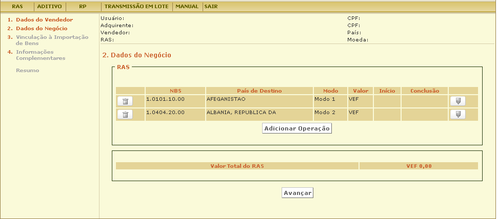

A alteração da **Moeda** na primeira operação do registro altera a moeda
das demais operações, inclusive das operações de aditivos. Entretanto
essa alteração não promove a conversão automática do valor em função da
moeda alterada. Se for o caso, o usuário deve converter o valor de cada
operação em função da nova moeda do registro.

 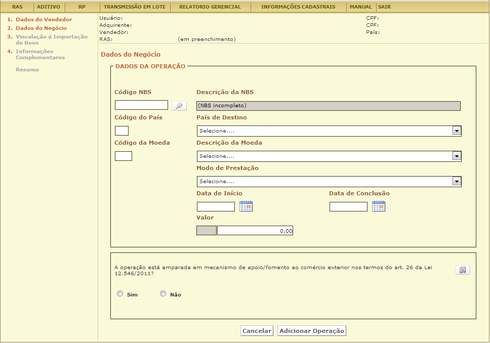

#### [Modo de Prestação](#modos-de-prestação-de-serviços-módulo-aquisição)

O usuário deve selecionar item na lista **Modo de Prestação**, dentre as
opções:

Modo 1 -- Transfronteiriço

Modo 2 -- Consumo no Exterior

Modo 4 -- Movimento Temporário de Pessoas Físicas

O registro no Módulo Aquisição deve indicar, sempre que possível, o
valor da operação correspondente ao Modo de Prestação. Assim, caso uma
operação de aquisição de um serviço envolva mais de um modo de
prestação, estes devem ser informados no RAS. Caso isso não seja
possível, deve ser indicado o modo de prestação predominante para a
aquisição daquele serviço associado ao valor total da operação.

Não há registro de operação no [Modo 3](#Modo3) -
Presença Comercial no Brasil no Módulo Aquisição pelas
razões explicitadas na pagina 14 deste Manual.

#### Data de Início

Data em que se [iniciou a prestação do serviço](#datainicio) adquirido,
a transferência do [intangível](#Intangível) ou a realização de [outra
operação que produza variações no patrimônio](#Variações). A data
informada não pode ser posterior à data em que a operação estiver sendo
registrada no Sistema.

#### Data de Conclusão

Data em que foi ou será concluída a prestação do serviço adquirido, a
transferência do [intangível](#Intangível) ou a realização de [outra
operação que produza variação no patrimônio](#Variações).

#### Valor

Deve ser especificado o valor da [operação](#operaçao), na moeda
indicada em **Código da Moeda / Descrição da Moeda.**

Para o Siscoserv é considerado como valor comercial das operações o
valor bruto pactuado entre as partes adicionado de todos os custos
necessários para a efetiva prestação do serviço, transferência do
[intangível](#Intangível) ou realização de [outra operação que produza
variação no patrimônio](#Variações). Estes valores deverão ser
considerados no mesmo código NBS da operação final.

Exemplo:

1)  Empresa (A), domiciliada no Brasil, adquire um serviço de uma
    > empresa (B), residente no exterior. Posteriormente, a empresa (B)
    > envia uma nota de despesa solicitando reembolso de transportes,
    > alimentação e hospedagem, entre outros custos incorridos durante a
    > prestação desse serviço.

Neste caso, a empresa (A) deve adicionar o valor dessas despesas ao
valor total da operação adquirida, mediante retificação do RAS, conforme
o item [2.1.2 do Capítulo 2](#retificação-do-ras) deste Manual.

Só poderá ser informado valor acima de 0,00 (zero).

**Gastos Pessoais a Serviço do Empregador**

Os gastos pessoais no exterior, relativos à aquisição de serviços[^19],
efetuados por pessoas físicas residentes no País, que se desloquem
temporariamente ao exterior a serviço de pessoas jurídicas domiciliadas
no País, são operações da pessoa física no Siscoserv.

São exemplos de gastos pessoais a aquisição de refeições, hospedagem e
locomoção no exterior em viagens de negócios, de treinamento, missões
oficiais, participação em congressos, feiras e conclaves.

Os gastos pessoais no exterior de pessoas físicas residentes no País, em
operações de valor superior a US\$ 30.000,00 (trinta mil dólares dos
Estados Unidos da América), ou o equivalente em outra moeda, no mês,
relativas à aquisição de serviços[^20], devem ser registrados pela
pessoa física pelos seus montantes acumulados mensalmente, por NBS e por
País do vendedor, conforme orientado [na situação especial de registro
4.3.3](#operação-envolvendo-gastos-pessoais-no-exterior-por-pessoas-físicas-residentes-no-brasil),
no Capítulo 1 deste Manual.

Neste caso, há duas possibilidades:

1.  Se a pessoa física tiver se deslocado temporariamente ao exterior a
    serviço de pessoa jurídica domiciliada no Brasil, e seus gastos
    pessoais forem superiores a US\$ 30.000,00 ao mês deverá marcar **(
    ) Sim** no campo **Gastos Pessoais a Serviço do Empregador?**

2.  Se a pessoa física tiver se deslocado ao exterior para uma viagem às
    suas próprias custas, seja de turismo, para estudo, ou outra, e seus
    gastos pessoais forem superiores a US\$ 30.000,00 ao mês, deverá
    marcar **( ) Não** no campo **Gastos Pessoais a Serviço do
    Empregador?**

 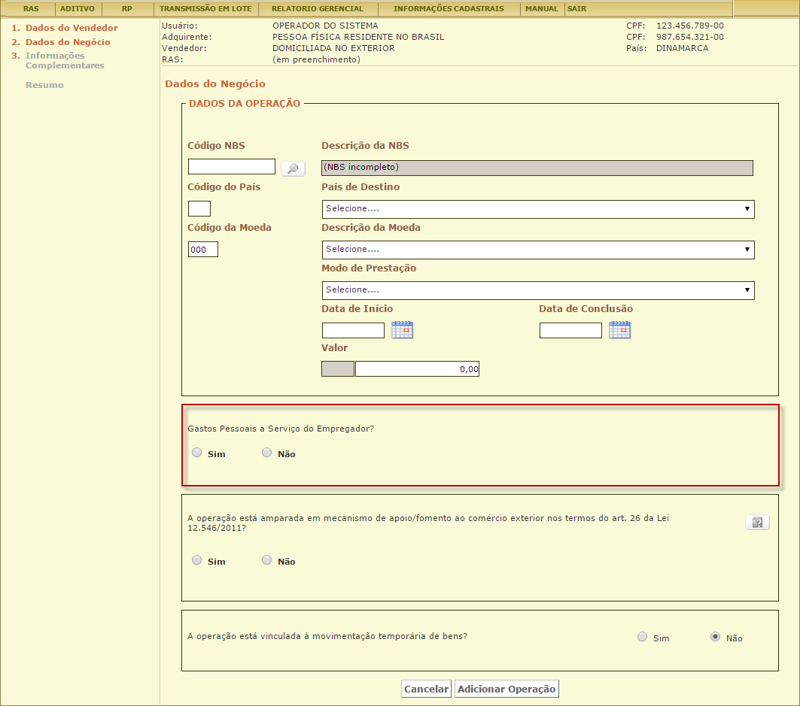

No caso de a operação referir-se a um gasto pessoal a serviço do
empregador, o usuário deverá fornecer o CNPJ do empregador.

#### [Mecanismo](#enquadramento) de Apoio/Fomento

Para informar **Mecanismo de apoio/fomento** da
operação, tal como previsto no [item
10](file:///\\FILESERVER\mdic$\SCS\DECIN\Trabalho\CGSE\Pasta%20Técnica\SISCOSERV\MANUAIS\Aquisição\11aEdicaoManualModuloAquisição_versao%20final.doc#10.  Enquadramento (Mecanismo de apoio / fomento ao Comércio Exterior de Serviços e Intangíveis))
do capítulo 1 deste Manual, marque "sim" à direita da pergunta: "A
operação está amparada em mecanismo de apoio/fomento ao comércio
exterior nos termos do art. 26 da Lei 12.546/2011?". O Sistema abrirá
uma nova tela para inclusão do(s) mecanismo(s) de apoio.

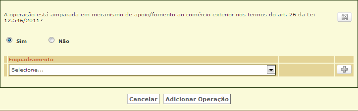

Selecione o [Mecanismo](#enquadramento) de
apoio/fomento desejado, no campo Enquadramento, e acione o botão
 para adicioná-lo ao RAS.

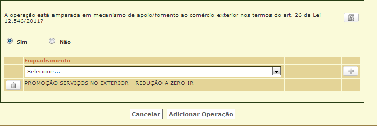

Caso deseje excluir um [Mecanismo](#enquadramento) de Apoio selecionado,
o usuário deve acionar o botão .

Para maiores informações acerca da lista de [Mecanismo](#enquadramento)s
de Apoio s disponíveis para seleção no Módulo Aquisição, veja o [item 10
do capítulo
1](#mecanismos-de-apoio-fomento-ao-comércio-exterior-de-serviços-e-intangíveis).

#### Vinculação à Movimentação Temporária de Bens

 Deve ser indicado se a operação está
vinculada à [movimentação temporária de bens](#movimetacaotemporaria).

Se a operação estiver vinculada à movimentação temporária de bens,
selecionar a opção **Sim**. Nesse caso, preencher os campos com o número
da [Declaração de Importação (DI)](#DI) e/ou com o número
da Declaração Única de Exportação (DU-E) ou do
[Registro de Exportação (RE)](#RE) averbado, se o registro ainda tiver
sido realizado no Siscomex.

Para incluir mais de um número de DI ou de DU-E (ou RE), clique no ícone
.

Para excluir número de DI ou de DU-E (ou RE), clique no ícone
 à direita do número registrado.

#### Inclusão de Operação no RAS

Após preenchimento dos campos **Código NBS / Descrição da NBS, Código do
País / País de Destino**, **Código da Moeda / Descrição da Moeda**,
**Modo de Prestação**, **Data de Início**, **Data de Conclusão**,
**Valor** e, se for o caso, de [Mecanismo](#enquadramento) de
apoio/fomento , deve-se acionar o botão **Adicionar Operação** para
inclusão da operação no RAS.

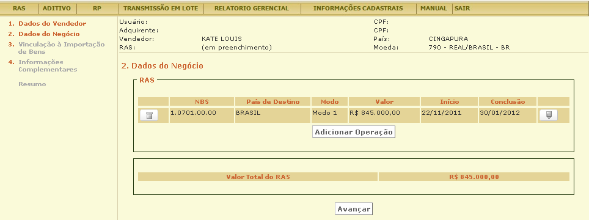

Caso deseje incluir outra operação no mesmo RAS, clique em **Adicionar
Operação.**

Caso deseje alterar uma [operação](#operaçao) adicionada ao RAS, acione
o botão .

Caso deseje excluir uma operação adicionada ao RAS, acione o botão
. A exclusão de uma operação só é possível antes da
confirmação da inclusão do RAS.

Após a confirmação da inclusão do RAS, os dados de uma operação somente
poderão ser alterados por meio da função **Retificar RAS.**

Caso não deseje adicionar mais operações, clicar em **Avançar.**

#### Informações Complementares

Destina-se ao preenchimento de informações pertinentes ao RAS que não
tenham campo específico no Sistema.

Os casos de obrigatoriedade de preenchimento deste campo estão indicados
nos seguintes itens:

[5. Quem deve efetuar registro no Siscoserv -- Módulo
Aquisição](#quem-deve-efetuar-registro-no-siscoserv-módulo-aquisição)
(Capítulo 1)

[3.1 O Registro de Aquisição de Serviços, Intangíveis e Outras Operações
que Produzam Variações no Patrimônio (RAS)](#_3.1_O_RVS)

[2.1 Inclusão do RAS](#inclusão-do-ras) (Capítulo 2)

[2.1.1 Inclusão de Aditivo ao RAS](#inclusão-de-aditivo-ao-ras)

[2.1.2 Retificação do RAS](#retificação-do-ras)

[2.1.3 Retificação do Aditivo ao RAS](#retificação-do-aditivo-ao-ras)

[2.2 Inclusão do RP](#inclusão-do-rp) (Capítulo 2)

Acione **Avançar** para seguir para o próximo passo.

 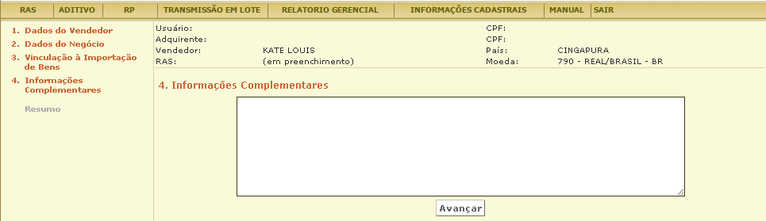

#### Resumo do RAS

A tela **Resumo do RAS** traz as informações preenchidas pelo usuário
para incluir o RAS.

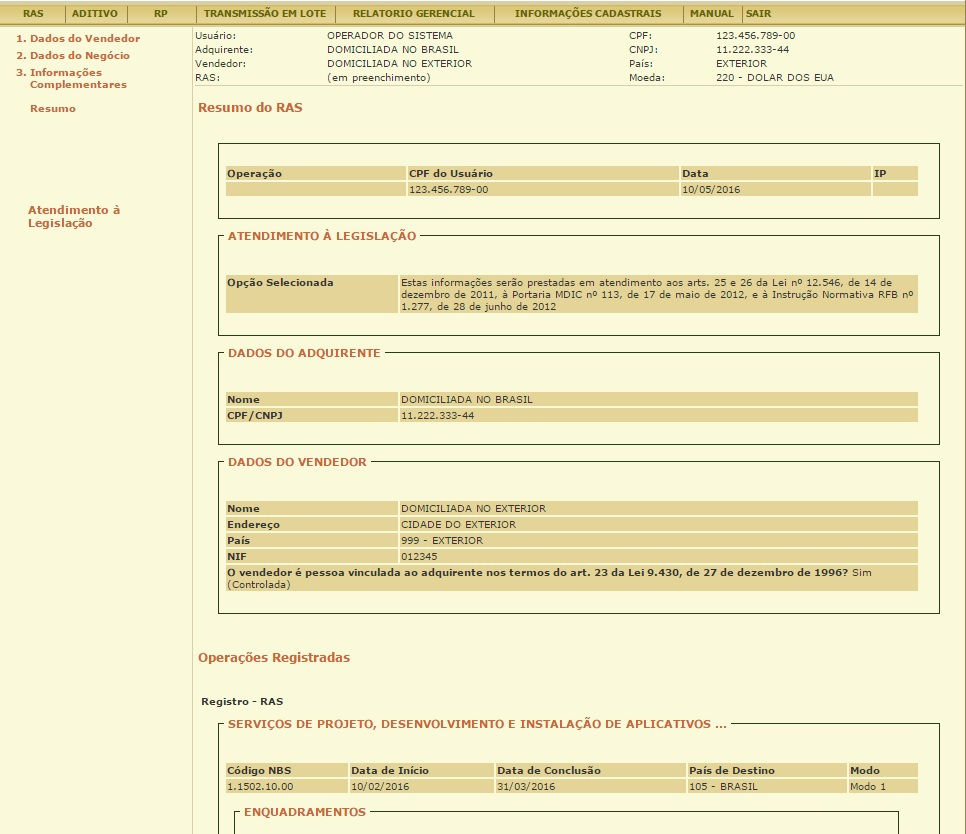

Os dados devem ser conferidos antes da inclusão do RAS.

Neste momento, caso necessite realizar alguma alteração, o usuário deve
acessar o tópico desejado por meio do *menu* à esquerda da tela. Em
seguida, deve realizar a alteração e clicar em **Avançar** até retornar
à tela **Resumo do RAS** ou, alternativamente, clicar em **Resumo** no
*menu* à esquerda.

Para que o RAS seja gerado é preciso acionar o botão **Incluir**.

O Sistema retornará mensagem de confirmação da inclusão dos dados no
Siscoserv e apresentará número de identificação do RAS.

 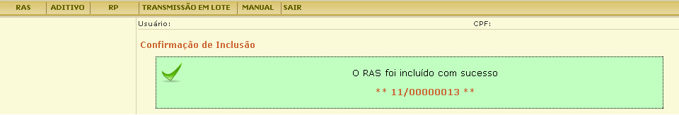

Após a disponibilização do Número de Confirmação da inclusão do RAS, o
registro está efetuado.

Convém manter controle dos números dos RAS incluídos no Siscoserv, para
facilitar os registros e/ou retificações posteriores relativos ao RAS.

**Após a inclusão de um RAS, não é possível o seu cancelamento,
admitindo-se apenas [retificações](#retificação-do-ras).**

#### 2.1.1 Inclusão de Aditivo ao RAS

O aditivo ao RAS deve ser usado para a inclusão de nova operação em um
RAS previamente incluído, quando houver complementação ou aditamento nos
termos do contrato ([negócio](#Negócio)), que envolva execução de outra
operação classificada em [NBS diferente](#NBS), ou ainda executada em
outro modo de prestação, outra etapa do negócio, período ou mesmo em
outro país.

Na inclusão de Aditivo, não é possível realizar alterações nos **Dados
do Vendedor**, tendo em vista tratar-se de dados do registro como um
todo e que só podem ser alterados pela função [**Retificar
RAS**](#retificação-do-ras).

Devido à publicação da [NBS
2.0](http://www.mdic.gov.br/images/REPOSITORIO/scs/decos/NBS/Anexo_I_NBS_2.0_com_altera%C3%A7%C3%B5es_6.12.18.pdf)[^21],
novos serviços[^22] derivados de complemento ou aditamento em termo de
contrato, que envolva operação iniciada a partir de 1º de janeiro de
2019, não poderão ser registrados por meio de Aditivo em um RAS incluído
até o dia 31 de dezembro de 2018.

Neste caso, o usuário deverá incluir um novo RAS, classificando o
serviço prestado[^23] de acordo com a [NBS
2.0](http://www.mdic.gov.br/images/REPOSITORIO/scs/decos/NBS/Anexo_I_NBS_2.0_com_altera%C3%A7%C3%B5es_6.12.18.pdf).

A inclusão de nova operação é realizada em [**Dados do
Negócio**](#DadosDoNegócio) e deve obedecer aos prazos descritos no
[item](#_3.1.1_Prazo_para) 4.1.1, do Capítulo 1 deste Manual.

Se for o caso, o usuário deve preencher os campos de **Vinculação à
Importação de Bens** e **Informações Complementares**, com os
respectivos dados adicionais relativos às operações incluídas.

Após a inclusão do aditivo ao RAS, os dados de uma operação somente
poderão ser alterados por meio da função **Retificar Aditivo ao RAS**.

Para incluir um Aditivo ao RAS, é preciso acessar o *menu* **Aditivo** e
em seguida a opção **Incluir**.

 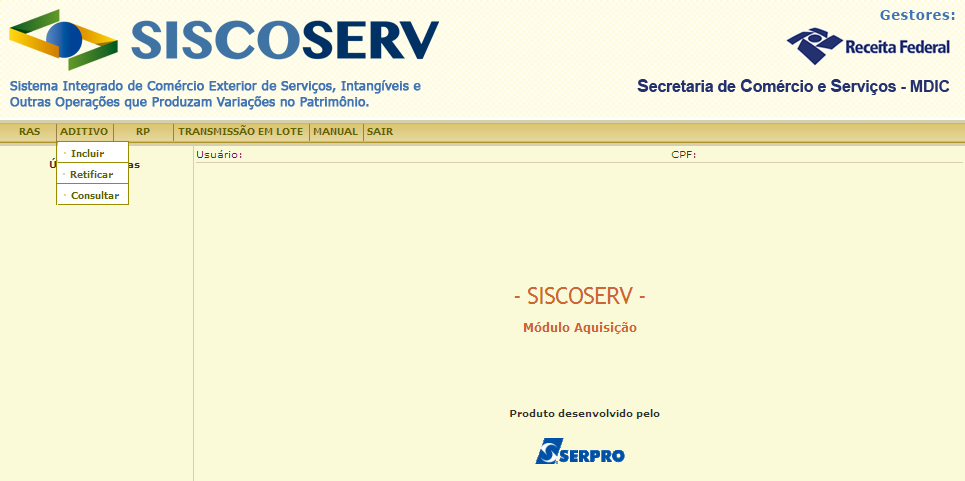

O campo **CPF do Usuário** é preenchido automaticamente pelo Sistema com
informação advinda do Certificado Digital do usuário.

No campo **CPF/CNPJ do Adquirente,** o usuário representante legal de
outra pessoa, física ou jurídica, deve informar o CPF ou CNPJ do
Adquirente representado. Caso o usuário seja o próprio adquirente, então
deve marcar a opção que indica essa situação. Para atuar como
representante legal de outra pessoa, física ou jurídica, o usuário deve
possuir [procuração eletrônica](#procuraçao) do representado.

  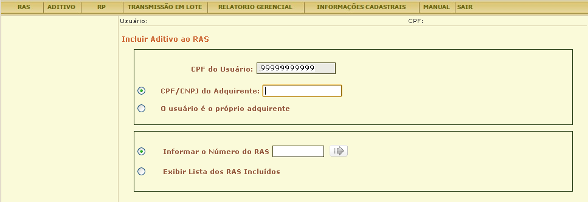

Para incluir um aditivo a um registro, o usuário tem como opções:
Informar o Número do RAS ou Exibir Lista de RAS Incluídos.

Selecionada a opção Informar o Número do RAS, preencha o campo com
número de RAS que se deseja aditar e acione o botão .

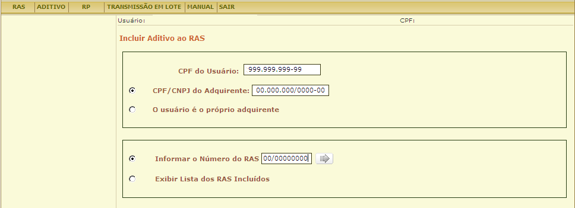

Selecionada a opção Exibir Lista de RAS Incluídos, acione o botão
. O Sistema exibe lista de RAS incluídos,
do mais recente para o mais antigo. Acione o botão , à direita do RAS desejado.

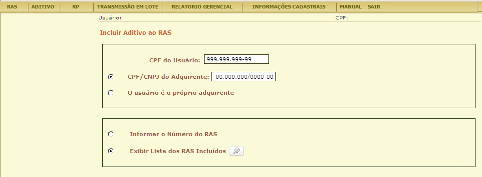

 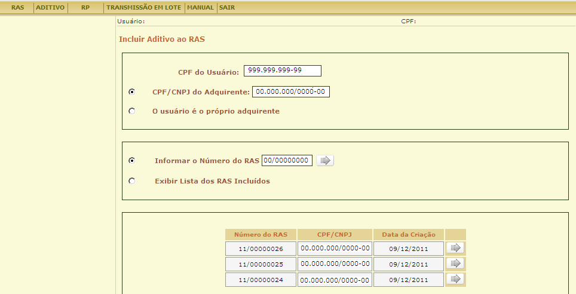

Após selecionar o RAS que deseja aditar, siga os passos descritos a
partir do tópico "2. Dados do Negócio" no item 2.1 - Passos para incluir
RAS.

O aditivo utiliza a mesma moeda cadastrada na primeira
[operação](#operaçao) do RAS. Caso a nova operação envolva outra moeda,
deve ser feito um novo RAS.

Após conferir os dados na tela **Resumo do RAS**, acione o botão
**Incluir** para gerar o Aditivo ao RAS.

O sistema retornará mensagem de confirmação da inclusão dos dados no
Siscoserv e apresentará número do aditivo ao RAS.

 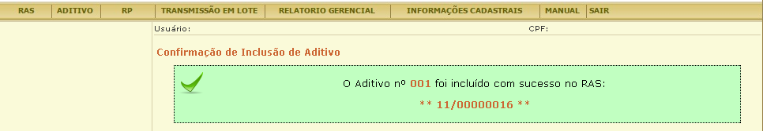

**Após a inclusão de um Aditivo ao RAS não é possível o seu
cancelamento, admitindo-se apenas retificações.**

Cabe ressaltar ainda que os registros inseridos a partir de um arquivo
de lote não podem ser edita-dos (retificados, aditados, etc.)
manualmente. Caso o usuário tente editar o registro manualmente, o
Sistema apresentará a seguinte tela:

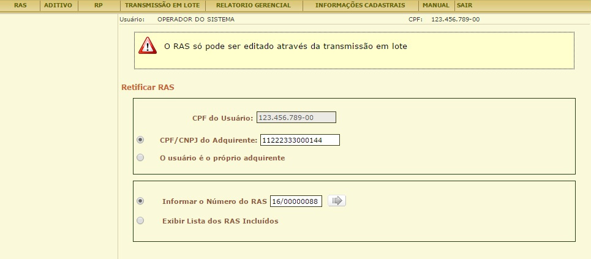

#### 2.1.2. Retificação do RAS

O RAS ou o Aditivo ao RAS **não podem ser cancelados**, cabendo apenas
retificações.

Não pode ser incluída nova operação por meio de retificação. Para
incluir uma nova operação em um RAS já incluído, utilize a função
[**Inclusão de** **Aditivo ao RAS**](#inclusão-de-aditivo-ao-ras)**.**

Para retificar um RAS é preciso acessar o *menu* **RAS** e em seguida
**Retificar**.

 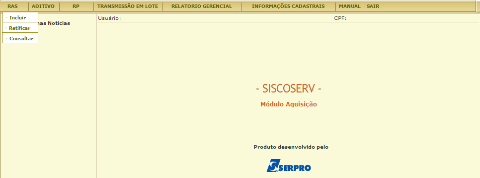

O campo **CPF do Usuário** é preenchido automaticamente pelo Sistema com
informação advinda do Certificado Digital do usuário.

No campo **CPF/CNPJ do Adquirente,** o usuário representante legal de
outra pessoa, física ou jurídica, deve informar o CPF ou CNPJ do
Adquirente representado. Caso o usuário seja o próprio adquirente, então
deve marcar a opção que indica essa situação. Para atuar como
representante legal de outra pessoa, física ou jurídica, o usuário deve
possuir [procuração eletrônica](#procuraçao) do representado.

Para retificar um RAS, o usuário tem como opções: Informar o Número do
RAS ou Exibir Lista de RAS Incluídos.

Selecionada a opção Informar o Número do RAS, preencha o campo com o
número de RAS que se deseja retificar e acione o botão .

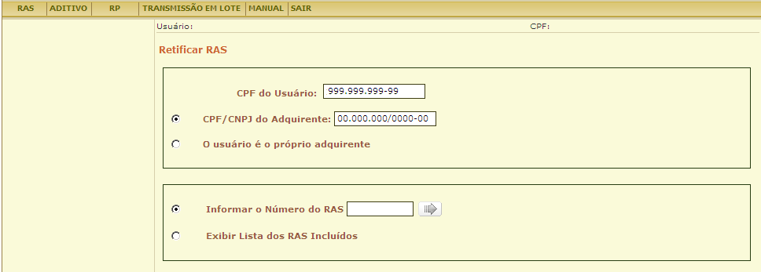

Selecionada a opção Exibir Lista de RAS Incluídos, acione o botão
. O Sistema exibe lista de RAS incluídos,
do mais recente para o mais antigo. Acione o botão , à direita do RAS desejado.

 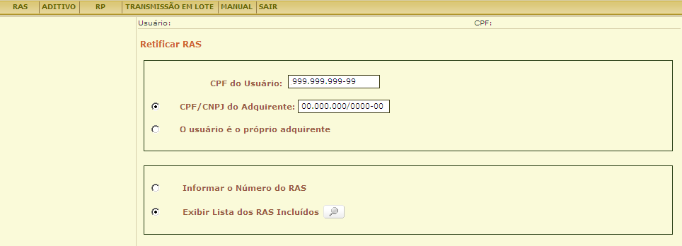

 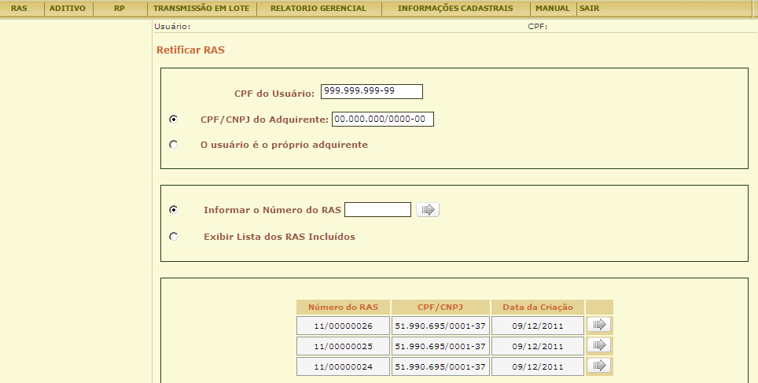

Após selecionar o RAS que deseja retificar, siga os passos descritos no
tópico **[2.1 -- Inclusão do RAS](#inclusão-do-ras).**

Após conferir os dados retificados na tela **Resumo do RAS**, acione o
botão **Incluir** para retificar o RAS. O sistema retornará mensagem de
confirmação de retificação dos dados no Siscoserv.

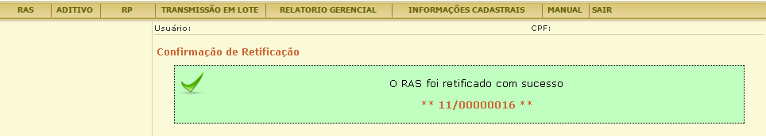

Os RAS podem ter todos os campos retificados antes da inclusão de
Pagamento da operação. Após o Pagamento da operação não podem ser
retificados os campos Código NBS e Moeda. Em caso de erro de
preenchimento nestes campos para as operações já pagas, proceder
previamente conforme o [item 2.2.2](#retificação-do-rp) deste capítulo -
Cancelamento do RP.

Caso, devido à necessidade de cancelamento do RP para retificar o RAS, o
usuário perca o prazo de inclusão de RP, devem ser incluídos em
Informações Complementares o número do RP cancelado e o número do RP que
o substituiu após a retificação do RAS.

A retificação do campo Moeda é feita apenas na primeira operação
inserida no RAS e altera automaticamente a moeda das demais operações,
inclusive das operações de aditivos. Os valores previamente cadastrados
são mantidos, ou seja, o Sistema não faz conversão de valores para a
nova moeda selecionada, devendo o usuário efetuar os ajustes nos
valores, caso necessário.

A retificação do Valor da [Operação](#operaçao) só é possível se esse
for maior ou igual aos valores já pagos.

Após o término do [prazo para inclusão do último RP](#inclusão-do-rp), o
valor total pago deve coincidir com o **Valor da Operação**, ou seja, o
valor do(s) RP(s) devem coincidir com o valor informado no RAS.

Excepcionalmente, se, após o término do [prazo para inclusão do último
RP](#inclusão-do-rp), ocorrer de os valores do RAS e do(s) RP não serem
coincidentes:

a\) caso o serviço prestado tenha valor diferente do inicialmente
registrado, o usuário deve retificar no RAS o **Valor da Operação** de
forma a corresponder ao valor do serviço efetivamente prestado;

b\) caso o serviço tenha sido prestado e o pagamento tenha sido parcial
ou inexistente, o usuário deve retificar o RAS para incluir em
**Informações Complementares** a justificativa para tanto.

O Valor da Operação pode ser retificado para 0,00 (zero) nos seguintes
casos:

a\) o usuário tenha registrado a operação para um adquirente incorreto;

b\) a operação tenha sido informada em duplicidade;

c\) a operação tenha sido informada no Módulo Aquisição indevidamente; ou

d\) o pagamento tenha sido inexistente.

Nesses casos, o usuário deve obrigatoriamente justificar a referida
retificação em Informações Complementares. No caso das alíneas a e b,
deve-se indicar o número do RAS correto. No caso da alínea c, indique o
número do RVS.

Não é possível excluir uma operação de um RAS, somente retificá-la.

Cabe ressaltar ainda que os registros inseridos a partir de um arquivo
de lote não podem ser edita-dos (retificados, aditados, etc.)
manualmente. Caso o usuário tente editar o registro manualmente, o
Sistema apresentará a seguinte tela:

Não pode ser incluída nova operação por meio de retificação. Para
incluir uma nova operação em um RAS já incluído, utilize a função
[**Inclusão de Aditivo ao RAS**](#inclusão-de-aditivo-ao-ras).

#### 2.1.3. Retificação do Aditivo ao RAS 

O aditivo ao RAS não pode ser cancelado, cabendo apenas retificações.

Para retificar um aditivo ao RAS é preciso acessar o *menu* **Aditivo**
e em seguida **Retificar**.

 

O campo **CPF do Usuário** é preenchido automaticamente pelo Sistema com
informação advinda do Certificado Digital do usuário.

No campo **CPF/CNPJ do Adquirente,** o usuário representante legal de
outra pessoa, física ou jurídica, deve informar o CPF ou CNPJ do
Adquirente representado. Caso o usuário seja o próprio adquirente, então
deve marcar a opção que indica essa situação. Para atuar como
representante legal de outra pessoa, física ou jurídica, o usuário deve
possuir [procuração eletrônica](#procuraçao) do representado.

Para retificar um aditivo ao RAS, o usuário tem como opções: Informar o
Número do RAS ou Exibir Lista de RAS Incluídos.

Selecionada a opção Informar o Número do RAS, preencha o campo com o
número de RAS que se deseja retificar. Informe o número do aditivo que
se deseja retificar e acione o botão .

 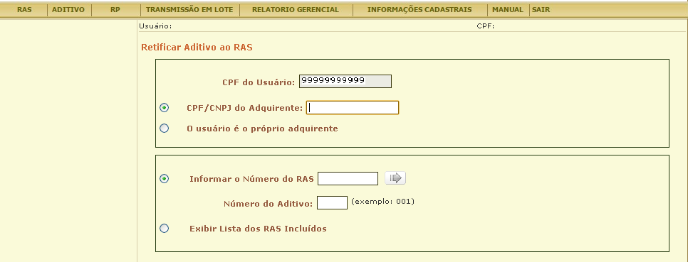

> Selecionada a opção Exibir Lista de RAS Incluídos, informe o número do
> aditivo que se deseja retificar e acione o botão {. O Sistema exibe lista de RAS
> incluídos, do mais recente para o mais antigo. Acione o botão
> , à direita do RAS desejado.

 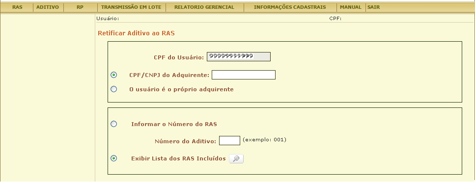

 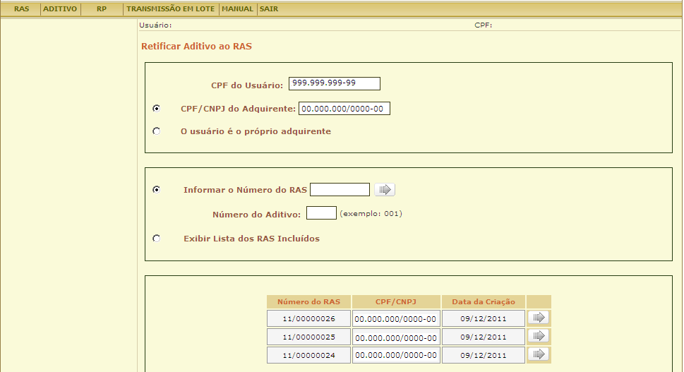

Após selecionar o RAS cujo aditivo se deseja retificar, o Sistema mostra
a tela **[Dados do Negócio](#DadosDoNegócio)** do RAS selecionado,
indicando as [operações](#operaçao) cadastradas no registro original e
todos os termos aditivos. Há dois tipos de ícones: Visualizar -
 e Alterar -
. O ícone para alterar aparecerá apenas
ao lado do aditivo que se deseja retificar, informado na tela anterior.

 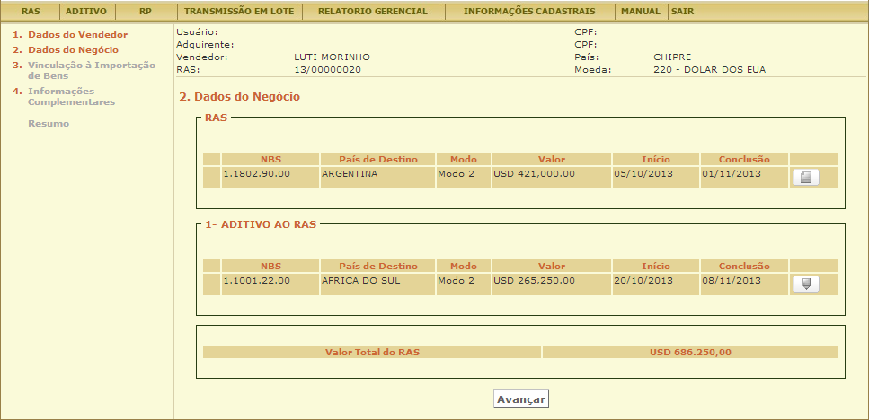

Ao clicar no ícone
 o sistema mostrará a tela [Dados do
Negócio](#DadosDoNegócio) do aditivo que se deseja retificar. O usuário
deve efetuar o preenchimento, seguindo os passos descritos no tópico
**[2.1.2 do Capítulo 2 deste Manual -- Retificação do
RAS](#retificação-do-ras).**

Após conferir os dados retificados na tela **Resumo do RAS**, acionar o
botão **Incluir** para retificar o aditivo ao RAS. O Sistema retornará
mensagem de confirmação de retificação do aditivo.

 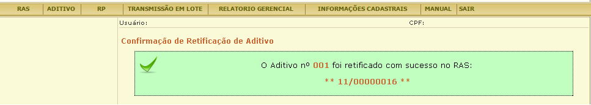

Os aditivos ao RAS podem ter todos os
campos retificados antes da inclusão do RP da [operação](#operaçao).
Após o [pagamento](#Pagamento) da operação não podem ser retificados os
campos Código NBS e Moeda. Em caso de erro de preenchimento nestes
campos para as operações já pagas, proceder previamente ao cancelamento
do RP conforme o [item 2.2.2](#cancelamento-do-rp).

A retificação do campo Moeda é feita apenas na primeira operação
inserida em um RAS e altera automaticamente a moeda das demais
operações, inclusive das operações de aditivos. Os valores previamente
cadastrados são mantidos, ou seja, o Sistema não faz conversão de
valores para a nova moeda selecionada, devendo o usuário efetuar os
ajustes nos valores, caso necessário.

A retificação do Valor da Operação só é possível se esse for maior ou
igual aos valores já pagos.

Após o término do [prazo para inclusão do último R](#inclusão-do-rp)P, o
valor total pago deve coincidir com o **Valor da Operação**, ou seja, o
valor do(s) RP(s) devem coincidir com o valor informado no RAS.

Excepcionalmente, se, após o término do [prazo para inclusão do último
RP](#inclusão-do-rp), ocorrer de os valores do RAS e do(s) RP não serem
coincidentes:

a\) caso o serviço prestado tenha valor diferente do inicialmente
registrado, o usuário deve retificar o aditivo do RAS o **Valor da
Operação** de forma a corresponder ao valor do serviço efetivamente
prestado;

b\) caso o serviço tenha sido prestado e o pagamento tenha sido parcial
ou inexistente, o usuário deve retificar o RAS para incluir em
**Informações Complementares** a justificativa para tanto.

O Valor da Operação pode ser retificado para 0,00 (zero) nos seguintes
casos:

> a\) o usuário tenha registrado o aditivo para o RAS incorreto;
>
> b\) a operação tenha sido informada em duplicidade;
>
> c\) a operação tenha sido informada no Módulo Aquisição indevidamente; ou
>
> d\) o pagamento tenha sido inexistente.

Nesses casos, o usuário deve obrigatoriamente justificar a referida
retificação no campo Informações Complementares do RAS aditado
incorretamente. No caso das alíneas a e b, deve-se indicar o número do
aditivo e do RAS correto. No caso da alínea c, é necessário indicar o
número do aditivo e do RVS.

Não é possível excluir uma operação de um aditivo ao RAS, somente
retificá-la.

Cabe ressaltar ainda que os registros inseridos a partir de um arquivo
de lote não podem ser edita-dos (retificados, aditados, etc.)
manualmente. Caso o usuário tente editar o registro manualmente, o
Sistema apresentará a seguinte tela:

#### 2.1.4. Consulta ao RAS ou ao Aditivo ao RAS

Esta função permite efetuar consulta a dados dos RAS no Sistema.

Para consultar um RAS é preciso acessar o *menu* **RAS** e em seguida
**Consultar**.

 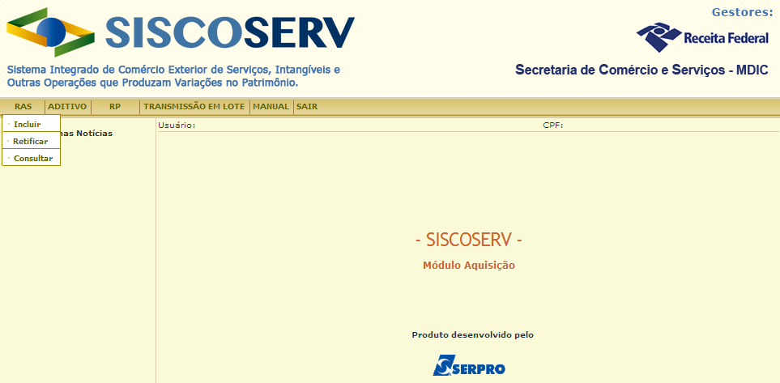

Para consultar um aditivo ao RAS é preciso acessar o *menu* **Aditivo**
e em seguida **Consultar**.

 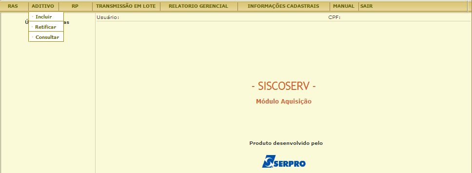

Ao clicar o botão **Consultar**, o campo CPF do usuário é preenchido
automaticamente pelo sistema com informação advinda do Certificado
Digital do usuário.

No campo **CPF/CNPJ do Adquirente** o usuário representante legal de
outra pessoa, física ou jurídica, deve informar o CPF ou CNPJ do
Adquirente representado. Caso o usuário seja o próprio adquirente, então
deve marcar a opção que indica essa situação. Para atuar como
representante legal de outra pessoa, física ou jurídica, o usuário deve
possuir [procuração eletrônica](#procuraçao) do representado.

Para consultar um RAS ou um Aditivo ao RAS, o usuário tem como opções:
Informar o Número do RAS ou Exibir Lista de RAS Incluídos.

Selecionada a opção Informar o Número do RAS, preencha o campo com o
número do RAS que se deseja consultar e acione o botão .

> 

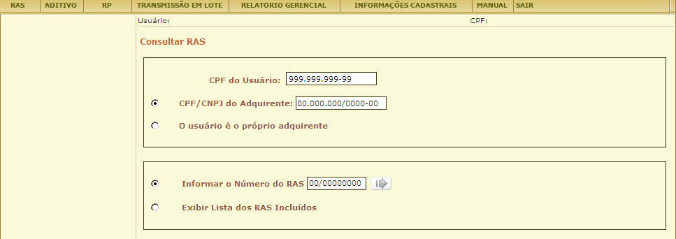

Selecionada a opção Exibir Lista de RAS Incluídos, acione o botão
. O Sistema exibe lista de RAS incluídos,
do mais recente para o mais antigo. Acione o botão , à direita do RAS desejado.

 

 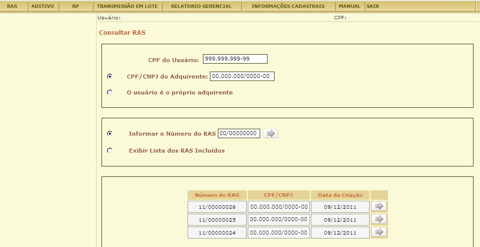

Após selecionar o RAS que deseja consultar, o Sistema apresenta a tela
**Resumo do RAS** a seguir, que inclui todos os dados do RAS, e dos seus
aditivos, se for o caso.

### 2.2. Inclusão do RP

A partir do **Módulo Aquisição**, no *menu* **RP**, há 3 funções:
**Incluir**, **Cancelar** e **Consultar**.

 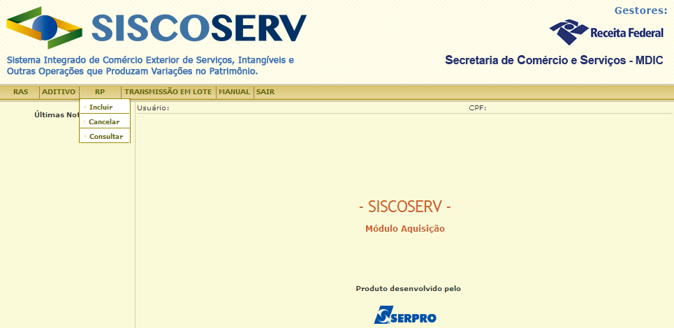

Para incluir um RP é preciso acessar o *menu* **RP** e em seguida a
opção **Incluir**.

O campo **CPF do Usuário** é preenchido automaticamente pelo Sistema com
informação advinda do Certificado Digital do usuário.

Em seguida, o Sistema disponibiliza duas opções para registro do
pagamento: **Informar o Número do RAS** ou **Pesquisar pelo CPF/CNPJ do
Adquirente**.

 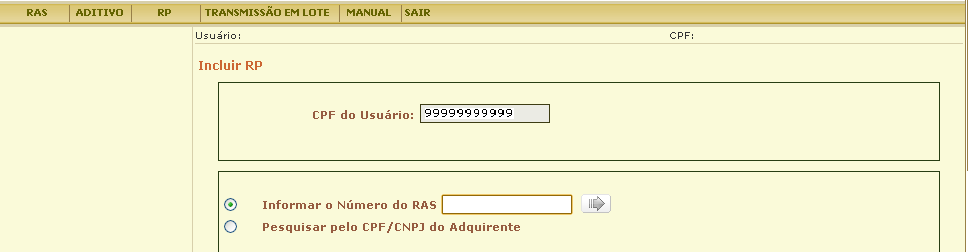

Selecionada a opção Informar o Número do RAS, preencha o campo com o
número do RAS que se deseja incluir o RP e acione o botão .

 

 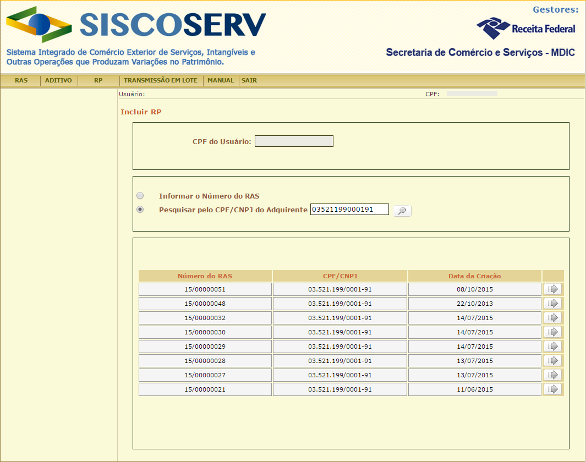

Selecionada a opção **Pesquisar pelo CPF/CNPJ do Adquirente**, preencha
o CPF/CNPJ do Adquirente, ainda que seja o mesmo CPF do usuário, acione
o botão  para ser disponibilizada a relação de
todos os RAS previamente incluídos. Na lista de RAS exibida, acione o
botão . O Sistema abrirá a tela **Operações a
Pagar**, sendo possível visualizar o **Valor da Operação** e **Saldo a
Pagar** para cada operação, referente ao RAS selecionado**.**

 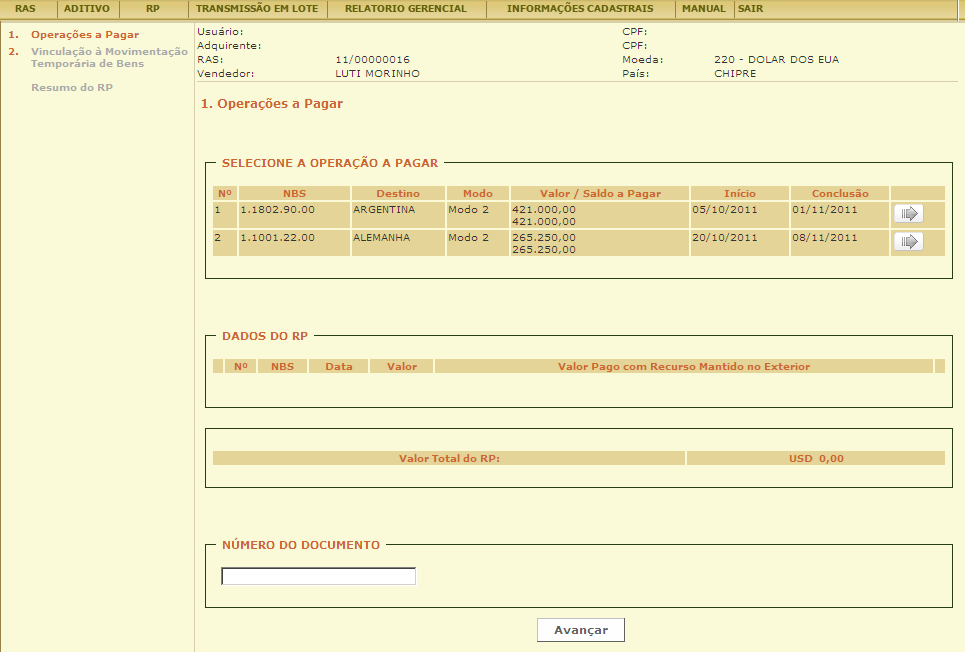

> **Operações a Pagar**
>
> Para incluir os dados do [pagamento](#Pagamento) de um serviço [^24]no
> campo **Operações** **a Pagar**, o usuário deve:
>
> a\) selecionar a operação a ser paga, acionando o botão ;
>
> b\) na tela seguinte **Incluir Dados do RP**, verificar o **Valor da
> Operação** e **Saldo a Pagar** da operação selecionada, bem como outros
> dados, no campo **Dados da Operação**;
>
> c\) preencher a data do [pagamento](#Pagamento) ou selecioná-la, clicando
> no ícone **Calendário**;
>
> d\) inserir o valor pago, o [valor pago com recurso mantido no
> exterior](#valormantidonoexterior), se for o caso, e clicar no botão
> **Adicionar Dado**. Caso haja outra operação a pagar no mesmo RAS, com a
> mesma data e referente ao mesmo documento que comprove o pagamento,
> acionar o botão  ao lado da operação desejada para incluir
> novos dados;

 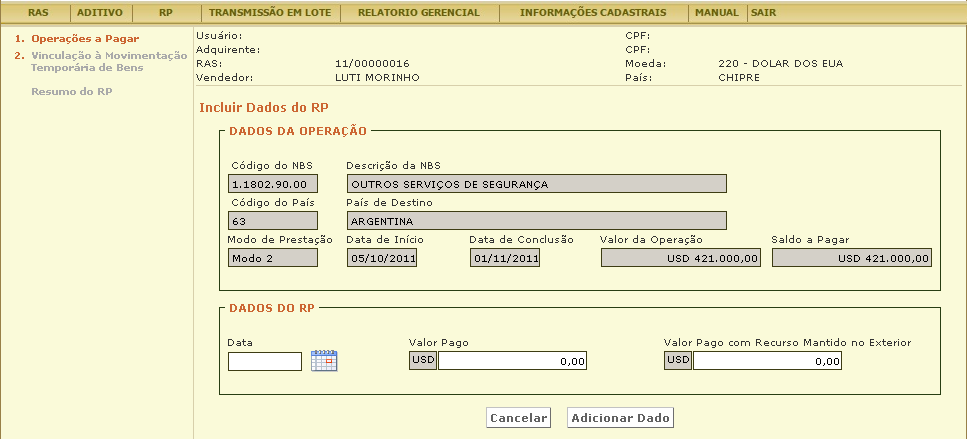

 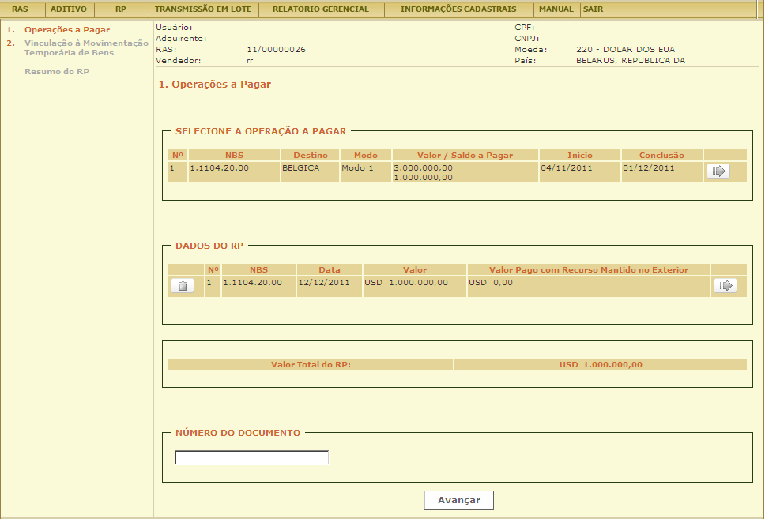

> e\) antes da inclusão do RP, caso seja detectado erro de preenchimento,
> clicar no ícone  à direita para corrigi-lo, procedendo
> conforme descrito acima. Para excluí-lo, clicar no ícone
>  à esquerda do campo;
>
> f\) inserir o **Número do Documento** que comprove o pagamento ao
> residente ou domiciliado no exterior e acionar o botão **Avançar.** O
> usuário deve preencher o campo **Número do
> Documento** com o número da *invoice* ou do contrato ou de outro
> documento que comprove o [pagamento](#Pagamento) realizado.

Após a **Data de Conclusão** da [operação](#operaçao), o valor total
pago deve coincidir com o **Valor da Operação**, na moeda do RAS. Caso
os valores sejam divergentes, o usuário deve retificar o **Valor da
Operação** utilizando os passos descritos no item
[2.1.2](#retificação-do-ras) (Retificação do RAS) e
[2.1.3](#retificação-do-aditivo-ao-ras) (Retificação do Aditivo ao RAS),
se for o caso.

Todas as retificações de valor no RAS realizadas após o primeiro RP
devem ser justificadas no campo **Informações Complementares**.

No quadro **Selecione a Operação a Pagar** são apresentados o **Valor da
Operação** e o **Saldo a Pagar.**

Quando a operação estiver totalmente paga, o ícone  à direita, no quadro **Selecione a
Operação a Pagar**, deixa de aparecer**.**

Na inclusão do RP, o Sistema calcula e exibe o **Valor Total do RP**.

**Resumo do RP**

O sistema exibirá o Resumo do RP, e o usuário deve:

1 - conferir os dados do Resumo do RP; e

2 - clicar no botão Incluir, para finalizar o registro.

 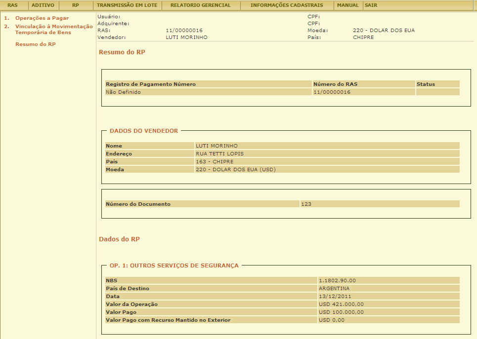

O Sistema confirmará o recebimento dos dados e gerará um número próprio
para o RP.

 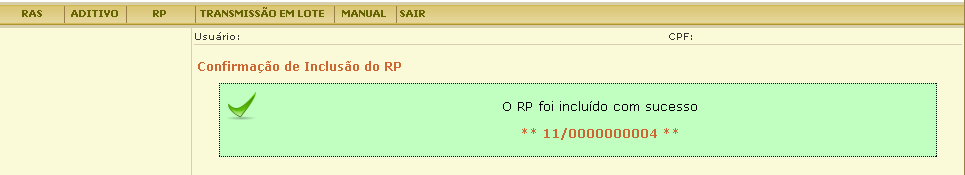

#### 2.2.1. Retificação do RP

Esta função permite ao usuário retificar um RP.

 Para retificar um RP é preciso acessar o
*menu* **RP** e em seguida **Retificar**.

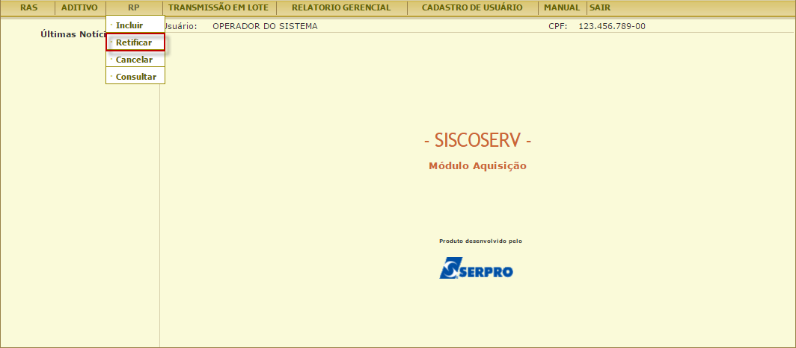

Ao selecionar o comando **Retificar**, o campo **CPF do Usuário** é
preenchido automaticamente pelo Sistema com informação advinda do
Certificado Digital do usuário.

 Em seguida, o Sistema disponibiliza duas
opções para retificação do RP: **Pesquisar pelo Número do RAS** ou
**Pesquisar pelo CPF/CNPJ do Adquirente**.

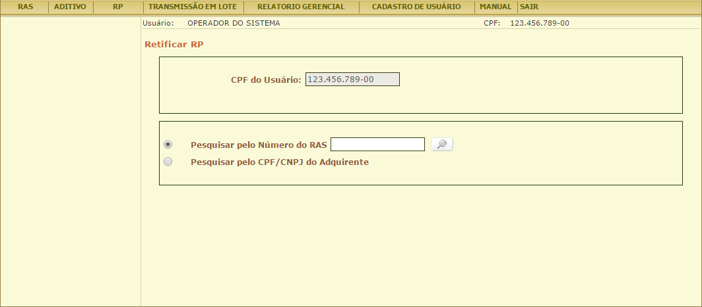

 Selecionada a opção **Pesquisar pelo
Número do RAS**, preencha o campo com o número do RAS cujo RP se deseja
retificar e acione o botão . Clique no botão  à direita do RP a ser retificado.

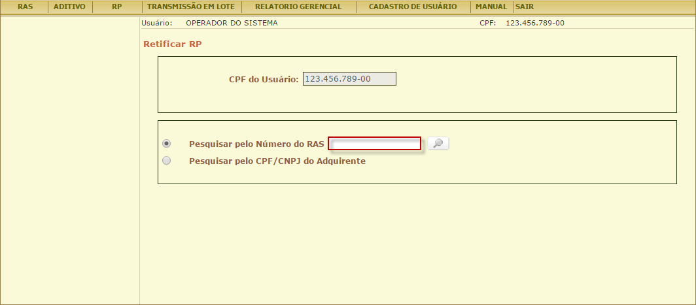

 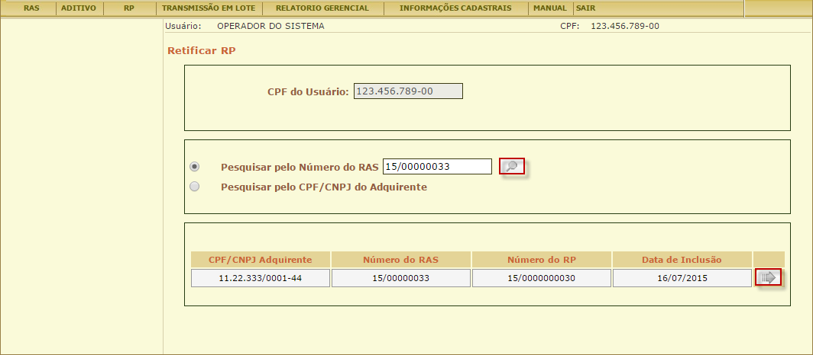

Selecionada a opção **Pesquisar pelo CPF/CNPJ do Adquirente**, preencha
o CPF/CNPJ do adquirente, ainda que seja o mesmo CPF do usuário. Acione
o botão  para ser disponibilizada a relação de
todos os RP previamente incluídos. Na lista de RP exibida, acione o
botão  à direita do RP a ser retificado.

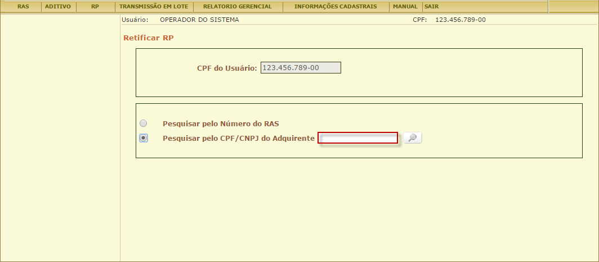

 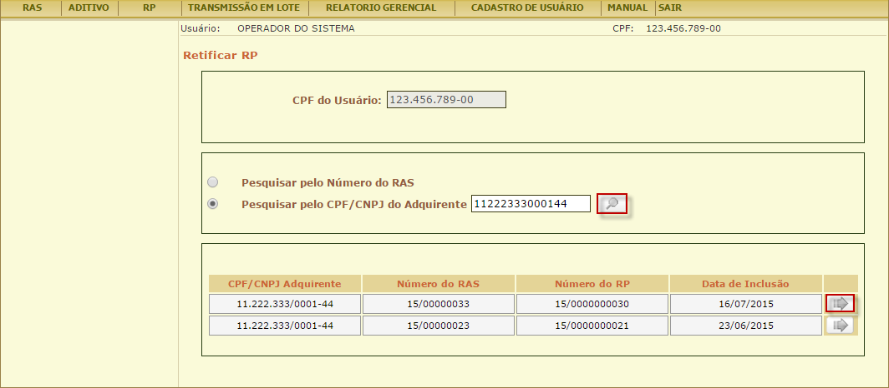

Após selecionar o RP que se deseja retificar, o Sistema mostra a tela
**Resumo do RP**. Os **Dados do RP** indicam as [operações](#Operação)
cadastradas no registro original e todos os termos aditivos.

Nessa tela, o usuário poderá:

> 1 - retificar o **Número do Documento**;
>
> 2 - retificar uma ou mais operações, clicando no botão **Retificar
> Esta Operação.**

 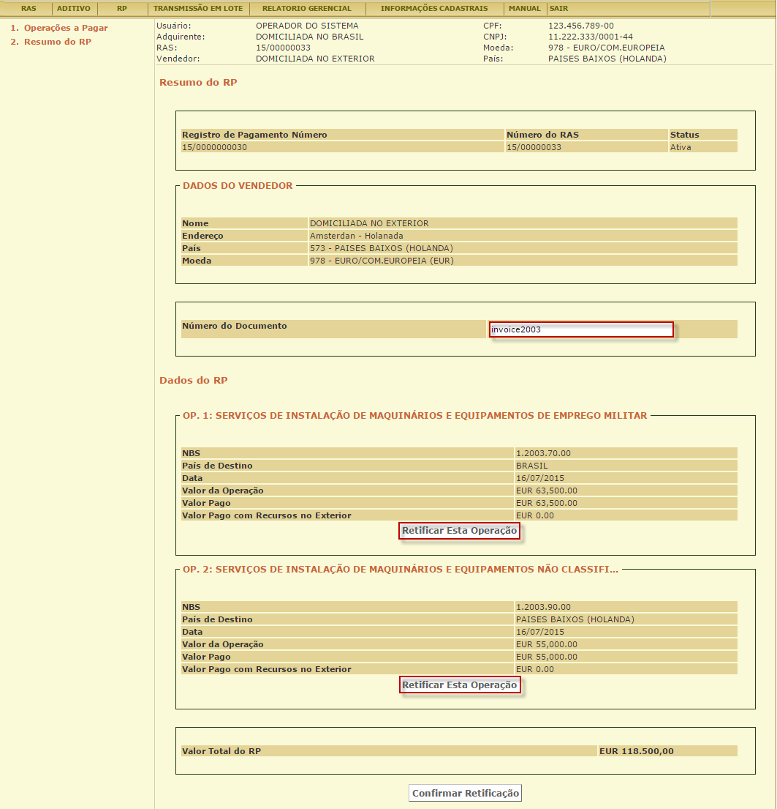

Caso o usuário deseje retificar somente o **Número do Documento**, basta
editar o número no campo correspondente e, em seguida, clicar no botão
**Confirmar Retificação**.

 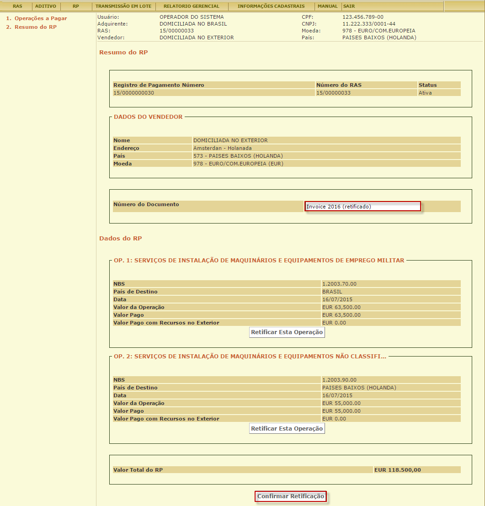

Caso deseje retificar os dados do RP em uma operação, clique no botão
**Retificar Esta Operação**.

 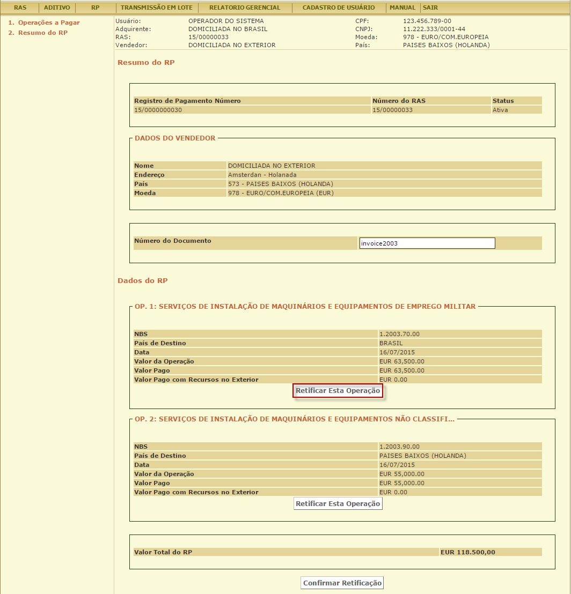

 Em seguida o Sistema apresenta a tela de
**Retificar dados** **do RP** e o usuário pode alterar a Data, o Valor
Pago e o Valor Pago com Recursos no Exterior.

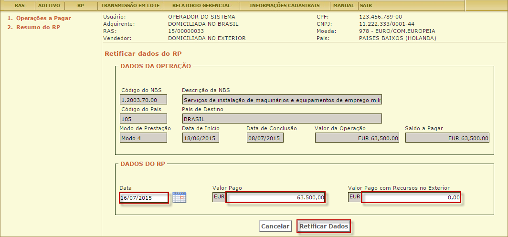

 Para confirmar a alteração dos dados,
clique no botão **Retificar Dados** e, na tela seguinte, clique em
**Confirmar Retificação**. Caso contrário, clique em **Cancelar**.

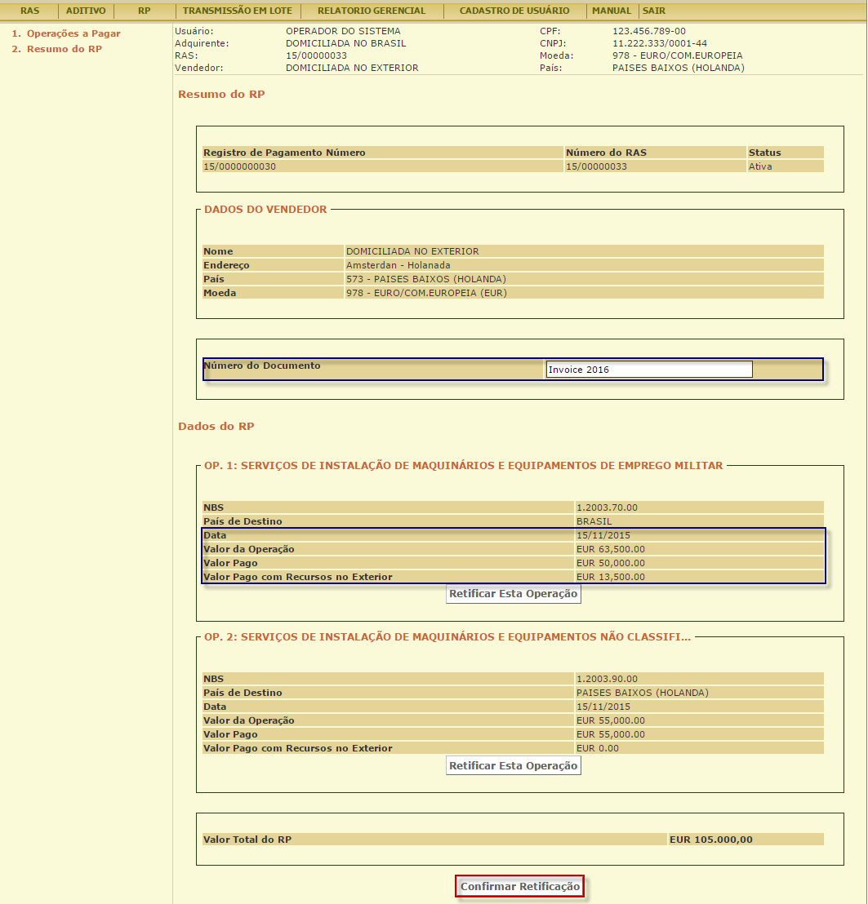

 Após o usuário clicar em **Confirmar
Retificação**, o Sistema confirmará a retificação dos dados do RP.

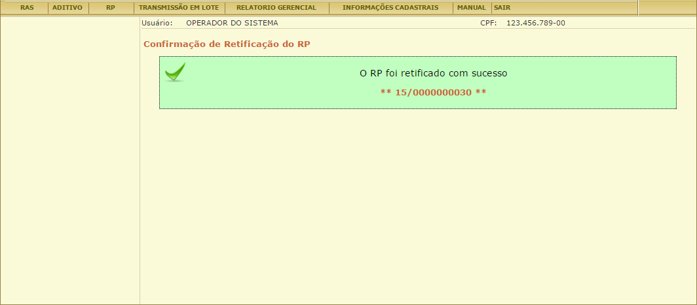

#### 2.2.2. Cancelamento do RP

Esta função permite ao usuário cancelar um RP.

O RP pode ser cancelado na hipótese de erro no preenchimento dos campos
**Código NBS** ou **Moeda** .

Para cancelar um RP é preciso acessar o *menu* **RP** e em seguida
**Cancelar**.

 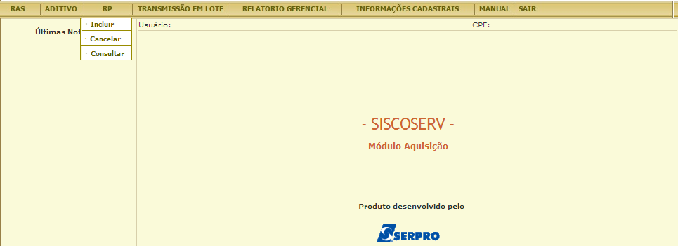

Ao selecionar o comando **Cancelar**, o campo **CPF do Usuário** é
preenchido automaticamente pelo Sistema com informação advinda do
Certificado Digital do usuário.

Em seguida, o Sistema disponibiliza duas opções para cancelamento do RP:
**Pesquisar pelo Número do RAS** ou **Pesquisar pelo CPF/CNPJ do
Adquirente**.

 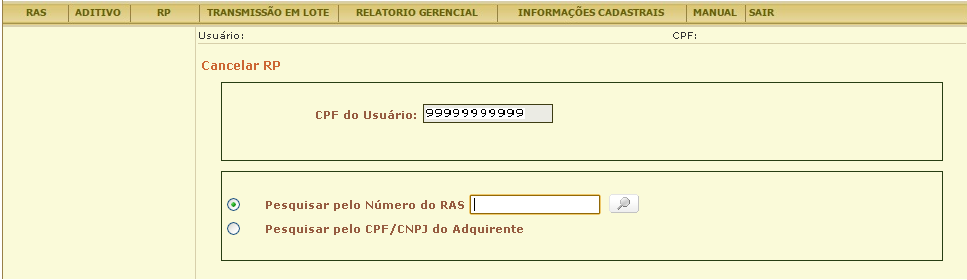

Selecionada a opção Pesquisar pelo Número do RAS, preencha o campo com o
número do RAS cujo RP se deseja cancelar e acione o botão . Clique no ícone
 à direita do respectivo Número do RP a
ser cancelado. Confirme o cancelamento do RP clicando no botão OK na
caixa de mensagem.

 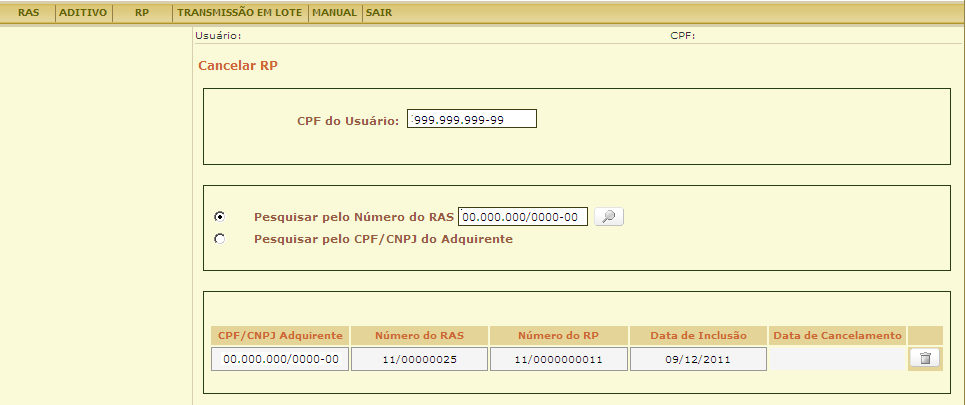

Selecionada a opção Pesquisar pelo CPF/CNPJ do Adquirente, preencha o
CPF/CNPJ do adquirente, ainda que seja o mesmo CPF do usuário. Acione o
botão  para ser disponibilizada a relação de
todos os RP previamente incluídos. Na lista de RP exibida, acione o
botão . Confirme o cancelamento do RP clicando
no botão OK na caixa de mensagem.

 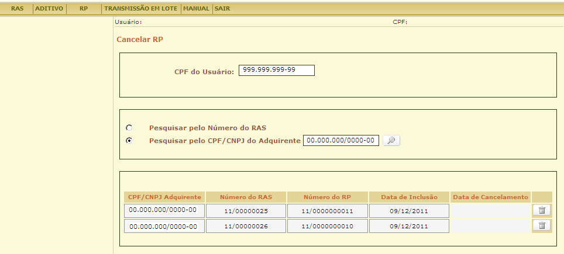

 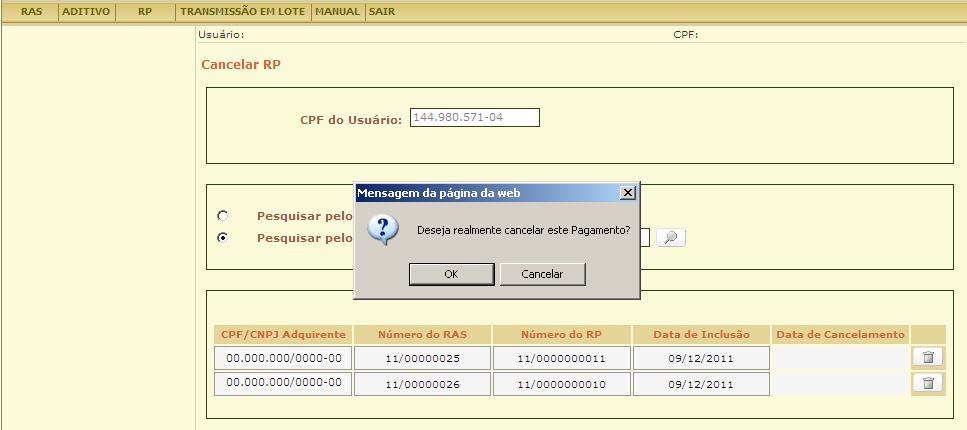

Em seguida o Sistema apresenta a tela de **Confirmação de Cancelamento**
do RP:

 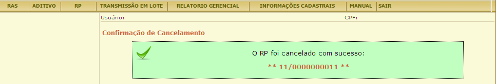

Caso o usuário acesse novamente o *menu* **RP \> Cancelar**, observará a
**Data de Cancelamento** ao lado da **Data de Inclusão** e o
desaparecimento do ícone  para o RP cancelado.

 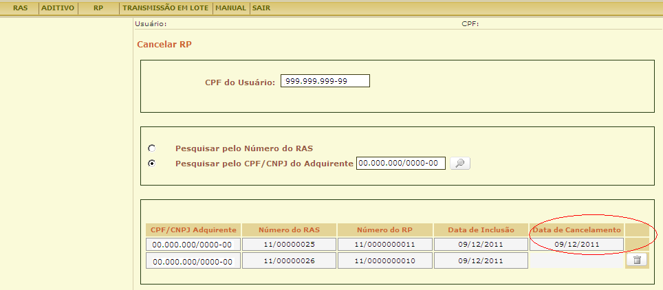

#### 2.2.3. Consulta ao RP

Esta função permite efetuar consulta a dados dos RP no sistema.

Para consultar um RP é preciso acessar o *menu* **RP** e em seguida
**Consultar**.

 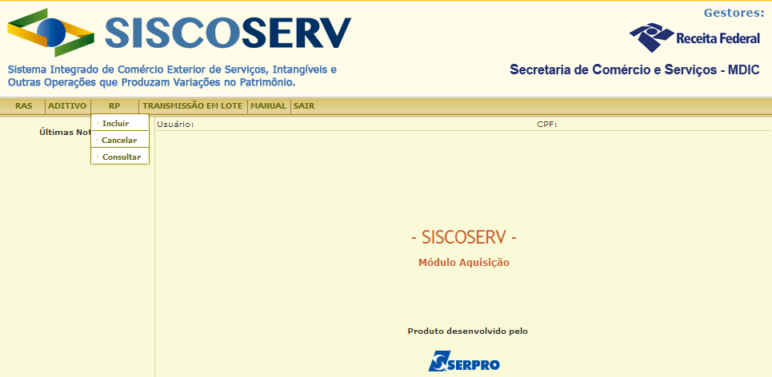

Ao clicar o botão **Consultar**, o campo CPF do usuário é preenchido
automaticamente pelo sistema com informação advinda do Certificado
Digital do usuário.

Em seguida, o Sistema disponibiliza duas opções para consultar RP:
**Pesquisar pelo Número do RAS** ou **Pesquisar pelo CPF/CNPJ do
Adquirente**.

 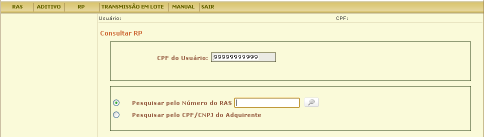

Se o usuário selecionar a opção Pesquisar pelo Número do RAS, deve
preencher o campo com o número do RAS cujo RP se deseja consultar e
acione o botão . Clique no ícone  à direita do respectivo Número do RP a
ser consultado. Em seguida é exibida a tela Resumo do RP.

 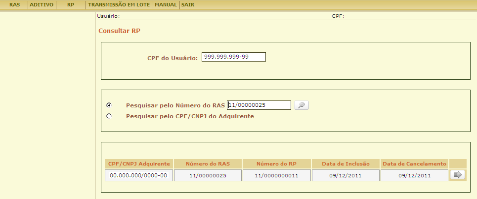

Se o usuário selecionar a opção Pesquisar pelo CPF/CNPJ do Adquirente,
deve preencher o CPF/CNPJ do adquirente, ainda que seja o mesmo CPF do
usuário. Acione o botão  para ser disponibilizada a relação de
todos os RP previamente incluídos. Clique no ícone  à direita do respectivo Número do RP a
ser consultado.

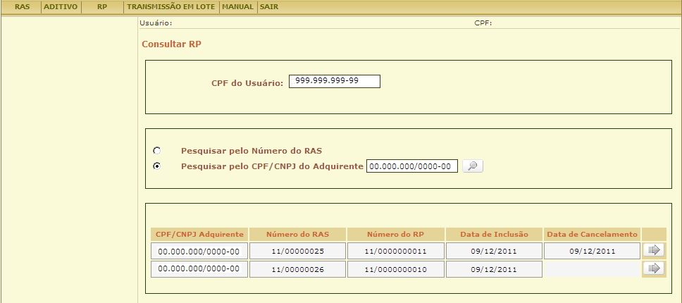

Em seguida, é exibida a tela **Resumo do RP**.

## 3. Transmissão em Lote

A transmissão em lote foi implementada para atender os residentes e
domiciliados no Brasil que realizam um grande número de transações de
venda ou aquisição de serviços com residentes ou domiciliados no
exterior e têm a obrigação legal de efetuar os registros correspondentes
no Siscoserv.

Por meio da transmissão em lote busca-se uma interoperabilidade entre o
Siscoserv e os sistemas internos de gestão de seus usuários. A forma de
comunicação são os arquivos de lote e retorno trocados pelos sistemas.
Os arquivos de lote são compostos por arquivos contendo dados de
registro que representam cada qual uma operação distinta no Siscoserv.
As operações realizadas por meio da transmissão em lote são no Módulo
Aquisição:

+------------------------+
| 1)  Incluir RAS;       |
|                        |
| 2)  Retificar RAS;     |
|                        |
| 3)  Incluir Aditivo;   |
|                        |
| 4)  Retificar Aditivo; |
|                        |
| 5)  Incluir RP;        |
|                        |
| 6)  Retificar RP; e    |
|                        |
| 7)  Cancelar RP.       |
+------------------------+

Este Manual trata apenas da transmissão dos arquivos após sua criação,
bem como do Retorno do Lote, detalhado na sessão 3.2 -- Consultar Lote.

Os seguintes documentos trazem as orientações técnicas necessárias para
a correta criação dos arquivos a serem transmitidos:

> \- [Orientações Técnicas para o desenvolvimento da funcionalidade
> Transmissão em Lote do SISCOSERV Módulos Venda e
> Aquisição](http://www.mdic.gov.br/images/REPOSITORIO/scs/decin/Orienta%C3%A7%C3%B5es_T%C3%A9cnicas.pdf);
>
> \- [Modelos dos Arquivos XML e XSD para Transmissão em
> Lote](http://www.mdic.gov.br/images/REPOSITORIO/scs/decin/Modelos_dos_Arquivos_XML_e_XSD_para_Transmiss%C3%A3o_em_Lote_-_V_2.0.zip);
> e
>
> \- [Tabelas de Códigos do Siscoserv para Transmissão em
> Lote.](http://www.mdic.gov.br/images/REPOSITORIO/scs/decin/Tabelas_de_C%C3%B3digos_do_Siscosev_para_Transmiss%C3%A3o_em_Lote.zip)

Cabe ressaltar a necessidade de avaliação
sobre alterações necessárias nos registros realizados por meio de
transmissão em lote a partir da publicação da nova edição da NBS e de
suas notas explicativas.

A prestação de serviços[^25] iniciada até 31 de dezembro de 2018 deve
ser registrada tendo por base a NBS 1.1, publicada pela [Portaria
Conjunta RFB / SCS nº 1.820, de
2014](http://pesquisa.in.gov.br/imprensa/jsp/visualiza/index.jsp?data=19/12/2013&jornal=1&pagina=187&totalArquivos=384).

A prestação de serviços iniciada a partir de 1º de janeiro de 2019 deve
ser registrada tendo por base a [NBS
2.0](http://www.mdic.gov.br/images/REPOSITORIO/scs/decos/NBS/Anexo_I_NBS_2.0_com_altera%C3%A7%C3%B5es_6.12.18.pdf),
publicada pela [Portaria Conjunta RFB/SCS nº 2.000, de 18 de dezembro de
2018.](http://pesquisa.in.gov.br/imprensa/jsp/visualiza/index.jsp?data=20/12/2018&jornal=515&pagina=139&totalArquivos=243),
que produz efeitos a partir de 1º de janeiro de 2019.

Cabe ressaltar que todos os usuários que efetuam registro por meio de
transmissão em lote devem verificar na [versão 2.0 da
NBS](http://www.mdic.gov.br/images/REPOSITORIO/scs/decos/NBS/Anexo_I_NBS_2.0_com_altera%C3%A7%C3%B5es_6.12.18.pdf)
se houve alteração nos códigos em que classificam os serviços
registrados no Siscoserv, visto que houve reaproveitamento de códigos
previamente existentes na nova versão da Nomenclatura.

### Processamento dos Arquivos de Lote

O processamento dos arquivos de lote divide-se em 4 etapas:

1)  Validação do arquivo de lote;

2)  Validação do formato dos arquivos de dados;

3)  Validação das regras de negócio do Sistema; e

4)  Efetivação das operações contidas no lote.

As duas primeiras etapas ocorrem no momento do envio do arquivo de lote
enquanto que as duas etapas finais ocorrem durante o processamento
noturno dos lotes (o Sistema processa os lotes no período de menor
utilização do Sistema de forma a não impactar a seu desempenho durante
os períodos de maior acesso). Desta forma, o Sistema apresentará ao
usuário o resultado das duas primeiras etapas do processamento
imediatamente após o envio do lote. Quanto às demais etapas, o usuário
deverá consultar o seu resultado a partir do dia seguinte ao envio do
lote (veja [Consultar Lote](#consultar-lote)). A data que será
considerada como de inclusão de registro será a de envio do arquivo de
lote, desde que o arquivo esteja em conformidade com as especificações
pertinentes contidas nas [Orientações
Técnicas](http://www.mdic.gov.br/images/REPOSITORIO/scs/decin/Orienta%C3%A7%C3%B5es_T%C3%A9cnicas.pdf).

Durante a validação do arquivo de lote o Sistema verificará se as regras
referentes aos nomes de arquivo e ao formato de compactação do arquivo
de lote estão sendo respeitadas. Caso elas sejam violadas, o envio do
lote não se efetivará.

A validação do formato dos arquivos de dados ocorre logo após o envio
bem- sucedido do arquivo de lote. Os arquivos de dados que passarem pela
verificação de formato receberão o *status* EP (Em processamento). Caso
contrário, o Sistema atribuirá ao arquivo de dados o *status* NR (Não
Recebido) e o código de erro "E0005".

Este erro pode ocorrer por dois motivos:

1)  O usuário está enviando um tipo de informação diferente da
    > selecionada. Por exemplo, o arquivo de dados refere-se a **Incluir
    > RP**, mas o usuário selecionou **Incluir RAS** no *menu*. Neste
    > caso, basta reenviar o lote após selecionar a operação correta
    > (veja [Procedimentos para envio do arquivo de
    > lote](#procedimentos-para-envio-do-arquivo-de-lote)); ou

2)  O arquivo de dados enviado não está de acordo com as especificações
    > descritas nas [Orientações
    > Técnicas.](http://www.mdic.gov.br/images/REPOSITORIO/scs/decin/Orienta%C3%A7%C3%B5es_T%C3%A9cnicas.pdf)
    > Neste caso, o sistema responsável pela geração dos arquivos de
    > lote e de dados deve sofrer correções.

Neste momento, o Sistema atribuirá ao lote um *status* de acordo com o
*status* dos arquivos de dados que o compõem.

Durante o processamento noturno dos lotes, o Sistema analisará os dados
enviados de forma a garantir a sua coerência e aderência às regras de
negócio definidas no corpo deste manual. Como exemplo de uma das regras
de negócio verificadas, o Siscoserv não permitirá que o Brasil seja
indicado como o país de residência ou domicílio do adquirente. Em
seguida, o Sistema efetivará as operações contidas nos arquivos de dados
aprovados e atribuirá aos arquivos de lote e de dados os *status*
decorrentes deste processamento.

### Status dos Arquivos de Lote

Um arquivo de lote pode receber seis *status* diferentes:

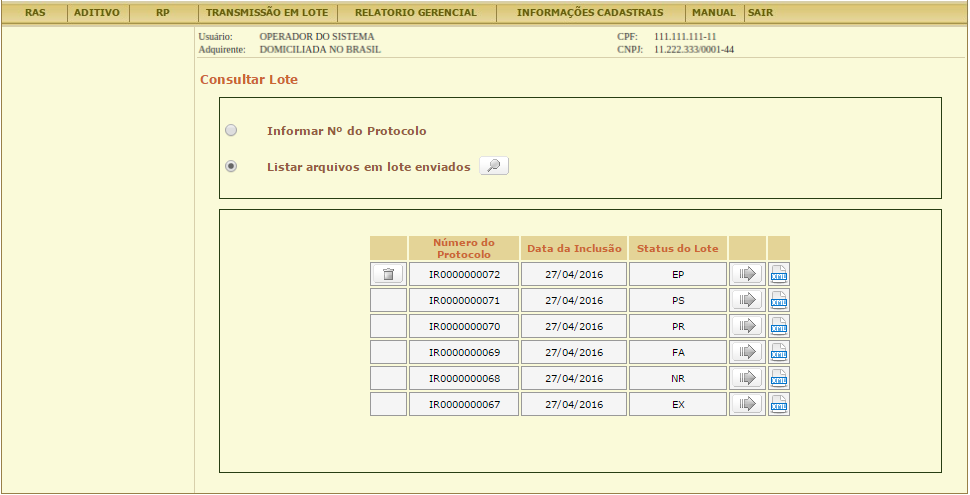

1)  **EP** -- **Em Processamento**: o lote foi recebido pelo Sistema e
    pelo menos um dos arquivos de dados que o compõem passou pela
    validação de formato (veja [Processamento dos Arquivos de
    Lote](#ProcessamentoLote)). Os arquivos de dados serão processados
    pelo Siscoserv que verificará se as informações estão de acordo com
    suas regras de negócio.

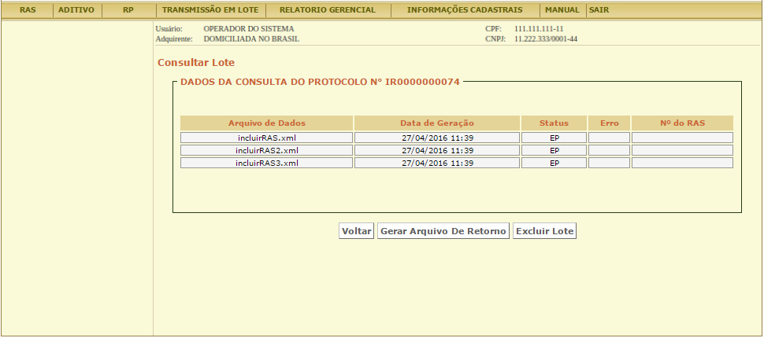

2)  **PS** -- **Processado com Sucesso**: o lote foi recebido e
    > processado. Todas as operações representadas pelos arquivos de
    > dados são efetivadas. Os arquivos de dados que estavam com
    > *status* EP passam para o *status* PS. O Sistema apresenta o
    > número do RAS incluído, retificado, aditado, etc.

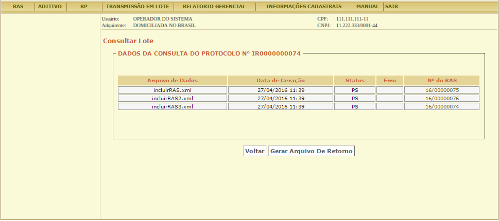

3)  **PR** -- **Processado com Ressalva**: o lote foi recebido e
    > processado, mas há pelo menos um arquivo do lote que apresentou um
    > ou mais erros em relação às regras do Siscoserv. O registro do
    > arquivo que apresentar erro não será efetivado, podendo apresentar
    > *status* NR ou FA, devido a erro de formato ou de regra de
    > negócio, respectivamente.

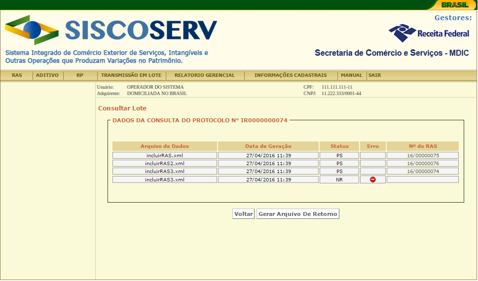

4)  **FA** -- **Falha**: o lote foi recebido e processado, porém todos
    os arquivos de dados que o compõem apresentaram pelo menos um erro
    em relação às regras de negócio do Siscoserv. As operações
    representadas pelos arquivos de dados não são efetivadas e todos os
    arquivos de dados deste lote que estavam com *status* EP passam para
    o *status* FA.

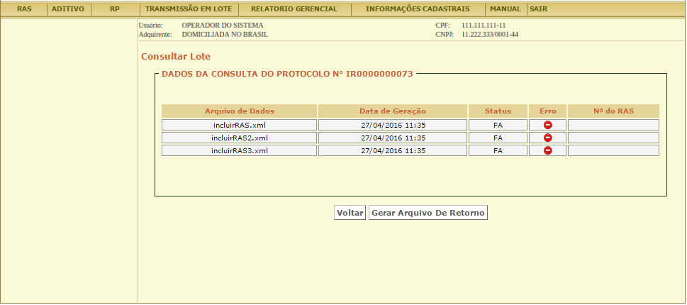

5)  **NR** -- **Não Recebido**: todos os arquivos de dados enviados no
    > lote apresentaram erros de formato e *status* NR.

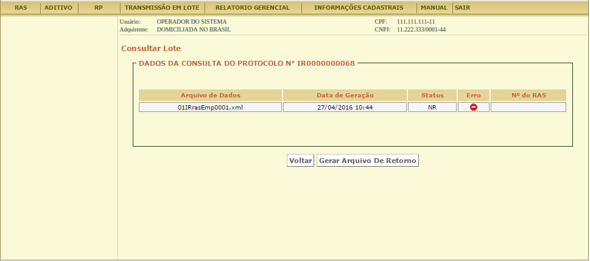

6)  **EX** -- **Excluído**: o lote foi recebido pelo Sistema e pelo
    > menos um dos arquivos de dados apresentou *status* EP, porém o
    > usuário optou por cancelar o seu processamento. Todos os arquivos
    > de dados que estavam com *status* EP passarão para o *status* EX.

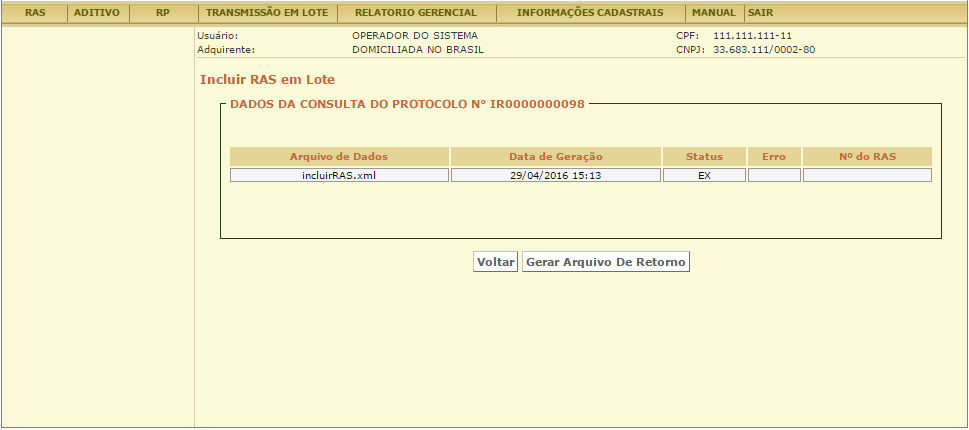

### 3.1. Procedimentos para envio do arquivo de lote

Para efetuar a transmissão em lote o usuário deve [acessar o
Siscoserv](#_2.1_Como_acessar) e clicar na aba **Transmissão em Lote**.

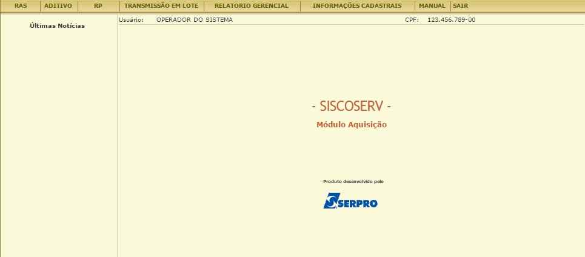

Em seguida, selecionar o tipo de informação que será prestada: **Incluir
RAS, Retificar RAS, Incluir Aditivo, Retificar Aditivo, Incluir RP,
Retificar RP ou Cancelar RP**.

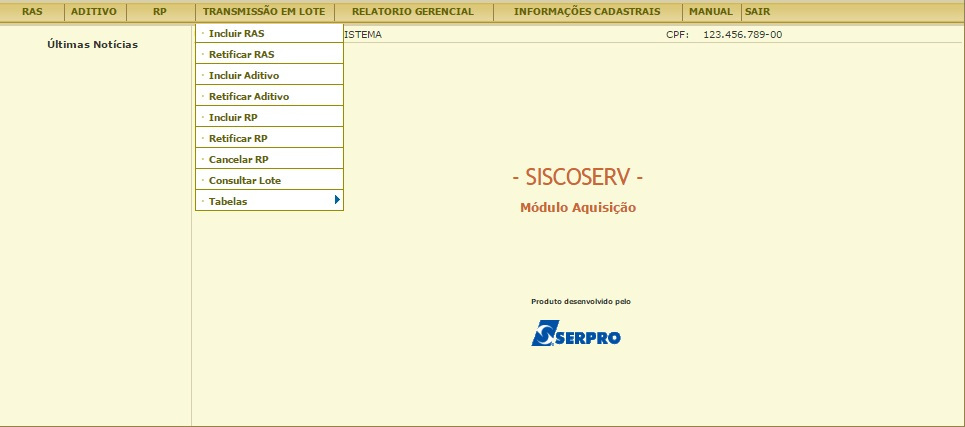

Após selecionar uma das opções do *menu* **Transmissão em Lote**, o
Sistema apresentará a tela para que se informe o CPF/CNPJ do Adquirente
ou se o usuário é o próprio adquirente. Na parte superior o sistema
informa a opção selecionada.

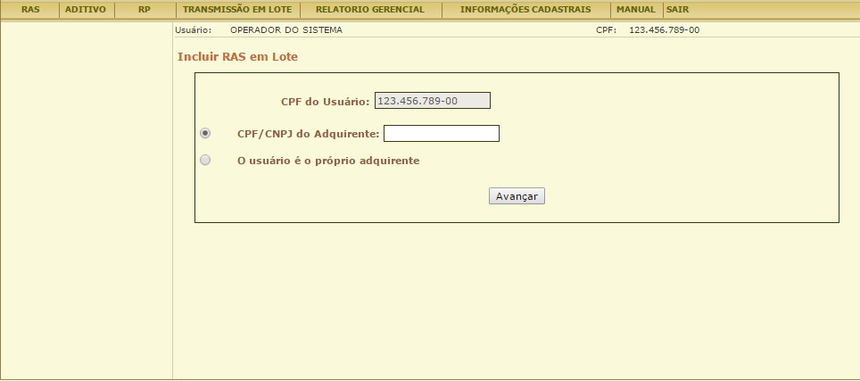

**Opção de Atendimento à Legislação**

O usuário deve informar a opção de atendimento à legislação apenas
quando for transmitir arquivo referente às funcionalidades Incluir RAS
ou Retificar RAS. O usuário deve escolher uma das opções de atendimento
à legislação para seguir adiante. É possível manter a opção de
atendimento à legislação para os futuros RAS selecionando o campo
"Desejo manter essa decisão". Após marcar essa opção, a tela não será
exibida novamente em futuros preenchimentos, que assumirão a última
opção selecionada.

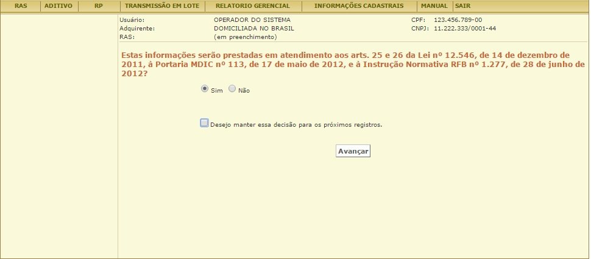

A decisão pode ser revista pelo usuário clicando em **Atendimento à
Legislação** no *menu* lateral esquerdo quando for **Incluir RAS** ou
**Retificar RAS**.

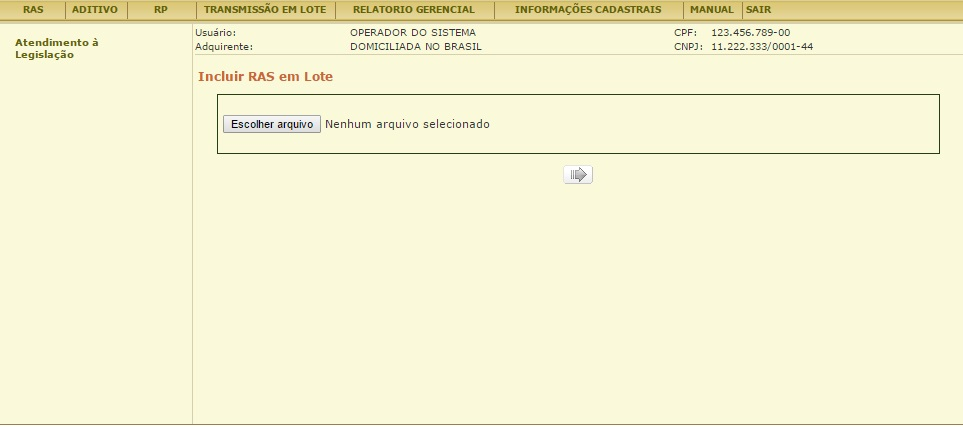

Após clicar em **Avançar** o sistema apresentará a seguinte tela:

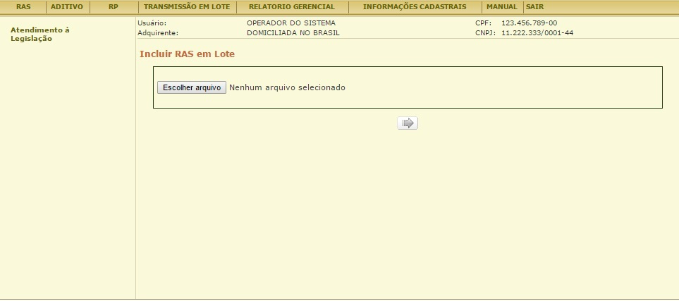

O usuário, então, deve clicar em **Escolher arquivo**, localizar o
arquivo de lote que deseja transmitir e clicar no botão 

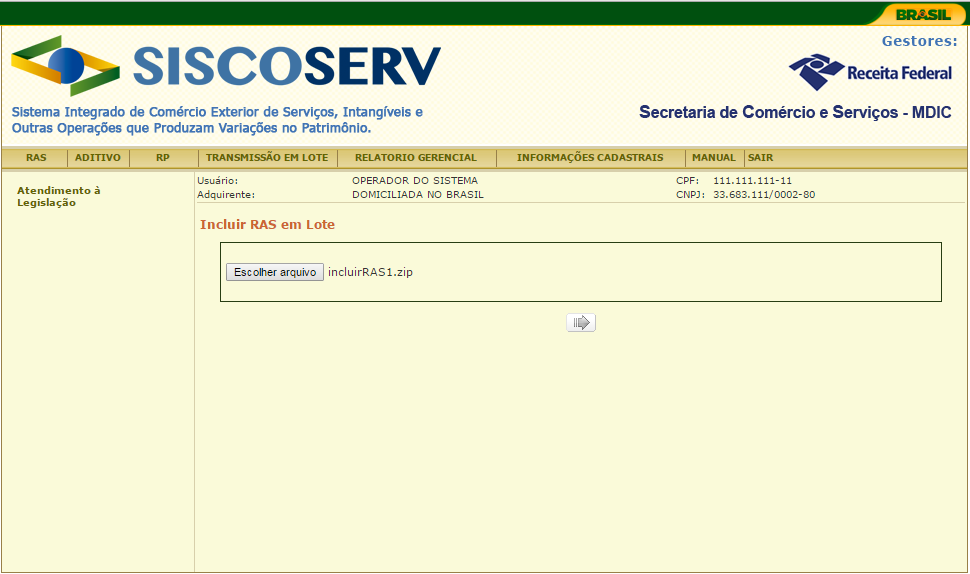

O sistema informará o número do protocolo de envio do lote e apresentará
o detalhamento do lote ao enumerar todos os arquivos de dados que o
compõem com seus respectivos *status*.

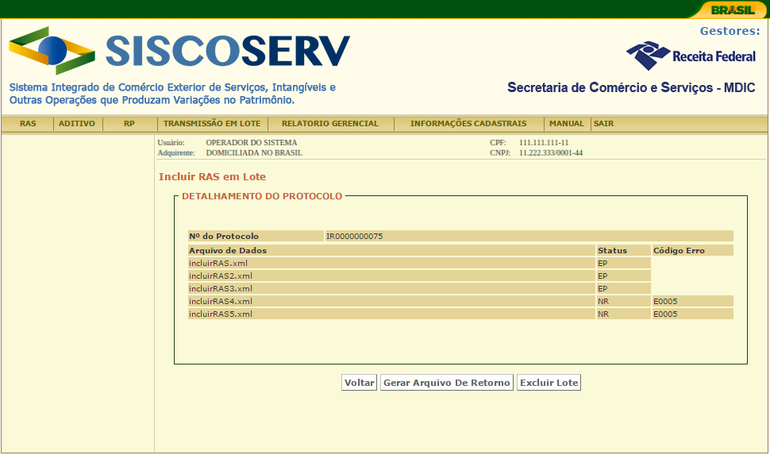

O campo **Nº do Protocolo** é composto por duas letras e um número
sequencial composto por 10 dígitos. As siglas indicativas do protocolo
são:

1)  IR -- Incluir RAS;

2)  RR -- Retificar RAS;

3)  IA -- Incluir Aditivo;

4)  RA -- Retificar Aditivo;

5)  IP -- Incluir RP;

6)  RP -- Retificar RP; e

7)  CP -- Cancelar RP.

### Validação dos Arquivos de Lote e de Dados

As [Orientações
Técnicas](http://desenvolvimento.gov.br/arquivos/dwnl_1336998170.pdf)
apresentam as regras a serem obedecidos na geração dos arquivos de lote
e de dados. A primeira regra a ser validada pelo Sistema refere-se ao
nome dos arquivos. Caso sejam enviados arquivos cujos nomes não obedeçam
a estas regras, o Sistema emitirá uma das seguintes mensagens.

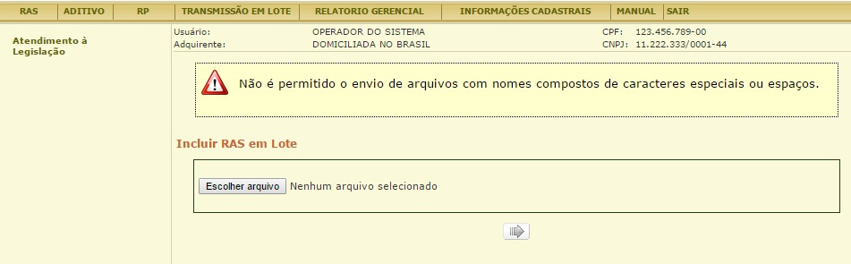

Em seguida, o formato do arquivo de lote é validado. Caso o arquivo
enviado não tenha o formato esperado, a seguinte mensagem será
apresentada.

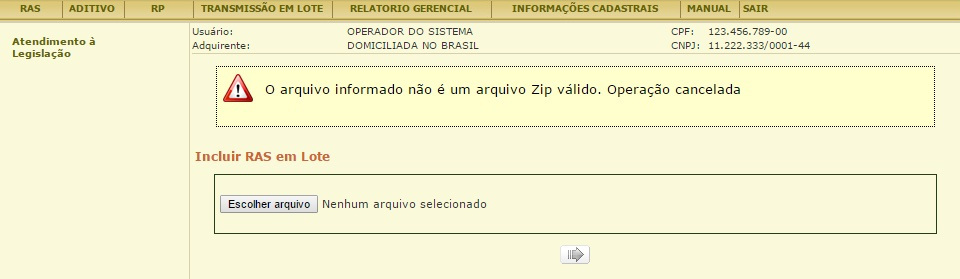

Após a transmissão bem-sucedida do arquivo de lote, o Siscoserv valida o
formato dos arquivos de dados e atribui ao lote e aos arquivos de dados
que o compõem um *status* de acordo com o resultado da validação (veja
[*Status* dos Arquivos de Lote](#StatusLote)).

Para maior detalhamento sobre o *status* ou o tipo de erro associados
aos arquivos de dados, ao deixar o cursor do *mouse* sobre a coluna
**Status** e **Código Erro**, o Sistema exibirá o significado dos
códigos apresentados:

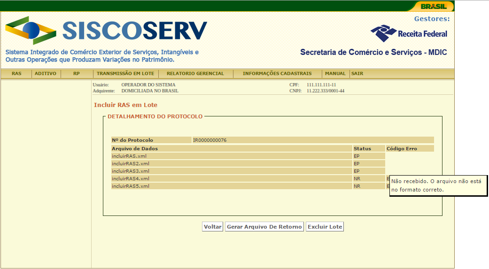

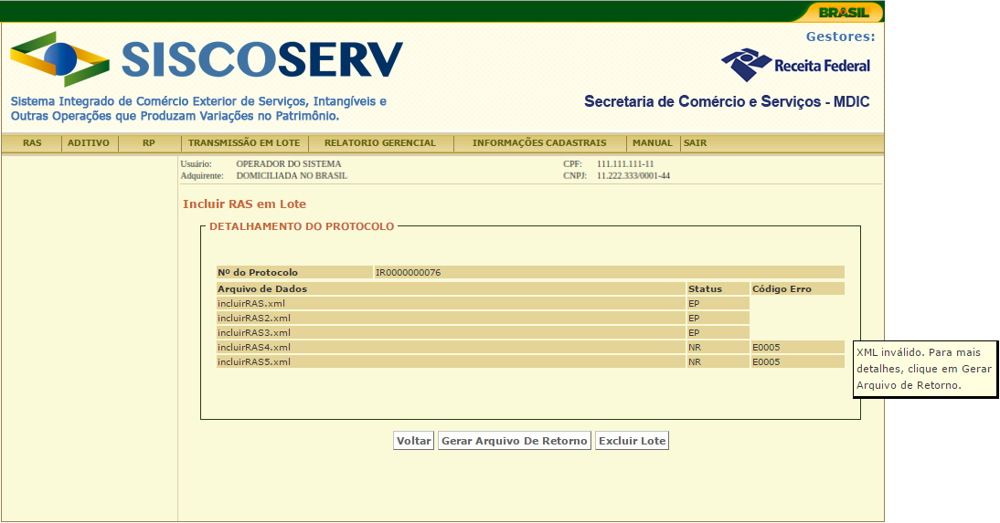

Um arquivo de retorno contendo mais detalhes sobre os erros encontrados
pode ser gerado ao clicar o botão **Gerar Arquivo de Retorno**. O
formato do arquivo de retorno está descrito nas [Orientações
Técnicas](http://desenvolvimento.gov.br/arquivos/dwnl_1336998170.pdf).

### 3.2. Consultar Lote

Para consultar o lote, o usuário deve clicar na aba **Transmissão em
Lote** e em seguida selecionar o item de *menu* **Consultar Lote.**

O Sistema apresentará a tela para que se informe o CPF/CNPJ do
adquirente ou se o usuário é o próprio adquirente.

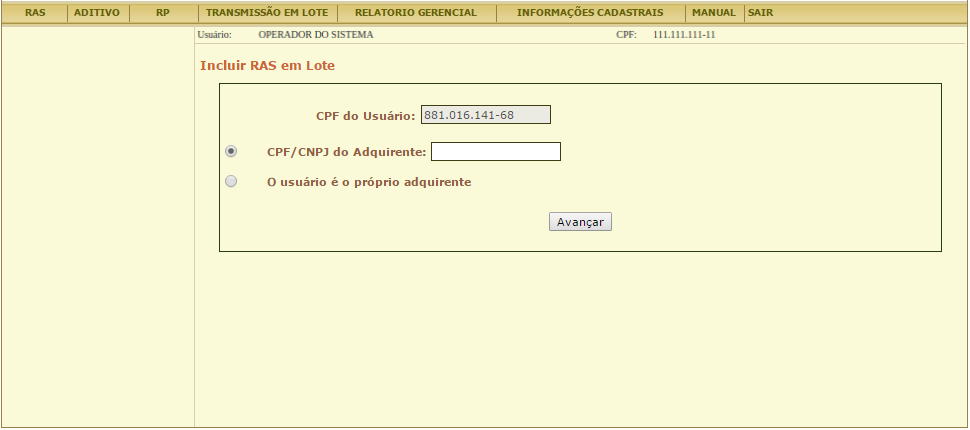

Após identificar o adquirente, o usuário poderá consultar o lote pelo
número de protocolo ou pela lista dos lotes enviados.

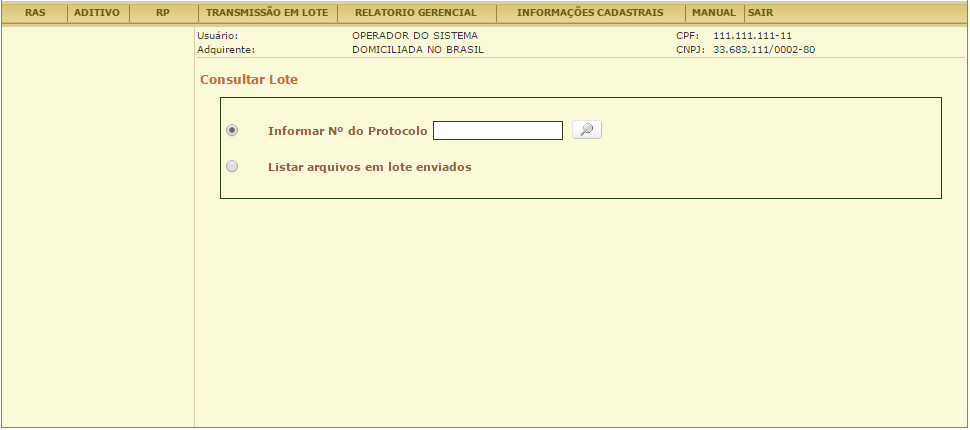

Caso o usuário utilize a opção **Informar Nº do Protocolo**, após clicar
o botão , o Sistema apresentará a tela com os
dados do lote informado.

Se o usuário selecionar a opção **Listar arquivos em lote enviados**, ao
clicar o botão , o Sistema listará todos os lotes
enviados em nome do CPF/CNPJ do adquirente. O usuário pode consultar um
lote específico ao clicar o botão . Neste caso, a tela com os dados do lote
será apresentada como se o usuário consultasse o lote pelo seu número de
protocolo.

Os registros inseridos, retificados ou aditivados a partir de um arquivo
de lote podem ser consultados diretamente da tela de dados, ou o usuário
pode solicitar ao Sistema que gere o arquivo de retorno do lote
encaminhado.

Caso o usuário escolha consultar o lote diretamente na tela, deverá
selecionar o número de registro apresentado.

Os erros de formatação ou de regra de negócio indicados podem ser
inspecionados ao se posicionar o cursor do mouse sobre o símbolo
.

#### 3.2.1. Arquivo de Retorno do Lote

Um arquivo de retorno contendo o resultado do processamento do lote, bem
como mais detalhes sobre os erros encontrados, pode ser gerado ao clicar
o botão **Gerar Arquivo de Retorno**.

Caso o lote tenha sido processado com sucesso, o arquivo de retorno
conterá os números de registro gerados pelo Siscoserv: RAS ou RP,
dependendo do tipo de registro incluído.

O formato do arquivo de retorno está descrito nas [Orientações Técnicas
- 3.1.8. Arquivo de
Retorno.](http://desenvolvimento.gov.br/arquivos/dwnl_1336998170.pdf)

Cabe ressaltar ainda que os registros inseridos a partir de um arquivo
de lote não podem ser editados (retificados, aditados, etc.)
manualmente. Caso o usuário tente editar o registro manualmente, o
Sistema apresentará a seguinte tela:

### 3.3. Excluir Lote

Caso o usuário detecte, antes do processamento noturno dos lotes, que
enviou um lote indevidamente, ele poderá exclui-lo. Para tal, é
necessário que o *status* do lote ainda seja EP -- Em Processamento.
Logo, a operação estará disponível apenas no mesmo dia do envio do lote.

A partir da tela de listagem dos lotes enviados (veja [Consultar
Lote](#consultar-lote)), ao clicar o botão
 ao lado do lote que se deseja excluir, o
Sistema removerá definitivamente o lote da fila de processamento.

### 3.4. Cumprimento de Prazos na Transferência em Lote

Para fins de cumprimento dos prazos legais, o sistema adota a data e o
horário informados na coluna **Data de Geração do Protocolo**, ou seja,
a data em que os arquivos foram enviados para processamento. Vale
ressaltar que a obrigação só é tempestivamente cumprida se os arquivos
forem processados com sucesso (*status* PS), dentro dos prazos legais
estabelecidos para os registros.

## 4. Relatório Gerencial

A funcionalidade **Relatório Gerencial** visa a atender uma solicitação
dos usuários do Siscoserv com vistas a gerar um relatório sobre todas as
operações registradas no sistema e, ainda, o status dessas informações.

O sistema permite a geração dos Relatórios Gerenciais cujas informações
abranjam um período máximo de 1 ano, retroativo ao início de operação do
Siscoserv.

O Siscoserv permite que o Usuário/Responsável pelo Registro gere os
Relatórios Gerenciais em 3 situações distintas, a saber:

a)  Usuário/Responsável pelo Registro representa uma Pessoa Jurídica;

b)  Usuário/Responsável pelo Registro representa Pessoa Física; e

c)  Usuário/Responsável pelo Registro é o Próprio Vendedor.

O **Usuário/Responsável pelo Registro** é que detém o e-CPF e/ou a
procuração eletrônica da Pessoa Jurídica ou da Pessoa Física e é o
responsável pela inserção dos dados no Sistema.

### 4.1. Caso 1 - Usuário/Responsável pelo Registro representa Pessoa Jurídica

Passo 1: Usuário/Responsável pelo Registro acessa o Siscoserv e clica em
Relatório Gerencial;

Passo 2: Usuário/Responsável pelo Registro preenche o CNPJ da Pessoa
Jurídica Adquirente e clica em "Avançar";

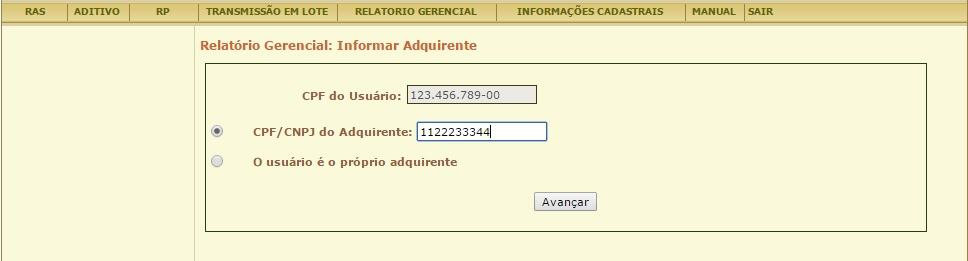

Passo 3: Usuário/Responsável pelo Registro seleciona dentre as diversas
opções possíveis aquelas que deseja e clica em "Gerar Relatório".

Podem ser selecionadas as seguintes opções:

**Agrupamento:**

\- CNPJ de 14 posições: para gerar o relatório de apenas uma empresa do
Grupo; ou

\- CNPJ de 8 posições: para gerar relatório contendo todas as empresas
do mesmo Grupo. Este tipo de consulta está
disponível apenas para CNPJ de natureza matriz, que terá acesso aos
registros da própria matriz e de suas filiais.

**Opção de registros efetuados no Sistema:**

\- RAS ou RP: serão disponibilizados todos os registros efetuados no
período de 1 ano. As informações sobre os RAS aparecem em uma planilha e
as informações sobre os RP em outra.

**Período para geração do relatório:**

\- Selecionar o período das informações desejadas, que não deve ser
superior a 1 ano.

- Consulta disponível para **matriz**:

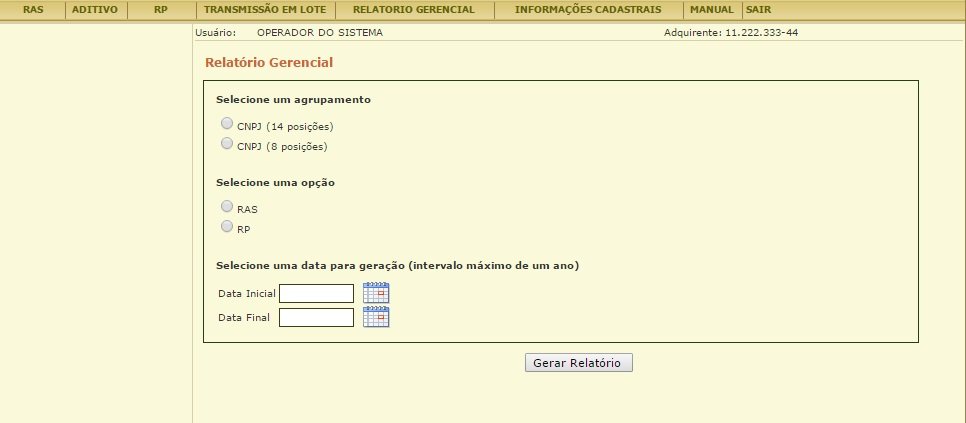

- Consulta disponível para **filial**:

 

O sistema gera uma Planilha Excel com todos os dados de RAS ou RP
vinculados para o período selecionado.

#### Relatórios Gerenciais relativos aos RAS

Informações disponibilizadas: 

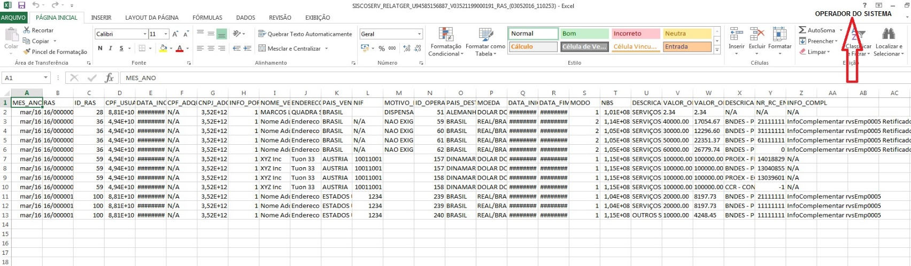

-   Mês/ano

-   Nº do RAS

-   ID/RAS\* (Essa informação se refere ao identificador do registro no
    banco do Siscoserv. O usuário poderá vincular uma operação ou
    pagamento ao registro.)

-   CPF do Usuário

-   Data da Inclusão do Registro

-   CPF do Adquirente (que neste caso vem preenchido com N/A -- não se
    aplica)

-   CNPJ do Adquirente

-   Info-Portaria (Essa informação se refere à opção de atendimento a
    legislação. Os valores possíveis são: 1 -- MDIC; 2 -- RFB; 3 --
    Ambos)

-   Nome do Vendedor

-   Endereço do Vendedor

-   País do Vendedor

-   NIF

-   Motivo do não preenchimento do NIF

-   ID-operação\* (Essa informação se refere ao identificador da
    operação no banco do Siscoserv. O usuário poderá vincular uma
    operação a um item de pagamento.)

-   País de Destino

-   Moeda

-   Data de Início da operação

-   Data de fim da operação

-   Modo de Prestação

-   Código da NBS (serviço, intangível ou outra operação que produz
    variação no patrimônio adquirido pela empresa).

-   Descrição da NBS

-   Valor da operação (valor da operação na moeda do contrato, conforme
    registrado pelo usuário).

-   Valor da operação em dólar (valor calculado pelo Sistema)

-   Descrição do [Mecanismo](#enquadramento) de Apoio (Inclui informação
    caso o usuário tenha indicado mecanismo de apoio ao comércio
    exterior. Caso o campo não tenha sido preenchido, o sistema
    informará a sigla N/A -- Não se aplica.)

-   NR\_RC\_[Mecanismo](#enquadramento) de Apoio

-   Informações Complementares (Caso o campo não tenha sido preenchido,
    o sistema informará a sigla N/A -- Não se aplica. Caso tenha sido
    preenchido, indicará os comentários incluídos).

*\* As informações acima servem para criar os vínculos entre registro,
operação e pagamento. Esses dados não têm nenhuma utilidade para
operações transmitidas por lote.*

#### Relatórios Gerenciais relativos aos RP

Informações disponibilizadas:

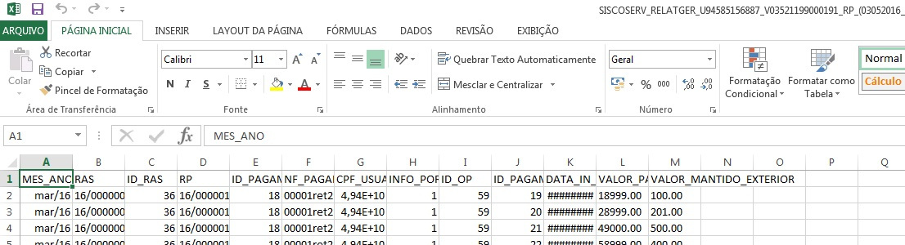

-   Mês/ ano

-   Nº do RAS

-   ID/RAS\* (Essa informação se refere ao identificador do registro no
    banco do Siscoserv. O usuário poderá vincular uma operação ou
    pagamento ao registro.)

-   Nº do RP

-   ID\_Pagamento\* (Essa informação se refere ao identificador do
    pagamento no banco do Siscoserv. O usuário poderá vincular um
    pagamento ao registro.)

-   NF\_Pagamento (Este é o número indicado pelo usuário para
    identificar o documento que comprove o pagamento ao residente ou
    domiciliado no exterior)

-   CPF do Usuário

-   Info \_Portaria (Essa informação se refere à opção de atendimento a
    legislação. Os valores possíveis são: 1 -- MDIC; 2 -- RFB; 3 --
    Ambos)

-   ID\_ OPERAÇÃO\* (Essa informação se refere ao identificador da
    operação no banco do Siscoserv. O usuário poderá vincular uma
    operação a um item de pagamento.)

-   ID\_PAGAMENTO\_OP\* (Essa informação se refere ao identificador do
    pagamento no banco do Siscoserv. O usuário poderá vincular
    pagamentos às operações.)

-   Data\_In\_PAGAMENTO (Data do pagamento, indicada no RP)

-   Valor Pago

-   Valor Pago com Recurso Mantido no Exterior

*\* As informações acima servem para criar os vínculos entre registro,
operação e pagamento. Esses dados não têm nenhuma utilidade para
operações transmitidas por lote.*

### 4.2. Caso 2 - Usuário/Responsável pelo Registro representa Pessoa Física

Passo 1: Usuário/Responsável pelo Registro acessa o Siscoserv e clica em
Relatório Gerencial;

Passo 2: Usuário/Responsável pelo Registro preenche o CPF da Pessoa
Física Adquirente e clica em "Avançar";

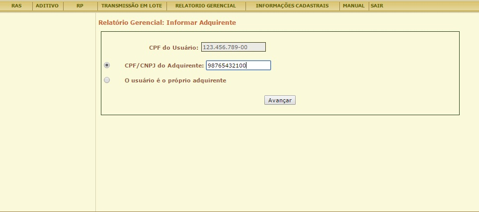

Passo 3: Usuário/Responsável pelo Registro seleciona dentre as diversas
opções possíveis, aquelas que deseja e clica em "Gerar Relatório".

Podem ser selecionadas as seguintes opções:

**Opção de registros efetuados no Sistema:**

\- RAS ou RP: serão disponibilizados todos os registros efetuados no
período de 1 ano. As informações sobre os RAS aparecem em uma planilha e
as operações sobre os RP em outra.

**Data para geração do relatório:**

\- Selecionar o período das informações desejadas, que não deve ser
superior a 1 ano.

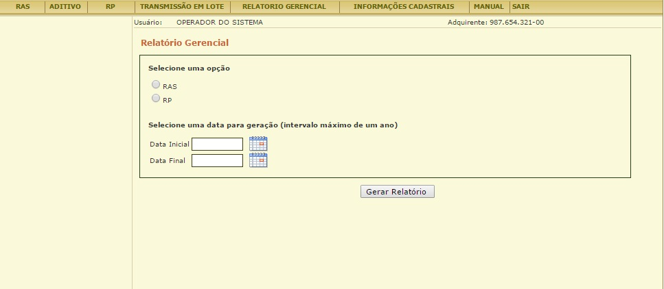

O sistema gera uma Planilha Excel com todos os dados de RAS ou RP
vinculados para o período selecionado. Para verificar as informações
disponibilizadas nas planilhas Excel, acessar: [Relatórios Gerenciais
RAS](#relatorioRVS) (atentar que no 2º caso as informações do CPF do
adquirente serão disponibilizadas e as informações de CNPJ do adquirente
virão preenchidas com N/A -- não se aplica) e [Relatórios Gerenciais
R](#relatorioRF)P.

### 4.3. Caso 1 - Usuário/Responsável pelo Registro é o próprio Adquirente

Passo 1: Usuário/Responsável pelo Registro, que neste caso é o próprio
adquirente, acessa o Siscoserv e clica em Relatório Gerencial;

Passo 2: Usuário/Responsável pelo Registro seleciona a opção "O Usuário
é o Próprio Adquirente";

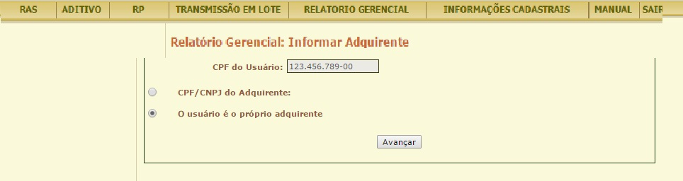

Passo 3: Usuário/Responsável pelo Registro seleciona dentre as diversas
opções possíveis, aquelas que deseja e clica em "Gerar Relatório".

Podem ser selecionadas as seguintes opções:

**Opção de registros efetuados no Sistema:**

\- RAS ou RP: serão disponibilizados todos os registros efetuados no
período de 1 ano. As informações sobre os RAS aparecem em uma planilha e
as operações sobre os RP em outra.

**Data para geração do relatório:**

\- Selecionar o período das informações desejadas, que não deve ser
superior a 1 ano.

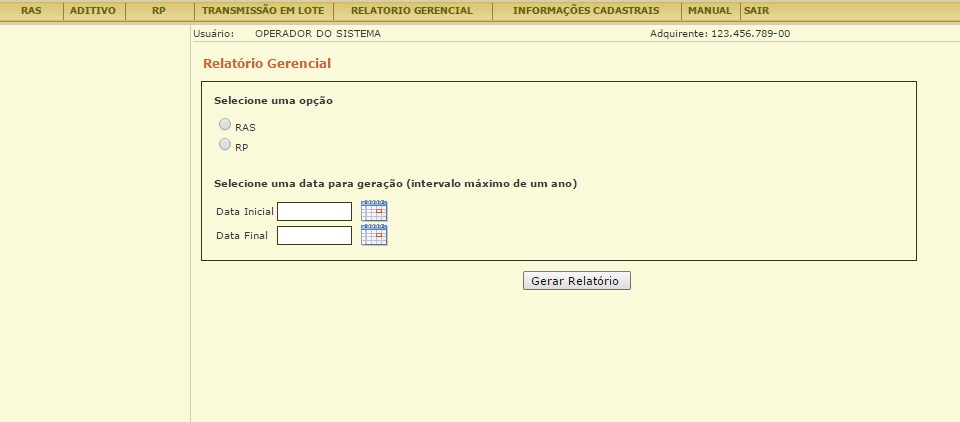

O sistema gera uma Planilha Excel com todos os dados do RAS ou RP
vinculados, para o período selecionado. Para verificar as informações
disponibilizadas nas planilhas Excel, acessar: [Relatórios Gerenciais
RAS](#relatorioRVS) (atentar que no 3º caso as informações do CPF do
usuário e do CPF do adquirente são as mesmas e as informações de CNPJ do
adquirente virão preenchidas com N/A -- não se aplica) e [Relatórios
Gerenciais RP](#relatorioRF).

# Capítulo 3 - Cenários Exemplificativos de Registro no Siscoserv

## 1. Registro de Transporte Internacional de Cargas (Frete)

A contratação de serviços de transporte de carga envolve vários "atores"
executando diferentes "papéis". Nos exemplos a seguir, são mostradas, em
alguns casos práticos, as relações entre os "atores" participantes desta
logística e a obrigação de registro no Siscoserv.

O conjunto de cenários abaixo apresentado não pretende ser exaustivo.
Entretanto, a lógica aplicada em cada uma das situações pode se estender
aos casos que não foram aqui descritos.

### Cenário 1.1. Transporte internacional de cargas intermediado por agente de cargas

**Exportação brasileira com a obrigação de transportar da empresa brasileira.** 

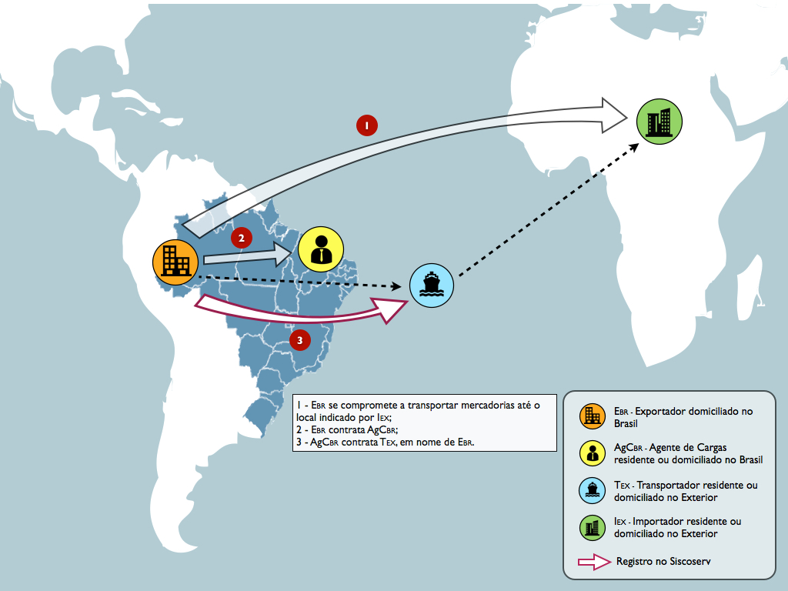

**Atores:**

> Eᴮᴿ: Exportador residente ou domiciliado no Brasil
>
> AgCᴮᴿ: Agente de Cargas residente ou domiciliado no Brasil
>
> Tₑₓ: Transportador residente ou domiciliado no Exterior
>
> Iₑₓ: Importador residente ou domiciliado no Exterior

**Relações entre os Atores:**

> Eᴮᴿ -- Iₑₓ: Exportador Brasileiro se compromete a transportar
> mercadorias até o local indicado pelo Importador residente ou
> domiciliado no exterior.
>
> Eᴮᴿ -- AgCᴮᴿ: Exportador brasileiro contrata Agente de Cargas
> residente ou domiciliado no Brasil para que, **em nome de Exportador
> brasileiro**, contrate o transporte marítimo das mercadorias até o
> local indicado pelo Importador residente ou domiciliado no Exterior~.~
>
> AgCᴮᴿ -- Tₑₓ: Agente de Cargas residente ou domiciliado no Brasil
> contrata Transportador residente ou domiciliado no Exterior, **em nome
> do Exportador Brasileiro**, para transportar as mercadorias até o
> local indicado pelo Importador residente ou domiciliado no Exterior,
> sendo que o Transportador residente ou domiciliado no Exterior de fato
> fará o transporte.
>
> Observação: A contratação de serviço neste cenário e nos demais
> revela-se por meio da existência de contrato, escrito ou não, e
> faturamento correspondente.

**Registros devidos:**

> Eᴮᴿ: RAS pelo serviço de transporte tendo Tₑₓ como vendedor.
>
> Observação: Neste cenário Eᴮᴿ não se sujeita a registrar no Módulo
> Venda do Siscoserv os serviços de transporte internacional de carga
> adquiridos de Tₑₓ, cujo custo seja por ele repassado a Iₑₓ.

### Cenário 1.2. Transporte internacional de cargas intermediado por agente de cargas

**Importação brasileira com a obrigação de transportar da empresa brasileira.**

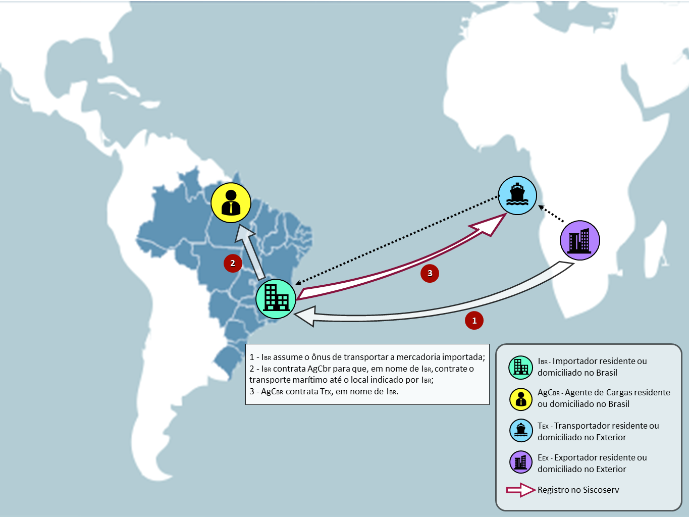

**Atores:**

> Iᴮᴿ: Importador residente ou domiciliado no Brasil
>
> Eₑₓ: Exportador residente ou domiciliado no Exterior
>
> AgCᴮᴿ: Agente de Cargas residente ou domiciliado no Brasil
>
> AgCgₑₓ: Agente de carga residente ou domiciliado no Exterior
>
> Tₑₓ: Transportador residente ou domiciliado no Exterior

**Relações entre os Atores:**

> Iᴮᴿ -- Eₑₓ: Iᴮᴿ assume o ônus de transportar a mercadoria
> importada
>
> Iᴮᴿ -- AgCᴮᴿ: Iᴮᴿ contrata AgCᴮᴿ para que, em nome de Iᴮᴿ,
> contrate o transporte marítimo das mercadorias até o local indicado por Iᴮᴿ.
>
> AgCᴮᴿ -- Tₑₓ: AgCᴮᴿ contrata Tₑₓ, em nome de Iᴮᴿ, para
> transportar as mercadorias até o local indicado por Iᴮᴿ, sendo que
> Tₑₓ de fato fará o transporte.

**Registros devidos:**

> Iᴮᴿ: RAS pelo serviço de transporte tendo Tₑₓ como vendedor.
>
> Observação: Caso o agente de cargas brasileiro intermedeie, em nome do
> importador brasileiro, a contratação do agente de cargas estrangeiro,
> deve ser feito um RAS por Iᴮᴿ tendo AgCgₑₓ como vendedor do
> serviço.

### Cenário 1.3. Transporte internacional de cargas com consolidação e desconsolidação de cargas

**Importação brasileira com a obrigação de transportar da empresa estrangeira.**

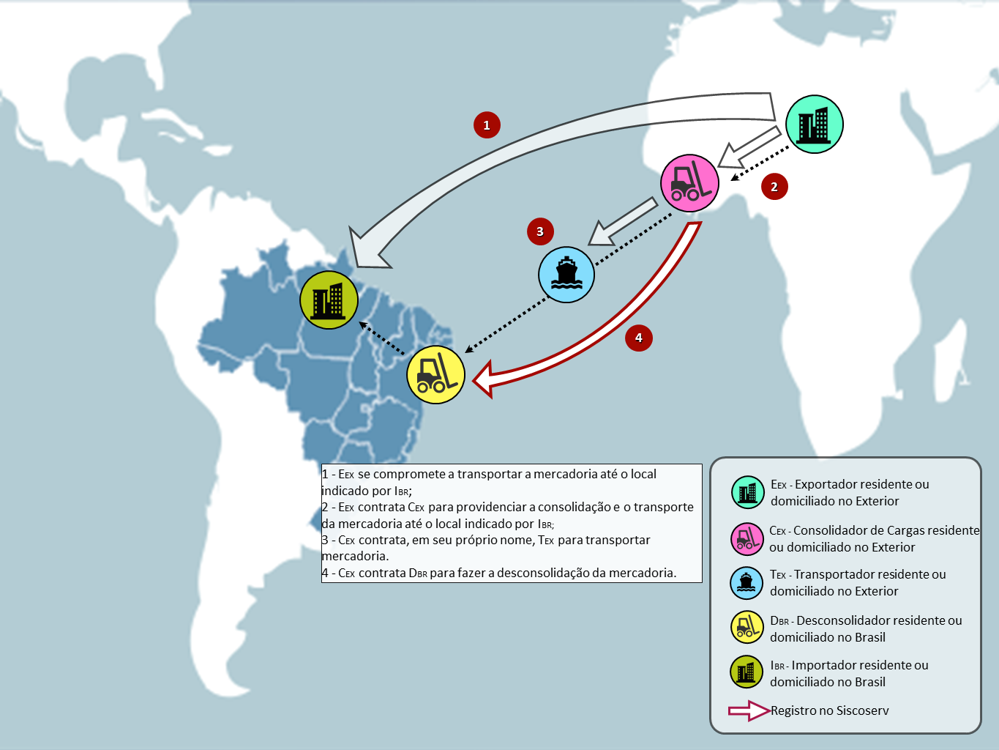

**Atores:**

> Eₑₓ: Exportador residente ou domiciliado no Exterior
>
> Iᴮᴿ: Importador residente ou domiciliado no Brasil
>
> Cₑₓ: Consolidador de cargas residente ou domiciliado no Exterior
>
> Dᴮᴿ: Desconsolidador de cargas residente ou domiciliado no Brasil
>
> Tₑₓ: Transportador residente ou domiciliado no Exterior

Relações entre os Atores:

> Eₑₓ -- Iᴮᴿ: Eₑₓ compromete-se com o Iᴮᴿ a transportar a
> mercadoria até local indicado por Iᴮᴿ em solo brasileiro.
>
> Eₑₓ -- Cₑₓ: Eₑₓ contrata Cₑₓ para providenciar a consolidação
> e o transporte da mercadoria até o local indicado por Iᴮᴿ
>
> Cₑₓ -- Dᴮᴿ: Cₑₓ contrata Dᴮᴿ para fazer a desconsolidação da
> mercadoria.
>
> Cₑₓ -- Tₑₓ: Cₑₓ contrata em seu próprio nome Tₑₓ para
> transportar a mercadoria.

**Registros devidos:**

> Dᴮᴿ: RVS pelo serviço de desconsolidação tendo Cₑₓ como
> adquirente.
>
> **Não há registro no Siscoserv** pelo serviço de transporte de cargas
> neste caso, pois ambos, Cₑₓ e Tₑₓ são domiciliados no exterior.

#### Cenário 1.4. Transporte internacional de cargas com consolidação e desconsolidação de cargas

**Exportação brasileira com a obrigação de transportar da empresa brasileira.**

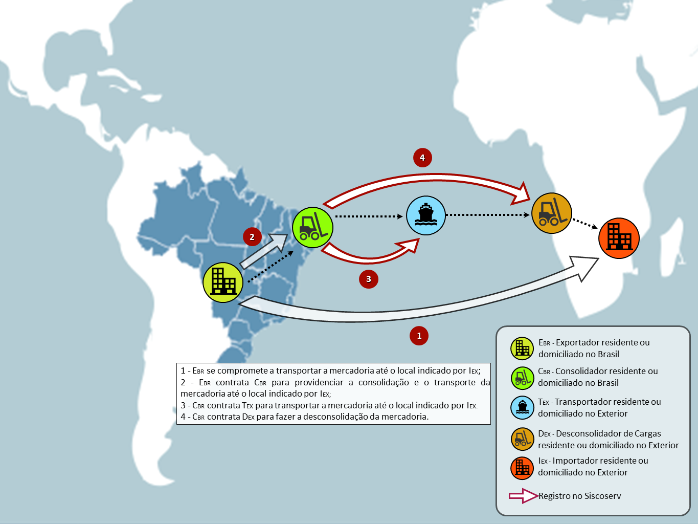

**Atores:**

> Eᴮᴿ: Exportador residente ou domiciliado no Brasil
>
> Iₑₓ: Importador residente ou domiciliado no Exterior
>
> Cᴮᴿ: Consolidador de cargas residente ou domiciliado no Brasil
>
> Dₑₓ: Desconsolidador de cargas residente ou domiciliado no Exterior
>
> Tₑₓ: Transportador, operador de veículo, residente ou domiciliado no
> Exterior.

**Relações entre os Atores:**

> Eᴮᴿ -- Iₑₓ: Eᴮᴿ compromete-se com o Iₑₓ a transportar a
> mercadoria até local indicado por Iₑₓ.
>
> Eᴮᴿ -- Cᴮᴿ: Eᴮᴿ contrata Cᴮᴿ para providenciar a consolidação
> e o transporte da mercadoria até o local indicado por Iₑₓ.
>
> Cᴮᴿ -- Tₑₓ: CBR contrata Tₑₓ para transportar as mercadorias até
> o local indicado por Iₑₓ, sendo que Tₑₓ de fato fará o transporte.
>
> Cᴮᴿ -- Dₑₓ: Cᴮᴿ contrata Dₑₓ para fazer a desconsolidação da
> mercadoria.

**Registros devidos:**

> Cᴮᴿ: RAS pelo serviço de transporte tendo Tₑₓ como vendedor e RAS
> pelo serviço de desconsolidação, tendo Dₑₓ como vendedor.

## 2. Seguros

### Cenário 2.1. Contratação de seguro com intermediação de corretora

**Descrição**

Empresa residente ou domiciliada no Brasil -- Empᴮᴿ, utiliza corretora
de seguros, também residente ou domiciliada no Brasil, -- Corᴮᴿ que
intermedeia a contratação com a seguradora residente ou domiciliada no
exterior -- Segₑₓ. Desta forma, mesmo intervindo o intermediário
Corᴮᴿ, as partes do contrato do seguro continuam a ser Empᴮᴿ e
Segₑₓ e cabe a Empᴮᴿ, a contratante no Brasil, o registro no
Siscoserv.

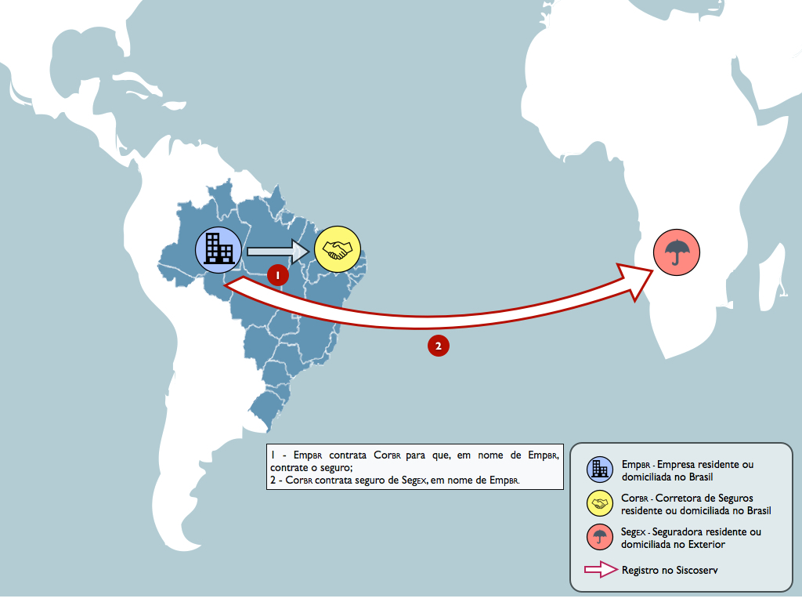

**Atores:**

> Empᴮᴿ: Empresa residente ou domiciliado no Brasil
>
> Corᴮᴿ: Corretora de seguros residente ou domiciliado no Brasil
>
> Segₑₓ: Seguradora residente ou domiciliado no Exterior

**Relações entre os Atores:**

> Empᴮᴿ -- Corᴮᴿ: Empᴮᴿ contrata Corᴮᴿ para que, em nome de
> Empᴮᴿ, contrate o seguro.
>
> Corᴮᴿ -- Segₑₓ: Corᴮᴿ contrata seguro de Segₑₓ, em nome de
> Empᴮᴿ.

**Registros devidos:**

> Empᴮᴿ: RAS pelo serviço de seguro tendo Segₑₓ como vendedora.

### Cenário 2.2. Contratação de seguro de estipulante domiciliada ou residente no Brasil

**Descrição**

Estᴮᴿ, residente ou domiciliada no Brasil, é uma corretora que
contrata e paga apólice coletiva de seguros, ficando investida dos
poderes de representação dos segurados perante as seguradoras, fazendo
papel de estipulante. Se Segₑₓ, seguradora residente ou domiciliada no
exterior, for contratada e paga por Estᴮᴿ em favor de Empᴮᴿ,
residente ou domiciliada no Brasil, Estᴮᴿ é considerado o contratante
e, consequentemente, o responsável pelo registro no Siscoserv

**Atores:**

> Empᴮᴿ: Empresa residente ou domiciliado no Brasil
>
> Estᴮᴿ: Estipulante residente ou domiciliada no Brasil
>
> Segₑₓ: Seguradora residente ou domiciliado no Exterior

**Relações entre os Atores:**

> Empᴮᴿ -- Estᴮᴿ: Empᴮᴿ contrata seguro de Estᴮᴿ.
>
> Estᴮᴿ -- Segₑₓ: Estᴮᴿ contrata apólice coletiva de seguros de
> Segₑₓ e paga por ela, ficando investida dos poderes de representação
> dos segurados, inclusive Empₑₓ, perante Segₑₓ

**Registros devidos:**

> Estᴮᴿ: RAS pelo serviço de seguro tendo Segₑₓ como vendedora.

## 3. Remessa Expressa

O serviço de remessa expressa (courier) apresenta, de forma genérica,
dois possíveis cenários.

### Cenário 3.1. Empresa brasileira exportadora (ou importadora) faturada por empresa estrangeira prestadora do serviço de remessa expressa

O registro é de responsabilidade do exportador/importador residente ou
domiciliado no Brasil sempre que a relação contratual relativa aos
serviços de remessa expressa seja entre esse exportador/importador e a
empresa prestadora desses serviços domiciliada no exterior.

Quando não houver clareza sobre essa relação contratual, o
exportador/importador residente ou domiciliado no Brasil deve se amparar
nos documentos de faturamento pelos serviços prestados.

Quando o exportador/importador residente ou domiciliado no Brasil
receber um documento de fatura de uma empresa de remessa expressa
domiciliada no exterior, mesmo que o fluxo de pagamento ocorra com a
filial desta empresa domiciliada no Brasil, caberá ao
exportador/importador o registro.

### Cenário 3.2. Empresa brasileira faturada pela filial residente ou domiciliada no Brasil de empresa estrangeira

O registro é de responsabilidade empresa de remessa expressa domiciliada
no Brasil sempre que a relação contratual relativa aos serviços de
remessa expressa seja entre essa empresa domiciliada no Brasil e a
empresa prestadora de serviços de remessa expressa domiciliada no
exterior, mesmo quando houver uma relação *intercompany*.

Quando não houver clareza sobre essa relação contratual, o
exportador/importador residente ou domiciliado no Brasil deve se amparar
nos documentos de faturamento pelos serviços prestados.

Quando o exportador/importador residente ou domiciliado no Brasil
receber um documento de fatura (nota fiscal ou documento equivalente) da
empresa de remessa expressa domiciliada no Brasil, não cabe a este
exportador/importador o registro no Siscoserv dos serviços de remessa
expressa, visto que neste caso trata-se de uma relação comercial entre
duas empresas domiciliadas no Brasil.

Neste caso, caberá à empresa de remessa expressa domiciliada no Brasil
verificar como se dá a operacionalização da prestação do serviço. Sempre
que houver uma operação comercial entre esta empresa e uma empresa
domiciliada no exterior, mesmo que *intercompany*, para que seja
efetivado o serviço de remessa expressa, caberá à empresa domiciliada no
Brasil o registro desses serviços.

É importante recordar que este Manual prevê a necessidade de registro
independentemente da contratação de câmbio, do meio de pagamento ou da
existência de um contrato formal.

Cabe ainda ressaltar que as empresas domiciliadas no Brasil, ainda que
relacionadas a empresas estrangeiras (ou seja, mesmo quando são uma
presença comercial de uma empresa estrangeira no Brasil), são
consideradas pela legislação brasileira, para todos os fins, empresas
brasileiras. Sendo assim, essas empresas consideradas presença comercial
de uma empresa estrangeira no Brasil, por estarem domiciliadas no país e
estarem regidas pela legislação comercial e tributária que afeta a todas
as empresas brasileiras, devem efetuar seus registros em Módulo Venda e
Aquisição do Siscoserv sempre que realizarem operações de venda ou
aquisição de serviços com residentes ou domiciliados no exterior,
inclusive operações *intercompany*, de acordo com o previsto na
legislação pertinente ao Siscoserv e neste Manual.

## 4. Expatriados

A movimentação temporária de pessoas físicas para prestação de serviços
enseja o registro no Siscoserv, sempre que cumpridos os pilares
previstos na legislação relativa ao Sistema. Conforme explicitado neste
Manual, deve-se registrar [operações](#operaçao) em Modo 4 no Módulo
Aquisição do Siscoserv as pessoas físicas ou jurídicas
[residentes](#residentenoBrasil) ou domiciliadas no Brasil, quando a
aquisição de serviço ensejar o deslocamento temporário de pessoa(s)
física(s) residente(s) no exterior com vistas a prestar um serviço no
Brasil, **exceto quando se estabelecer vínculo empregatício no Brasil**.

Além disto, a situação de residência ou não residência no país pode
interferir na necessidade ou não de registro.

Conforme o Art. 2° da Instrução Normativa SRF nº 208, de 2002,
considera-se **residente** no Brasil, a pessoa física que resida no
Brasil em caráter permanente, a que se ausente para prestar serviços
como assalariada a autarquias ou repartições do Governo brasileiro
situadas no exterior e a que se ausente do Brasil em caráter temporário
ou se retire em caráter permanente do território nacional sem apresentar
a Comunicação de Saída Definitiva do País, durante os primeiros 12
(doze) meses consecutivos de ausência.

Já segundo o Art. 3º, considera-se **não-residente** no Brasil
(**expatriado**), a pessoa física que não resida no Brasil em caráter
permanente e não se enquadre nas hipóteses previstas no art. 2º
supracitado, a que se retire em caráter permanente do território
nacional, na data da saída, desde que apresentada a Comunicação de Saída
Definitiva do País, e a que se ausente do Brasil em caráter temporário,
a partir do dia seguinte àquele em que complete doze meses consecutivos
de ausência.

### Cenário 4.1 

Empresa residente ou domiciliada no Brasil que envia empregado para
trabalhar em empresa residente ou domiciliada no exterior e que continua
remunerando esse empregado pelos serviços prestados fora do país, em
virtude de manutenção do vínculo empregatício. O reembolso feito pela
empresa estrangeira referente ao salário do empregado deve ser
registrado no Siscoserv, pois tal situação configura prestação de
serviço em modo 4. Também deve ser registrado no Siscoserv a remuneração
do empregado caso ele torne-se não residente, mantendo vínculo
empregatício no Brasil.

### Cenário 4.2 

Empresa residente e domiciliada no Brasil que efetua apenas o pagamento
de contribuições previdenciárias, referente a segurado facultativo, de
trabalhador residente no exterior e com vínculo empregatício
estabelecido junto a uma empresa residente e domiciliada no exterior, em
país que não possua tratado previdenciário com o Brasil, pagamento esse
reembolsado pela empresa estrangeira, não deve prestar essa informação
no Siscoserv. Tal situação não configura prestação de serviço em modo 4.
Importante ressaltar que esse cenário trata exclusivamente de situação
em que não há nenhuma prestação de serviços do expatriado à empresa
brasileira.

# Notas de rodapé

[^1]: Neste caso, leia-se "prestação de serviços" como "prestação de
    serviços, transferência de [intangível](#Intangível) e realização de
    [outras operações que produzam variações no
    patrimônio](#Outrasoperações).

[^2]: Neste caso, leia-se "bens ou serviços" como "bens, mercadorias,
    serviços, intangíveis ou [outras operações que produzam variações no
    patrimônio](#Variações)".

[^3]: Neste caso, leia-se "prestação de serviços" como "prestação de
    serviços, transferência de intangível e realização de [outras
    operações que produzam variações no patrimônio](#Variações)".

[^4]: Neste caso, leia-se "aquisição de serviços" como "aquisição de
    serviços, transferência de intangível ou realização de [outras
    operações que produzam variações no patrimônio](#Variações)".

[^5]: Neste caso, leia-se "aquisição de serviços" como "aquisição de
    serviços, transferência de intangível ou realização de [outras
    operações que produzam variações no patrimônio](#Variações)".

[^6]: Neste caso, leia-se "aquisição de serviços", como "aquisição de
    serviços, transferência de intangível e realização de outras
    operações que produzam variações no patrimônio".

[^7]: Neste caso, leia-se "aquisição de serviços" como "aquisição de
    serviços, transferência de intangível ou realização de [outras
    operações que produzam variações no patrimônio](#Variações)".

[^8]: Neste caso, leia-se "prestação de serviços", como "prestação de
    serviços, transferência de intangível e realização de [outras
    operações que produzam variações no patrimônio](#Variações)".

[^9]: Idem Nota 2

[^10]: Idem Nota 2.

[^11]: Aprovado pelo Decreto Legislativo nº 30, de 15 de dezembro de
    1994, e promulgado pelo Decreto nº 1.355, de 30 de dezembro de
    1994.

[^12]: Neste caso, leia-se "prestação de serviços", como "prestação de
    serviços, transferência de intangível e realização de [outras
    operações que produzam variações no patrimônio](#Variações)".

[^13]: Idem.

[^14]: Neste caso, leia-se "prestação de serviços" como "prestação de
    serviços, transferência de [intangível](#Intangível) e realização de
    [outras operações que produzam variações no
    patrimônio](#Outrasoperações).

[^15]: Neste caso, leia-se "aquisição de serviços" como "aquisição de
    serviços, intangíveis e [outras operações que produzam variações no
    patrimônio](file:///F:\Propostas%20para%20novas%20funcionalidades.doc#Variações)".

[^16]: Neste caso, leia-se "prestação de serviços", como "prestação de
    serviços, transferência de intangível e realização de [outras
    operações que produzam variações no patrimônio](#Variações)".

[^17]: Idem.

[^18]: Neste caso, leia-se "prestação de serviços", como "prestação de
    serviços, transferência de intangível e realização de [outras
    operações que produzam variações no patrimônio](#Variações)".

[^19]: Neste caso, leia-se "aquisição de serviços", como "aquisição de
    serviços, transferência de intangível e realização de outras
    operações que produzam variações no patrimônio".

[^20]: Neste caso, leia-se "aquisição de serviços" como "aquisição de
    serviços, transferência de intangível ou realização de [outras
    operações que produzam variações no patrimônio](#Variações)".

[^21]: Maiores informações no [item 9 do Capítulo
    1](#nomenclatura-brasileira-de-serviços-intangíveis-e-outras-operações-que-produzam-variações-no-patrimônio-nbs)
    deste Manual.

[^22]: Neste caso, leia-se "serviços" como "serviços, intangíveis e
    [outras operações que produzam variações no
    patrimônio](#Outrasoperações)".

[^23]: Neste caso, leia-se "serviço prestado" como "serviço prestado,
    intangível transferido e outra operação que produza variações no
    patrimônio realizada".

[^24]: Neste caso leia-se "pagamento de um serviço" como "pagamento de
    um serviço, comercialização de intangível ou outra operação que
    produza variação no patrimônio"

[^25]: Neste caso, leia-se "prestação de serviços", como "prestação de
    serviços, transferência de intangível e realização de [outras
    operações que produzam variações no patrimônio](#Variações)".
